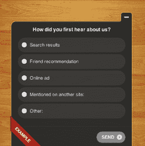

# 软件比较服务 CatchFree 收购 KISSinsights，将重点转向实时客户反馈 

> 原文：<https://web.archive.org/web/https://techcrunch.com/2012/06/14/software-comparison-service-catchfree-acquires-kissinsights-shifts-focus-to-real-time-customer-feedback/>

# 软件比较服务 CatchFree 收购 KISSinsights，将重点转向实时客户反馈

网络分析公司 [KISSmetrics](https://web.archive.org/web/20221206180239/http://www.crunchbase.com/company/kiss-metrics) 今天宣布将其基于网络的调查工具 [KISSinsights](https://web.archive.org/web/20221206180239/http://kissinsights.com/) 出售给 [CatchFree](https://web.archive.org/web/20221206180239/http://catchfree.com/) ，这是一家前 [TechCrunch Disrupt 参与者](https://web.archive.org/web/20221206180239/https://beta.techcrunch.com/2011/05/24/catchfree-wants-to-become-the-hub-of-the-freemium-ecosystem/)和一家为寻找免费网络和移动软件解决方案提供社会化比较服务的制造商。CatchFree 于 2010 年推出，由 Index Ventures、First Round Capital、True Ventures、Polaris 和 500 Startups 提供 550 万美元的资金支持，之前在网上收集了用户的反馈，汇编了结果，并提供了对软件各种功能进行评级的有序比较图表。与此同时，KISSinsights 提供了通过网页右下角的小弹出窗口直接从企业网站获取客户反馈的工具。

通过开发其服务，CatchFree 发现，与它为软件公司带来的流量相比，客户从它提供的见解中获得了更多价值。因此，收购后，CatchFree 将围绕 KISSinsights 技术发展其业务。

 KISSinsights 于 2010 年 11 月作为 [KISSmetrics](https://web.archive.org/web/20221206180239/http://kissmetrics.com/) 的一部分推出，其客户从星巴克到 Airbnb 都有。KISSmetrics 的创始人 Hiten Shah 说:“这是一个不断增长的软件即服务产品，但不是我们的主要产品 KISSmetrics。”他解释说，这笔交易是他的公司持续努力专注于核心产品的一部分，他说这是“巨大的牵引力”然而，Shah 不愿透露目前 KISSinsights 客户的数量。交易的条款也没有提供。

自 2011 年 5 月在 Disrupt 网站推出以来，CatchFree 已经吸引了 1，830，760 人，并有超过 1，013 家应用程序发行商注册，包括 Dropbox、LogMeIn、Lookout、Billguard、Live Nation、Soluto、Bu.mp、SignNow 和 SoundCloud。在这些出版商中，超过 40%的人专门签约从他们的客户群中获得见解，这就是 KISSinsights 提供的服务。

CatchFree 的收购涉及 KISSinsights 的所有资产，Shah 将作为顾问加入。该公司将在其博客上公布细节，并在今天晚些时候向所有 KISSinsights 用户发送电子邮件。