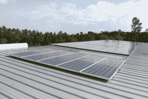

# Elon Musk，SolarCity 向墨西哥湾海岸救灾组织捐赠电力系统

> 原文：<https://web.archive.org/web/https://techcrunch.com/2010/12/13/solarcity-musk-gulf-coast/>

# Elon Musk，SolarCity 向墨西哥湾海岸救灾组织捐赠电力系统

连续的科技企业家和投资者 Elon Musk 和 SolarCity——太阳能发电系统和能效设计、融资、安装和相关服务的提供商——向受卡特里娜飓风和 BP 石油泄漏影响的阿拉巴马州[科登](https://web.archive.org/web/20230306225625/http://www.wkrg.com/search/results/48c82cb0b772c9a952db3698fa0454a3/)社区捐赠了一套太阳能发电系统。

该系统由连接到备用电池系统的太阳能电池板阵列组成，这将使南湾社区联盟(SBCA)飓风响应中心能够自己发电，降低运营成本，并在停电时保持供电。该系统刚刚启动并投入运行，每年将产生约 33，500 千瓦时的电力，这将抵消该中心近 100%的用电量。

SBCA 中心是 2006 年卡特琳娜飓风后由河口社区成立的，当时那里的家庭没有电力、食物、衣服、水和防暑措施。

SBCA 的执行主任保罗·尼尔森报告说，奥巴马总统的政府向(通过马斯克基金会)提供资金的埃隆·马斯克和 T2 太阳能公司推荐了他的草根组织作为该项目的当之无愧的接收者。

今天，科登地区正在从两次灾难中重建[。今年早些时候，当英国石油公司漏油事件发生时，300 多个家庭仍在遭受风暴造成的房屋损坏和损失，破坏了该地区的自然资源和就业机会。](https://web.archive.org/web/20230306225625/http://bridgethegulfproject.org/node/170)

一位代表 SolarCity 和公司董事长兼特斯拉汽车公司(Tesla Motors)和 SpaceX 首席执行官埃隆·马斯克(Elon Musk)发言的代表表示，这个项目——以及他们希望在 2011 年开展的其他项目——将帮助人们减少“对污染我们的空气和水并使我们的地缘政治复杂化的有限能源的依赖。”