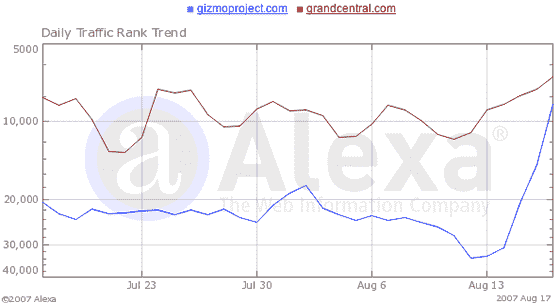

# 一些人从 Skype 中断中受益 

> 原文：<https://web.archive.org/web/http://www.techcrunch.com:80/2007/08/19/some-people-benefited-from-the-skype-outage/>

# 一些人从 Skype 服务中断中受益

Alexa 截至 8 月 17 日的统计数据显示，Skype 竞争对手 [Gizmo 项目](https://web.archive.org/web/20221205070540/http://www.gizmoproject.com/)的流量大幅上升，而[大中央车站](https://web.archive.org/web/20221205070540/http://www.grandcentral.com/)的流量在本周 36 小时 [Skype 中断](https://web.archive.org/web/20221205070540/http://www.beta.techcrunch.com/2007/08/16/skype-suffers-major-outage/)的高峰时段略有上升。

SIPphone 拥有的 Gizmo 项目提供了一个与 Skype 几乎相同的软件包，但增加了一些功能，包括内置录音和跨平台兼容性。Gizmo 的流量在三天内增长了两倍，在 Alexa 中的排名从 3 个月的平均 19102 上升到 8561。

谷歌拥有的大中央车站提供一个无处不在的电话服务。虽然该服务在软电话市场上不与 Skype 竞争，但该服务确实提供了与 Skype 等 Skype 服务竞争的功能。根据 Alexa 的数据，Grand Central 上周五创下 4 周新高，排名比 3 个月平均水平上升了 33%。