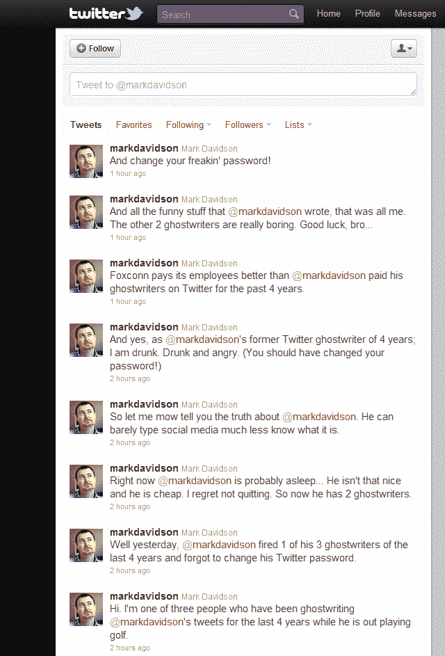

# 有人请醒醒吧@ mark Davidson——他的一个 Twitter 代笔人叛变了 

> 原文：<https://web.archive.org/web/http://techcrunch.com/2011/09/22/someone-please-wake-up-markdavidson-one-of-his-twitter-ghostwriters-went-rogue/>

# 有人请醒醒吧@ mark Davidson——他的一个推特代笔人叛变了

很抱歉，但这个实在太有趣了，不能不分享。

一个叫做[马克·戴维森](https://web.archive.org/web/20230205025018/https://plus.google.com/u/0/108387202801245500285/posts)的家伙，根据他在 [LinkedIn 上的简介](https://web.archive.org/web/20230205025018/http://www.linkedin.com/in/shiftplusone)，他是一个社交营销&沟通策略师，显然他雇佣了*三个*人在[他的推特账户](https://web.archive.org/web/20230205025018/http://twitter.com/#!/markdavidson)上代笔。

从表面上看，其中一人刚刚被马克莫名其妙的庞大代笔团队解雇，但他的前雇主未能更改他的 Twitter 密码…

结果:(到目前为止)马克的推特账户上有八条来自一个“喝醉了，愤怒的”流氓代笔人的消息，抨击他“在他出去打高尔夫球的时候”雇佣了一个作家团队，不友好，不便宜，缺乏对社交媒体的理解(以及如何键入文字)。哎哟。

戴维森的推特简历(虽然不清楚是不是他写的):

> 网络销售和营销专家。我写很多东西是为了娱乐自己和他人。有时候，我甚至会深思。

不，我不知道这个故事是真的还是恶作剧。不过，我知道这很搞笑。

(Via[@印度骑士](https://web.archive.org/web/20230205025018/http://twitter.com/#!/indiaknight/status/116820956172926976))

截图给后人(自下而上阅读):

