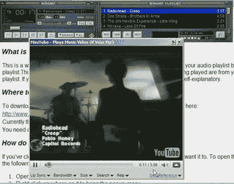

# Songreference 将您的 MP3 播放列表转变为视频播放列表 TechCrunch

> 原文：<https://web.archive.org/web/https://techcrunch.com/2008/09/27/songrefernce-turns-your-mp3-playlist-into-a-video-playlist/>

# Songreference 将您的 MP3 播放列表转换为视频播放列表

我喜欢像这样有用的工具。 [Songreference](https://web.archive.org/web/20230129081326/http://songreference.com/) 有 iTunes(目前仅适用于 Windows)和 Winamp MiniTube 的免费下载，它可以搜索你当时正在播放的任何 MP3 的音乐视频，然后与歌曲同步播放。同步这一部分并不简单，它会带来很大的不同。该插件还链接到每首歌曲的维基百科信息。

在这里看一个演示视频[。](https://web.archive.org/web/20230129081326/http://blip.tv/file/1249289/)