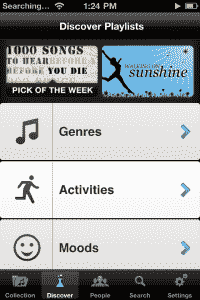

# 宋杂举七图圆；在云中发布可共享的移动音乐收藏| TechCrunch

> 原文：<https://web.archive.org/web/https://techcrunch.com/2011/09/13/songza-raises-seven-figure-round-launches-mobile-sharable-music-collections-in-the-cloud/>

迈克第一次采访李正吉大街是在 2006 年。当时，他是一个超级粉丝。当时，这家初创公司的目标是一种新的音乐模式，允许音乐家将他们的歌曲上传到李正吉街的平台上，免费向听众提供这些歌曲。歌曲吸引的下载量越多，价格就会慢慢上涨——价格表明歌曲的受欢迎程度。现在看来，这是一个明智的决定，[李正吉街去年 9 月以未披露的价格](https://web.archive.org/web/20230313204331/https://techcrunch.com/2010/09/08/amazon-acquires-amie-street-but-not-in-a-good-way/)出售给亚马逊，决定将精力集中在 [Songza](https://web.archive.org/web/20230313204331/http://songza.com/) 上:它[于 2008 年收购的社交网络广播服务](https://web.archive.org/web/20230313204331/https://techcrunch.com/2009/04/08/news-flash-amie-street-swallowed-songza-six-months-ago/)。

今天，经过多次迭代和修补，Songza 推出了 iOS 和 Android 的免费移动应用程序，允许用户在舒适的云环境中创建和分享个性化的音乐收藏。Songza 的联合创始人兼首席执行官 Elias Roman 将这项服务比作“音乐管家”，因为它为用户提供由专家(和朋友)创建的播放列表，满足你可能想要的任何情绪或音乐体验。联合创始人说，“音乐的未来将由专家和社会监管的融合来驱动”。

虽然 iTunes、Google Music 和 beyond 提供了一些简洁的可定制播放列表选项，但 Roman 说得有道理。我们更可能喜欢由我们信任的音乐家、评论家和 DJ 创建的播放列表，以及由朋友创建的播放列表，复杂的算法目前只能处理一个。潘多拉和它的基因组计划就是一个很好的例子。

 如今，听众想要大量的免费音乐收藏，这些收藏易于构建、易于保存、随处可得并能与朋友分享。Roman 说，他认为 Songza 提供的正是这种解决方案，因为它提供了超过 75，000 个由真人(包括音乐专家，名人，艺术家和唱片公司)创建的播放列表，并允许任何用户从 Songza 的超过 1，450 万首歌曲的库中创建自己的播放列表。

说到 Pandora(还有 Spotify ), Songza 的价值主张在很大程度上得益于它没有音频广告，也没有每月收听限制。

这家初创公司今天还宣布，它已经完成了一轮七位数的融资，由之前支持 AmieStreet.com 的投资者牵头，包括 [Deep Fork Capital](https://web.archive.org/web/20230313204331/http://www.crunchbase.com/financial-organization/deep-fork-capital-2) 以及一家“未披露的战略投资者”。Geoff Judge 也参与了这一轮，他是 [24/7 Real Media](https://web.archive.org/web/20230313204331/http://www.crunchbase.com/company/24-7-real-media) 的联合创始人，将加入 Songza 的董事会。

这家初创公司面向 iOS 和 Android[的新移动应用](https://web.archive.org/web/20230313204331/https://market.android.com/details?id=com.ad60.songza)[不仅允许用户在云中创建个性化和可共享的音乐收藏，还通过脸书提供社交发现功能，允许用户访问朋友正在听和创建的播放列表。](https://web.archive.org/web/20230313204331/http://itunes.apple.com/us/app/songza/id453111583?ls=1&mt=8)

除了社交发现，Songza 的移动应用程序用户还可以通过初创公司的播放列表来利用专家策划的发现，这些播放列表涵盖了各种活动、类型、情绪和文化。例如，用户可以找到晚餐聚会、编码或烧烤的播放列表。

Songza 试图提供一种音乐体验，这种体验在功能集的广度上可以媲美，但在概念上又足以与 Spotify、Pandora 和 Turntable.fm 等流行音乐服务区分开来，从而在音乐领域留下印记。流媒体播放列表的垄断似乎是游戏的终结。但是请插话，让我们知道你的想法。