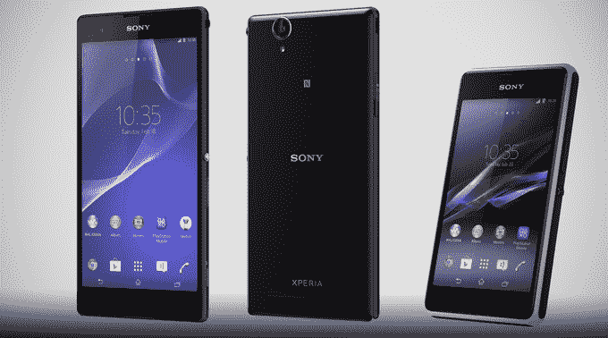

# 索尼凭借 Xperia T2 Ultra 和 Xperia E1 Android 手机加入其全球移动产品阵容 

> 原文：<https://web.archive.org/web/https://techcrunch.com/2014/01/13/sony-adds-to-its-global-mobile-lineup-with-the-xperia-t2-ultra-and-xperia-e1-android-phones/>

# 索尼凭借 Xperia T2 超和 Xperia E1 安卓手机增加了其全球移动产品阵容

索尼正在为其不断增长的设备系列增加两款智能手机。来看看 Xperia T2 Ultra 和 Xperia E1——这两款产品都是索尼 2013 年机型的重大更新。更好的是，这两款手机都有双卡版本。

这些最新的手机加入了上周在 CES 上宣布的 Z1S 和 Z1 的行列。然而，索尼似乎对这些产品并不感冒，因为它们有些普通，而且不是为美国市场设计的。此外，正如索尼从多年的经验中发现的那样，要“赢得”CES 需要集中和精简的公告，而不是众所周知的新闻稿传送带。

索尼对 T2 Ultra 的目的地很明确:这款手机面向中国、中东、非洲和亚太地区等新兴市场，新闻稿称。但这款手机并不缺乏任何实质性的东西。它集索尼最好的产品于一身，包括近乎无边框的设计，6 英寸屏幕和 1300 万像素摄像头。该手机的主要缺点是一个未公布血统的四核 1.4 GHz 骁龙。然而，由于这种较慢的 SoC 和 3000 毫安时电池，电池寿命可能是恒星。

E1 是混合中的廉价手机。它依赖于索尼的音频品牌，并配备了一个能够达到 100 分贝的扬声器，以防你想与不同办公楼的同事分享你对尼尔·杨的热爱。最前面是 4 英寸的屏幕，高于 2013 年初发布的 Xperia E 的 3.2 英寸。

不过，没有关于定价或发布日期的消息。索尼可能会保留这些信息，直到明年 2 月的世界移动通信大会。

凭借这些最新型号，索尼继续提供简化的设备阵容。该公司非常重视每个市场中的少数几款设备，而不像过去那样会有无数的 SKU 充斥市场。