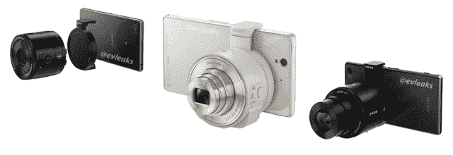
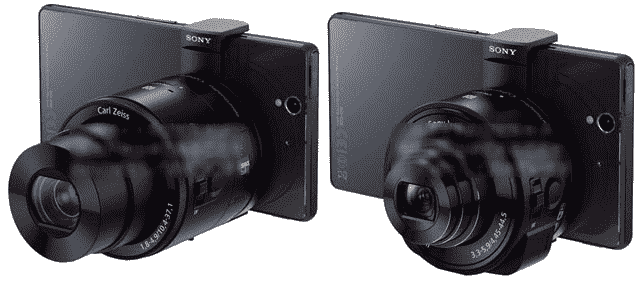

# 索尼希望你随身携带一个镜头 TechCrunch

> 原文：<https://web.archive.org/web/https://techcrunch.com/2013/09/03/sony-hopes-youll-carry-a-lens-in-your-pocket/>

# 索尼希望你能随身携带一个镜头

还记得你的智能手机摄像头不够好的时候吗？那次你想要一张稍微好一点的照片？你知道吗，那次你带着一个袖珍相机去上你孩子的空手道课或者重要的人的结肠镜检查。好吧。朋友，索尼很快就会为你推出一款产品！

索尼 QX10 和 QX100 继上个月的[惊喜亮相](https://web.archive.org/web/20221209021511/https://beta.techcrunch.com/2013/08/12/sonys-crazy-plan-to-improve-mobile-photos-involves-making-attachable-cameras-for-phones/)后，正从互联网的各个角落[泄露](https://web.archive.org/web/20221209021511/http://photorumors.com/2013/09/02/more-images-of-the-sony-dsc-qx10-and-dsc-qx100-lens-camera-modules-for-smart-phones/) [。这些产品基本上是一款相机的三分之二，旨在通过无线或坞站连接到智能手机。索尼创造了一个全新的系统，用一个新的传感器和玻璃取代了手机的摄像头。当然，是好是坏。](https://web.archive.org/web/20221209021511/https://twitter.com/evleaks/status/374984603783557120)

http://www.youtube.com/watch?v=HKGEEPIAPys

根据索尼 Alpha 的传言，QX10 将采用 1/2.3 英寸的 1800 万像素传感器，搭配 f/3.3-5.9 镜头。QX100 将拥有一个高质量的 1 英寸 2020 万像素 Exmor R 传感器和一个 f/1.8-4.9 卡尔·蔡司镜头。据报道，QX10 将为 250 美元，QX100 将为 450 美元。QX 系列基于出色的索尼傻瓜相机，QX10 看起来最像 WX150，QX100 则汲取了 RX100m2 的大部分魅力。

这个概念是可靠的，但市场可能不温不火。有了合适的软件，智能手机就能打包处理一张照片所需的所有物品。这些产品本质上允许智能手机捕捉更高质量的图像，更重要的是，更快地分享这些图像。

只是这些第一代机型太贵了。

让我们不要忘记这是以前做过的。Will.i.am 和 Fusion Garage(以及 CrunchPad 工程师)Chandra Rathakrishnan [用专注于时尚的 i.am+ foto.sosho V.5 击败了索尼的这个想法](https://web.archive.org/web/20221209021511/http://www.engadget.com/2012/11/28/will-i-am-iphone-accessories-hands-on/)，但它似乎从未上市。谢天谢地。这很可笑，从一开始就散发着一股蒸汽味。

索尼的拍摄更加合法和新颖。正如[克里斯解释的](https://web.archive.org/web/20221209021511/https://beta.techcrunch.com/2013/08/12/sonys-crazy-plan-to-improve-mobile-photos-involves-making-attachable-cameras-for-phones/)当产品首次开始在网上泄露时，索尼已经创造了一种产品，将相机硬件移出智能手机，创建了一个与设备无关的平台，并让消费者可以选择在未来的硬件上使用这种设备。

不要指望这些小镜头一推出就会大受欢迎。索尼大概没有。这显然是一个小批量的产品，旨在测试市场。但索尼最近又回到了缓慢而稳定的产品周期。该产品线是该公司移动和数字成像两大主要产品类别的巧妙结合。索尼将尽最大努力让消费者在口袋里携带一个镜头，而不是一个口袋里的射手。

