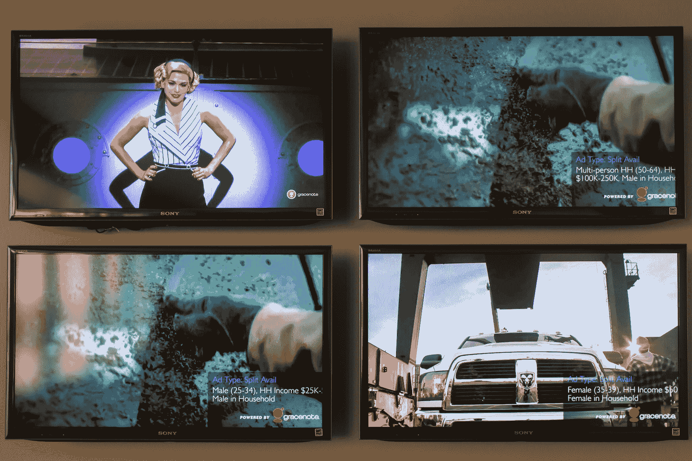

# 论坛报将以 1.7 亿美元收购索尼音频识别部门 Gracenote

> 原文：<https://web.archive.org/web/https://techcrunch.com/2013/12/23/sony-spins-out-gracenote/>

随着 Gracenote 的出售，全球消费电子集团索尼变得稍微精简了一些，grace note 是一个为许多设备制造商和媒体公司提供音频识别和元数据解决方案的业务部门。论坛报将斥资 1.7 亿美元收购 Gracenote，该交易预计将于 2014 年第一季度完成，并将与论坛媒体服务公司(Tribune Media Services)合并。

此次出售发生在索尼以 2.6 亿美元收购 Gracenote 的五年后。

### Gracenote 的音乐根源

Gracenote 成立于 20 世纪 90 年代末，为音乐行业提供音频指纹技术，当时唱片公司正在寻求遏制数字歌曲的大规模盗版。

该公司之前名为 CDDB，其业务转型为提供识别数字音乐播放器和程序上正在播放的歌曲的技术，并提供元数据，如与这些歌曲相关的艺术家和专辑信息。

如今，Gracenote 拥有超过 1.8 亿首歌曲的元数据，并用于苹果 iTunes、Rhapsody、Spotify 和 Xbox Music 等音乐服务的信息检索。它的数据库每天被查询超过 5.5 亿次，每月累计超过 160 亿次。

虽然论坛报和 Gracenote 客户的大部分重叠在视频领域，但音乐仍将是该公司整体业务的重要组成部分。

### 电视和第二屏幕应用的新机遇

在过去的 15 年里，Gracenote 围绕识别用户在笔记本电脑上和通过流媒体服务听的音乐建立了稳定的业务。然而，最近它也逐渐扩展到支持视频服务。

事实证明，可以应用于音乐的相同类型的自动内容识别(ACR)软件也可以用于识别电视上正在发生的事情。Gracenote 已经在几个领域应用了这项技术:首先是根据用户资料向观众提供动态的个性化广告，其次是支持第二屏幕的社交电视应用。

在前一种情况下，Gracenote 正在与 LG 等电视制造商合作提供 ACR 功能，同时还与视频广告公司合作动态插入广告。它还试图让网络和品牌加入进来，开始提供更加个性化的广告信息。

在后一种情况下，该公司已经向第三方应用程序开发人员提供了 API，这些开发人员希望知道电视上正在播放什么，并围绕这些内容提供适当的内容。Zeebox 就是一个例子，它在今年早些时候被列为客户。

在这两种情况下，论坛报将 Gracenote 与 TMS 相结合，以帮助增强其娱乐元数据服务。这两家公司已经是合作伙伴，TMS 数据集已经整合到 Gracenote 的视频产品中。

### 索尼缩减开支

对索尼来说，出售是因为它试图降低成本，重新将精力集中在硬件和制造上。母公司 10 月份宣布季度亏损近 2 亿美元，并因此降低了全年收益预期。

索尼一直在削减其媒体业务，并受到投资者丹尼尔·勒布(Daniel Loeb)的压力，要求剥离娱乐部门。因此，摆脱 Gracenote 是有意义的，它不仅为索尼提供技术，也为消费电子领域的许多竞争对手提供技术。

在短期内，我被告知 Gracenote 团队不会有太大变化。作为一项业务，它在很大程度上独立于作为母公司的索尼，并将继续作为 TMS 的一部分作为一个独立的业务部门运营。然而，随着时间的推移，两家公司将寻求协同效应，使它们的关系更加紧密。