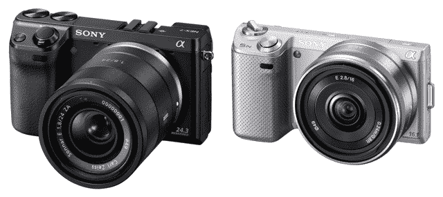
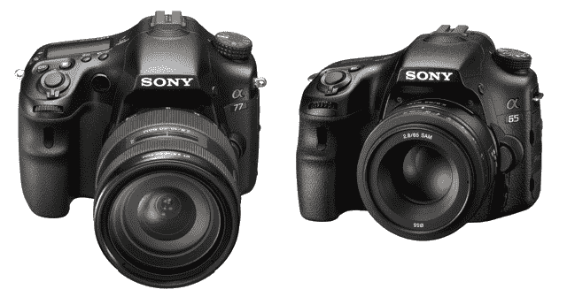

# 索尼用 NEX-5N、NEX-7、A65、A77 更新阿尔法和 NEX 产品线 

> 原文：<https://web.archive.org/web/http://techcrunch.com/2011/08/23/sony-updates-alpha-and-nex-line-with-nex-5n-nex-7-a65-a77/>

在过去的几个月里，很难避免关于索尼数码相机新系列的新闻。一个又一个漏洞暴露了机身设计、镜头、传感器尺寸和其他规格。不过，它们现在都是官方的，虽然我不会让你具体分析哪些谣言时断时续，但我会说它们大多是关于金钱的。新装备看起来也很有前途。

让我们来看看新的相机系列。我会尽量简洁；相机规格的比较往往会拖延，如果你想近距离比较，一个专门的摄影设备网站将为你提供所有信息，让你在闲暇时细读。这将是一个总结。

600 美元的 NEX-5N 和 1200 美元的 NEX-7 得到了铰接液晶显示屏，NEX-7 得到了一个新的 24MP APS-C 传感器(5N 是 16MP APS-C)。两者现在都可以录制 60、30 或 24fps 的完整 1080p，或 30 时的 640×480，但没有 720p。7 还内置了一个可爱的 1024×768 有机发光二极管 EVF，这是整个系列的主要特征之一。它在机身上也有更多的手动控制:顶部有两个控制光圈等的转盘。除了百万像素的差异之外，它们的功能基本相同，当然这些功能在 7 上更容易使用。

如果你想要 EVF，但不想花大钱，你可以花 350 美元买 FDA-EV1S，它似乎与 7 的规格相同。NEX-5N 将于下个月上市，NEX-7 将于 11 月发货。

售价 900 美元的 A65 和售价 1400 美元的 A77 也可以获得 1024×768 的电子取景器，并且都可以拍摄 2400 万像素的照片。A77 有更好的连拍率，更多的自动对焦点，更高的 ISO 能力，它的 LCD 更可调。闪光灯更好、更宽、更快。在机身上，A77 有一个后拨盘(专业人士不可或缺的功能)，和一个操纵杆，而不是圆形的 d-pad。这可能有点*太*简洁，但不深究细节，这些是主要的区别。

这款相机将于 10 月上市。

* * *

我的看法？如果你坚持的话。

这些是非常令人信服的规格。如果我没有在佳能投资到…我宁愿不说…我会跳上这些。然而，NEX-5N 对我来说，没有那些顶部转盘或 EVF，似乎不是很有吸引力。如果它只有一个，这将是一个更现实的购买。事实上，我认为 NEX-7 可能不会辜负它 1200 美元的价格。可惜上面的蔡司镜头不够紧凑，不过，把这样一个庞然大物的镜头放在上面是对纤细机身的浪费。

至于单反相机——如果你可以没有后拨盘，并且不太依赖多个自动对焦点或闪光灯(也就是我多年来拍摄的方式)，A65 绝对是更好的选择。你得到的是基本相同的机身，完全相同的传感器，以及 A77 80%的功能…而且还减去了 4 盎司的重量！

我们会尽快把这些放到我们的小手里进行检查。与此同时，我认为 NEX 7 号刚刚成为我新的渴望对象。