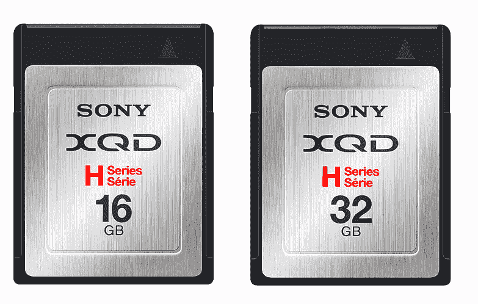
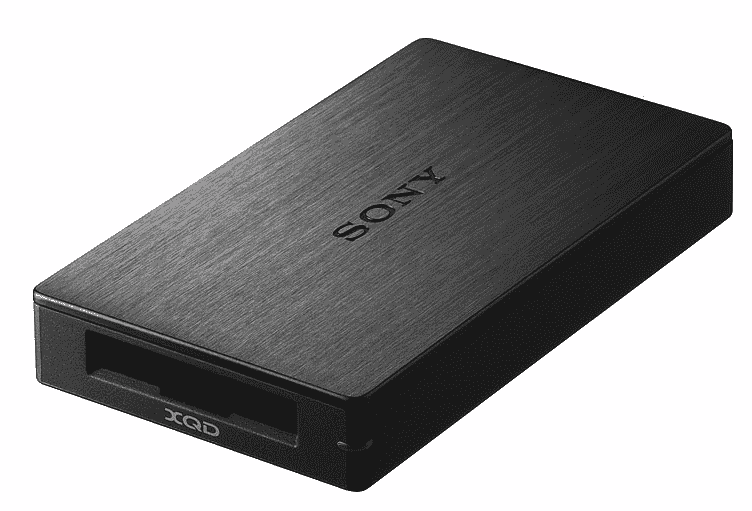
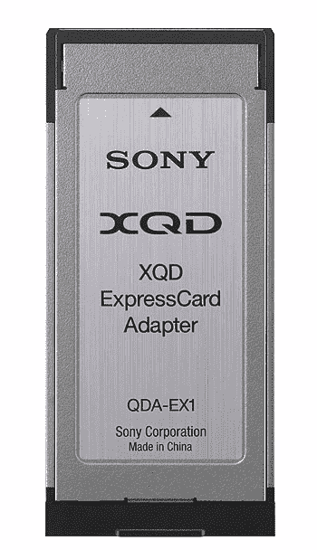

# 索尼宣布推出世界首款 XQD 存储卡

> 原文：<https://web.archive.org/web/https://techcrunch.com/2012/01/06/sony-xqd-memory-cards/>

# 索尼宣布推出世界首款 XQD 存储卡

你准备好接受另一种存储卡格式了吗？Sandisk、索尼和尼康在 2010 年 11 月首次发布了这种被称为 XQD 的介质。在 CompactFlash 协会上个月确定了规格之后，索尼今天发布了世界上第一张 T2 XQD 卡。

除了兼容 XQD 的读卡器(USB 3.0)和 ExpressCard 适配器之外，还将提供两种版本的卡。以下是索尼美国公司的一些细节:

*   QD-H16 卡，16 GB，129.99 美元
*   QD-H32 卡，32 GB，229.99 美元
*   读卡器，MRW E80，44.99 美元
*   ExpressCard 适配器，QDA-EX1，44.99 美元

索尼表示，这些卡的读写数据传输速率高达 1Gbps/125MB/s。来自新闻稿:

> 使用 XQD 存储卡，XQD 兼容的高端 DSLR(数码单镜头反光)相机用户可以在连续拍摄模式下以 RAW 格式拍摄多达约 100 帧。除了出色的高速数据传输能力之外，新卡在保护用户数据和图像方面也非常可靠。

索尼计划下个月推出 XQD 存储卡、阅读器和适配器。