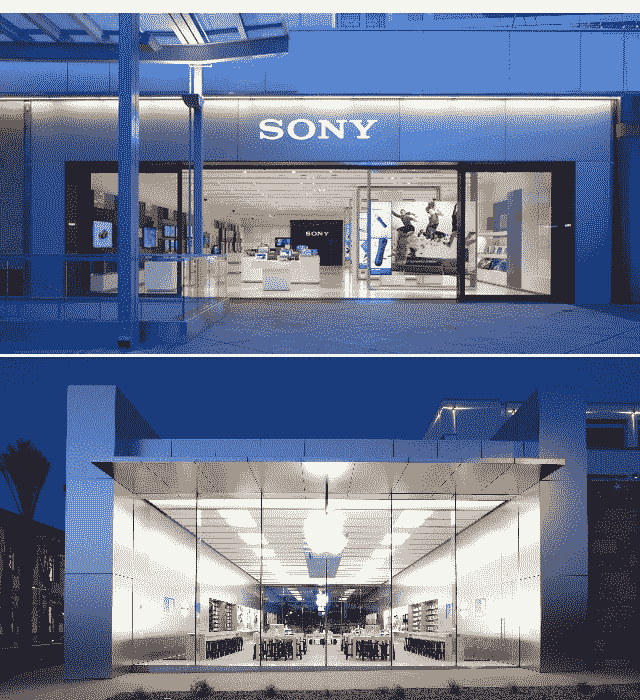
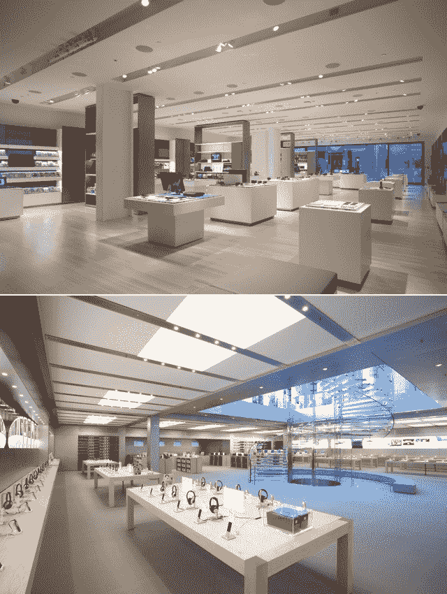
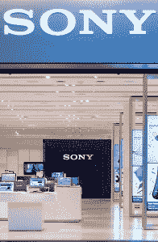

# 索尼最新零售战略:追随苹果 TechCrunch

> 原文：<https://web.archive.org/web/https://techcrunch.com/2011/11/30/sonys-latest-retail-strategy-follow-apples-lead/>

正如首席运营官·菲尔·莫利纽克斯今天上午在纽约市的新闻发布会上所概述的那样，索尼正在大力推进零售业务。当他用那可爱的英国口音解释索尼的零售计划时，有一件事一直在我脑海中闪现:苹果。

在许多方面，索尼的零售战略似乎是从过去几年苹果店内的成功中得到启示。这并不是说索尼在不择手段地抄袭苹果。即使从商业角度来看，索尼的重点也正在转向支持其媒体平台的产品，这正是苹果所做的。尽管如此，索尼似乎在以自己独特的方式效仿苹果(无论是在商业还是零售领域)。

4 月，索尼在洛杉矶世纪城开了第一家官方“索尼商店”(与索尼风格的商店相反，索尼商店正在被索尼商店取代)。简单地说，它非常漂亮。这也与苹果在零售店采取的方法惊人地相似。产品陈列在一个相对开放的地板上，中间只被普通的白色桌子和一排巨大的落地式显示器打断。从外面，你可以透过一个完全玻璃的店面看到几乎每个角落和缝隙，在后面你会发现一个专用的小模块，在那里你可以获得完整的索尼家庭娱乐体验。

在许多方面，这遵循了苹果的店内策略。最令人心酸的是，苹果公司在它建造的每一家商店里都使用了大量的玻璃，无论是在商店门前还是楼梯上。事实上，我与苹果零售店背后的建筑师彼得·博林(Peter Bohlin)进行了交谈，他说苹果公司引进了高度专业化的工程师，以尽可能将商店中使用的玻璃设计得简约而无缝。显然，许多店面都有玻璃面板显示屏，但在玻璃面板上做得更大是典型的苹果风格。

然后当然还有索尼的露天布局。苹果不一定会因为这个平面图居功，所以我不会说索尼是在直接模仿那个风格。但是如果你仔细想想，很少有电子产品制造商拥有强大的自有品牌零售业务(当然，除了苹果和现在的索尼)。也就是说，实际上只有两种模式可供选择:百思买风格的布局(产品杂乱地排列在货架上)或苹果的布局(这是一种美丽的东西)。正如我们所有人在试图创造新的和原创的东西时所做的那样，索尼很可能在设计过程中借鉴了它已经知道的东西，而苹果的零售策略显然产生了影响，不管这是不是有意识的。

但是，商店不仅仅是玻璃店面和堆满小配件的大房间。一家成功的零售店拥有无与伦比的客户服务——这也是苹果蓬勃发展的领域。索尼的计划是向客户提供优质服务，莫利纽克斯称之为“走出去工作”的概念。这包括在顾客离开商店之前为他们提供安装和教育、设备个性化、任何无线服务的激活、技术 PC 和 IT 支持，以及上门咨询、交付和安装。听起来熟悉吗？就像，哦我不知道，苹果的天才吧？

几年前，当我第一次转向苹果电脑，并给自己买了一台 MacBook Pro 时，一个所谓的“天才”开始问我一些意想不到的问题。第一个问题是:“你想让我用你的用户名和密码来设置吗？”第二个问题是:“我看到您已经购买了 Pages、Keynote 和 Numbers。你想让我尽快帮你安装吗？”他接着给了我一个关于个性化的快速教程，如何照顾我的新宝石，以及在 OS X 中提高效率的最佳方法。

同样，我不是说苹果在电子行业创造了良好的客户服务，但在我拿到 MBP 之前，我甚至不知道当我的电脑出故障时该怎么办。我是不是在黄页上随便找了个电脑高手？我*可以*把它送回制造商那里检查，但是那要花多长时间？在转换到苹果和它的天才吧之后，像这样的事情不再是问题。未来的索尼消费者也会有同样的感受。

 但是索尼也有一些独特的锦囊妙计，包括一种叫做[“黄金商店”的东西](https://web.archive.org/web/20221028223204/http://www.twice.com/article/461814-Fry_s_Opens_Second_Golden_Spaces_Sony_Shop.php)现在，黄金商店这个术语将不再是你在店面横幅上看到的东西，而是索尼公司内部使用的一个术语，用来指定哪些商店有特别销售活动。例如，某些销售索尼产品的大型零售商现在将有专门的索尼销售代表四处帮助客户，并培训零售商的员工如何以最佳方式向消费者介绍索尼。黄金商店的另一个例子是带有专用家庭娱乐模块的商店。

简而言之，索尼似乎正在从苹果的成功中学习，并以一种略微索尼化的方式发展。这对索尼来说是一个相当好的消息，因为根据 Bohlin 的说法，苹果在建筑设计方面真的无法超越。“我把(苹果的设计)视为一种态度和信念。人们可以模仿它，但我怀疑他们会把它开到那种完美的程度。完美是不容易达到的。你应该做得如此出色，以至于它似乎很容易。”

索尼目前有 46 家零售店开业，包括索尼商店和直销店。你可以点击查看完整的地点列表[。](https://web.archive.org/web/20221028223204/http://store.sony.com/webapp/wcs/stores/servlet/CategoryDisplay?catalogId=10551&storeId=10151&langId=-1&identifier=S_SonyStyle_Store_Listing)