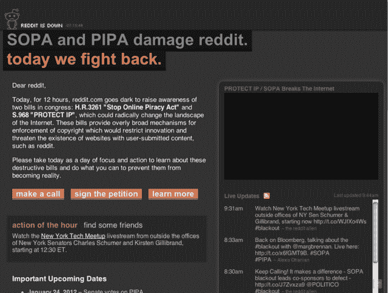
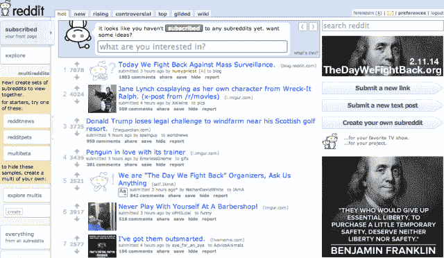
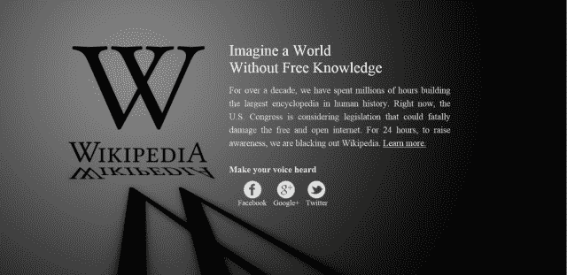
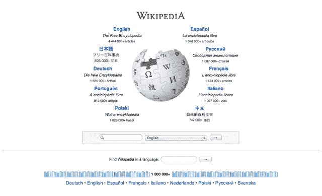
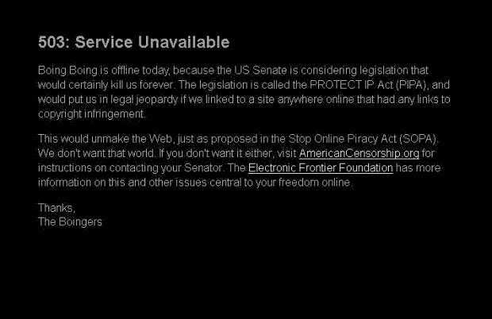
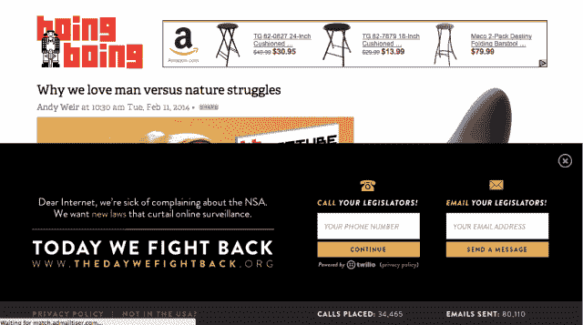
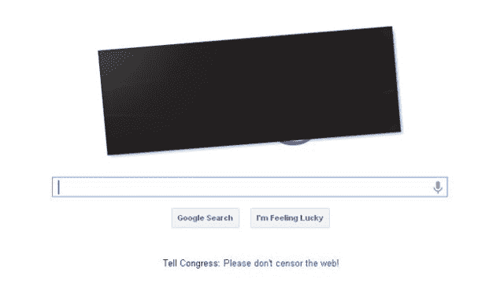
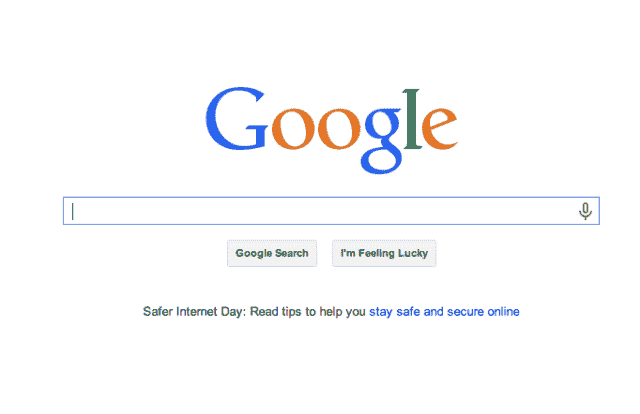
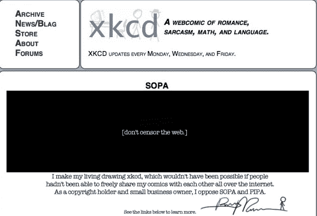
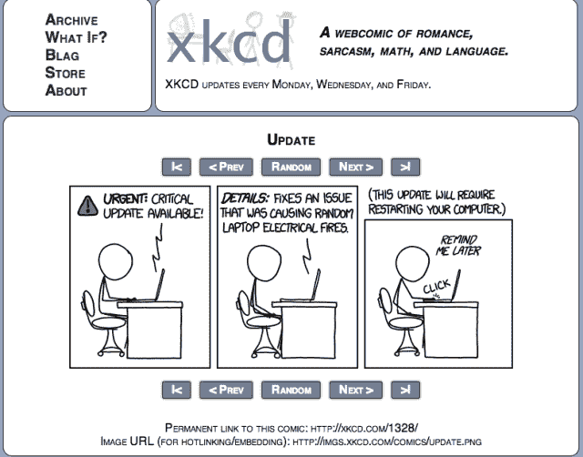

# SOPA 对美国国家安全局的抗议，图片 

> 原文：<https://web.archive.org/web/https://techcrunch.com/2014/02/11/sopa-vs-nsa-protests-in-pictures/>

# SOPA 对国家安全局的抗议，图片

今天，一个网站联盟承诺在互联网范围内对国家安全局进行抗议，类似于反对《停止在线盗版法案》的[大规模停电](https://web.archive.org/web/20221208074044/https://beta.techcrunch.com/2011/12/22/over-40-internet-companies-have-come-out-publicly-against-sopa/) (SOPA)。每一家主要的互联网公司[都站出来强烈反对大规模收集互联网和电话数据，那么今天针对 SOPA 的抗议怎么样呢？在这里，在头版的图片中(SOPA 在上面，国家安全局在下面):](https://web.archive.org/web/20221208074044/https://beta.techcrunch.com/2013/12/08/tech-companies-outline-more-nsa-reform-demands/)

**流行内容聚合网站 Reddit**

SOPA 抗议

国家安全局抗议

**维基百科，众包百科**

SOPA 抗议

国家安全局抗议

**Boing Boing，网络新闻与文化博客**

SOPA 抗议

国家安全局抗议

**谷歌、搜索引擎和许多其他东西**

SOPA 抗议

美国国家安全局抗议([谷歌的确发布了一篇博客解释他们的立场](https://web.archive.org/web/20221208074044/http://googlepublicpolicy.blogspot.com/2014/02/its-time-to-reform-government.html)

**XKCD，超级牛逼的网络漫画**

SOPA 抗议

国家安全局抗议([链接到更新软件](https://web.archive.org/web/20221208074044/http://xkcd.com/1328/)上今天的漫画)

**大都被制服，略有不同的** 

国家安全局的抗议在战略上不同于 SOPA。在 SOPA 期间，各大网站完全将其网站下线或涂黑其首页。今天的抗议在屏幕的下半部分放置了一个更简单的行动呼吁，比如联系国会代表的方式。

但是，无论如何，你切战略，今天是更加柔和。可以肯定的是，这不是第一次与公民自由相关的抗议未能捕捉到同样的 SOPA 愤怒，无论是来自盈利还是非盈利网站。

在最后一次反对失败的网络安全法案的尝试中，reddit 的联合创始人 Alexis Ohanian 向我解释说:“最大的原因是 sopa/pipa 提供的关闭我们热爱的东西(如 Reddit，所有社交媒体等)的迫在眉睫的威胁。然而，可悲的是，第四修正案对网络隐私权的抹杀并不那么明目张胆，因此更难团结起来。”