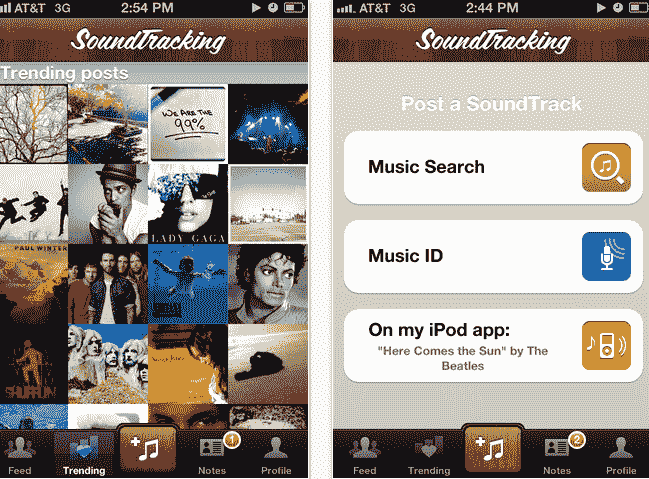
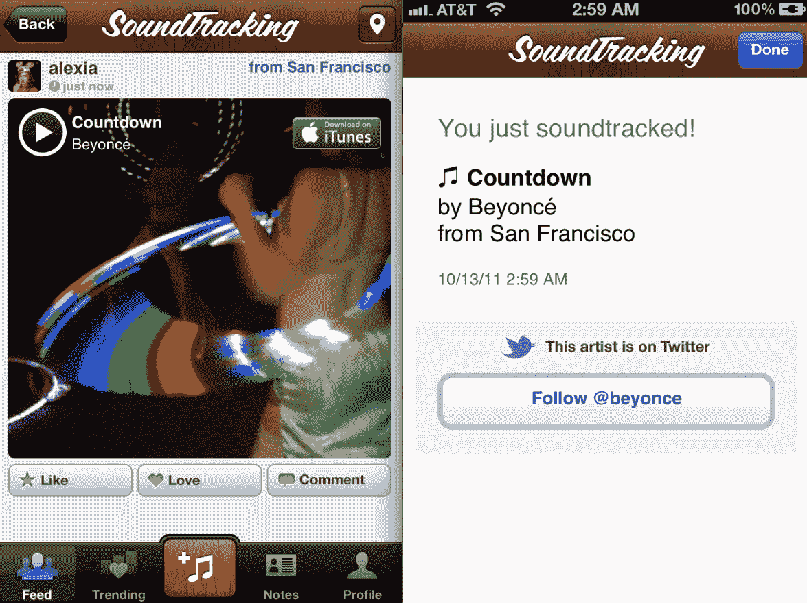

# iOS 5 的 SoundTracking 2.0 在您分享歌曲时会提到艺术家 TechCrunch

> 原文：<https://web.archive.org/web/http://techcrunch.com/2011/10/13/soundtracking-2-0-for-ios-5-replies-an-artist-when-you-share-their-song/>

# iOS 5 的 SoundTracking 2.0 在你分享歌曲时会提到艺术家

音乐时刻分享应用[声音追踪](https://web.archive.org/web/20230203145425/http://itunes.apple.com/us/app/soundtracking/id414323798?mt=8)今天加入了苹果应用商店[的其他八个特色应用](https://web.archive.org/web/20230203145425/http://ios.twitter.com/)，凸显了其与 Instagram 和 Flipboard 的深度 iOS 5 Twitter 集成。

iOS 5 的新 SoundTracking 在 Twitter 集成方面有着常见的嫌疑，允许用户自动登录并使用新的漂亮的 Tweet Sheet 功能定制他们的 SoundTracking tweets(例如去掉标签 [#soundtracking](https://web.archive.org/web/20230203145425/https://twitter.com/#!/search/%23soundtracking) )。

https://twitter.com/#!/Steve jang/status/124267769335263232

除了基本的用于 iOS 的 Twitter 内容和简化的用户界面(以及一个“光滑的木头配乐按钮”)，SoundTracking 2.0 还允许你将歌曲发布到脸书粉丝页面，这意味着像品牌或艺术家页面这样的东西的多个管理员现在可以配乐。

然而，比新的脸书集成、授权和定制功能更有趣的是，SoundTracking 2.0 允许你在应用程序内关注你在 Twitter 上听的艺术家——例如，在你对她的一首歌进行了配乐之后，你可以选择关注@Beyonce。此外，当用户在推特上发布原声音乐时，SoundTracking 会自动@提及某个艺术家，如果这个艺术家在推特上的话。

这个功能本身对 SoundTracking 的规模来说就意味着很多，让这款在 7 个月后下载量刚刚超过 75 万次的应用进入了拥有大量 Twitter 粉丝的音乐人的视野，如 [@ladyGaga](https://web.archive.org/web/20230203145425/http://www.twitter.com/ladygaga) 和 [@KanyeWes](https://web.archive.org/web/20230203145425/http://www.twitter.com/kanyewest) t。至少自动@提及是一种简单而出色的方式，可以促进粉丝和艺术家之间的联系。

Schematic Labs 的联合创始人 [Steve Jang](https://web.archive.org/web/20230203145425/http://www.crunchbase.com/person/steve-jang) 告诉我，这些更深层次的整合是合适的，因为音乐跟踪用户似乎无法从 Twitter 上获得足够的关注(他说，该应用程序目前是关于音乐服务的最多推文)。

Jang 计划进一步扩展 soundtrack 的社交功能，并正在研究其他令人兴奋的 APIs 如果 Spotify 用户可以在应用程序内收听整首歌，或者将 soundtrack 的歌曲添加到 Spotify，以便进一步收听，我会很高兴。

