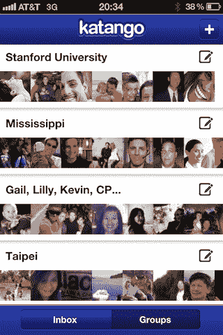

# 来源:谷歌正在谈判收购 Katango 

> 原文：<https://web.archive.org/web/http://techcrunch.com/2011/09/28/source-google-in-talks-to-acquire-katango/>

# 来源:谷歌正在谈判收购 Katango

我们听说谷歌正在谈判收购凯鹏华盈支持的初创公司 [Katango](https://web.archive.org/web/20230205011530/http://www.katango.com/) ，该公司使用算法自动将你的朋友分类到不同的群组，用户只需很少的努力(见我们关于他们的发布的完整帖子[这里](https://web.archive.org/web/20230205011530/https://techcrunch.com/2011/07/11/kleiner-backed-katango-automatically-organizes-your-facebook-friends-into-groups-for-you/))。

Katango 显然非常适合谷歌(事实上，我们听说自从他们在七月[推出](https://web.archive.org/web/20230205011530/https://techcrunch.com/2011/07/11/kleiner-backed-katango-automatically-organizes-your-facebook-friends-into-groups-for-you/)以来，谷歌一直对该公司感兴趣)。为什么？因为 Google+围绕着把你的朋友分成不同的圈子，可以是熟人，家庭成员，等等。但是在这一点上，虽然 Google+很擅长告诉你谁是你可能认识的人，但是它不会建议你把他们放在这些圈子中的哪一个。

Katango 接受这笔交易也很有意义。在推出时，该服务与脸书连接紧密集成，但脸书最近推出了智能列表，基本上做同样的事情(脸书有更多的数据可用于生成其列表)。

到目前为止，Katango 已经筹集了 200 万美元。我们联系了这家初创公司，但尚未收到回复，我们会及时更新。

