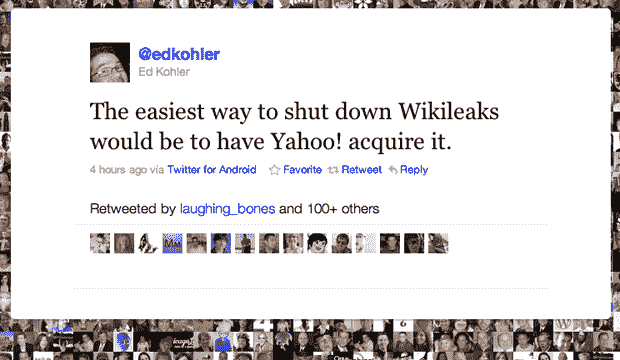

# Spabba 给你的 Del.icio.us 书签一个新家

> 原文：<https://web.archive.org/web/https://techcrunch.com/2010/12/16/spabba-gives-your-del-icio-us-bookmarks-a-new-home/>

# Spabba 给你的 Del.icio.us 书签一个新家

[Spabba](https://web.archive.org/web/20230307213249/http://www.spabba.com/) 是由 [Blippy](https://web.archive.org/web/20230307213249/http://www.blippy.com/) 联合创始人 [Philip Kaplan](https://web.archive.org/web/20230307213249/http://www.crunchbase.com/person/philip-kaplan) 快速整合的一项服务，帮助你保存你所有的 [Del.ic.io.us](https://web.archive.org/web/20230307213249/http://del.icio.us/) 书签，以防[时日无多](https://web.archive.org/web/20230307213249/https://techcrunch.com/2010/12/16/is-yahoo-shutting-down-del-icio-us/)。Kaplan 在 Safeway 杂货店购物时，使用 iPhone 上的 FTP 程序编写了大部分 Spabba 代码。

虽然有相当多的服务(包括雅虎自己)可以让你导出美味的书签，但是 Spabba(你可能不应该谷歌)也可以让你导出标签，可以搜索，而且只需 30 分钟就可以完成。虽然该服务目前只支持雅虎 Del.icio.us 之前的账户，但卡普兰计划在雅虎之后提供支持，如果有足够的需求，还会提供导出功能。

斯帕巴绝对是美国草根怀旧风潮的一部分。似乎就在昨天，我们还在报道这次收购，而现在……像[“美味的苹果:你对我来说是如此美丽”，](https://web.archive.org/web/20230307213249/http://www.readwriteweb.com/archives/rip_delicious_you_were_so_beautiful_to_me.php)[# save Delicious](https://web.archive.org/web/20230307213249/http://search.twitter.com/search?q=%23savedelicious)标签和[网站](https://web.archive.org/web/20230307213249/http://www.savedelicious.com/)以及像[这样雄心勃勃的推文](https://web.archive.org/web/20230307213249/http://twitter.com/#!/j_hodges/status/15536938610065408)都在说同样的事情。

嘿，雅虎，杀死这个比保留它更伤害你的品牌。

