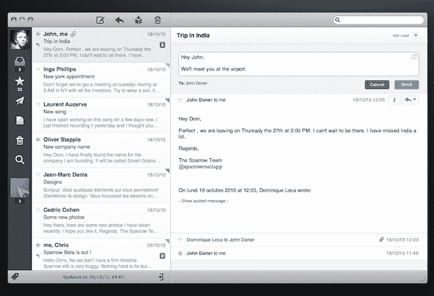
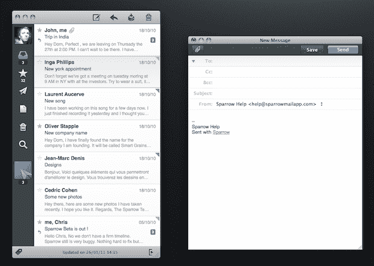

# 美丽的 Mac 电子邮件客户端 Sparrow 飞进了 Mac App Store——并获得了 TechCrunch 的资助

> 原文：<https://web.archive.org/web/http://techcrunch.com/2011/02/09/sparrow-mac-mail-app/>

# 美丽的 Mac 电子邮件客户端 Sparrow 飞进了 Mac 应用商店——并获得了资助

回到去年 10 月，我们写了关于 [Sparrow](https://web.archive.org/web/20230203003400/http://www.sparrowmailapp.com/) ，一个漂亮的[Mac 新邮件客户端](https://web.archive.org/web/20230203003400/https://techcrunch.com/2010/10/05/sparrow-mac/)。但是，鉴于现在大多数邮件客户端都是基于网络的，Sparrow 决定是时候再次专注于创造一个伟大的原生电子邮件体验了。今天，这场赌博似乎有了回报。Sparrow 1.0 刚刚在 Mac App Store 推出，它立即成为包括美国在内的全球许多国家的头号付费应用

考虑到这款应用售价 9.99 美元，这个成绩对 Sparrow 来说意义重大。但是绝对值得。正如我们在最初的评论中所写的，Sparrow 是一个以 Gmail 为中心的客户端，它为电子邮件带来了一个用于 Mac 的 Tweetie(现在是用于 Mac 的 Twitter)外观和感觉。当时，它仍处于测试阶段，我们注意到有一些性能问题。但是大部分问题现在已经解决了，并且增加了一系列新功能，包括对 Gmail 标签的全面支持。

你可能还会注意到，他们已经把“for Gmail”从他们的 logo 中去掉了。这是因为虽然该产品目前仍只支持 Gmail，但 1.1 版(即将推出)将为其他主要邮件服务提供 IMAP 支持。因此，它将能够成为一个功能齐全的邮件客户端。

今天对 Sparrow 来说还有更多好消息——他们筹集到了资金。这项服务已经从投资 Paper.li、Rapportive 等公司的法国风险投资公司 Ventures 筹集了种子资金。Sparrow 的联合创始人多姆·勒卡拒绝透露融资金额，但他对这笔资金可能带来的可能性感到非常兴奋。

他还应该对他们从 Mac 应用商店获得的收入所带来的可能性感到兴奋。虽然已经有一些 Mac 应用程序商店取得了成功(Evernote 跃入脑海)，但如果一个销售 10 美元邮件客户端的小型独立应用程序制造商能够获得突破，它将让许多其他开发者对商店的潜力抱有希望。

你可以在苹果应用商店[这里](https://web.archive.org/web/20230203003400/http://itunes.apple.com/us/app/sparrow/id417250177?mt=12)找到麻雀。

