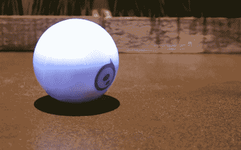

# Sphero 2.0 比 TechCrunch 快两倍，更敏捷，更棒

> 原文：<https://web.archive.org/web/https://techcrunch.com/2013/08/14/sphero-2-0-is-twice-as-fast-agile-and-awesome/>

为下一代玩球做好准备。

Orbotix 的机器人球 Sphero 现在已经长大了一点，该公司今天发布了 Sphero 2.0。

Sphero 2.0 的速度是第二代的两倍，滚动速度约为每秒七英尺，亮度是第一代球的三倍。据联合创始人兼首席软件架构师亚当·威尔逊称，第二代机器人不仅更快更强，实际上更智能。

Sphero 2.0 现在配备了一个不同的用户界面，让你在越来越多地控制球时“升级”。当你开始时，你的速度会有所限制。你完成的挑战越多(比如在没有撞到任何东西的情况下开了整整一分钟)，你的 Sphero 就会滚动得越快，你可以使用的 LED 颜色就越多。

即使使用其他 Sphero 游戏，如 tag，也可以升级并获得更高的速度。

除了升级的机器人，Sphero 2.0 还配有一个感应充电器和两个开箱即用的小斜坡，所以你可以工作来获得一些空气。

作为一个附加的配件，你还可以拿起 Orbotix 公司的人称为“Nubby Protector”的东西，这是一个小小的橡胶盖，给 Sphero 带来一些额外的牵引力，特别是当你在游泳池里玩耍的时候。封面有红色、透明、蓝色或黄色。

但是 Sphero 2.0 并不是唯一一个四处奔波的机器人——Orbotix 也推出了 Sphero Revealed，这是一款苹果专属版本的设备，它有一个部分透明的外壳，因此用户可以看到机器人的内部工作。

Sphero 2.0 旨在接触新的人群。显然，书呆子和技术极客倾向于 Sphero，认为它是市场上更先进的消费机器人之一。但 Orbotix 希望触及更年轻的孩子，他们似乎自动喜欢升级的想法，并给他们的 Spheros 一个身份。

此外，与更年轻的人群合作可以为 Sphero 提供更多的教育机会。

Sphero 2.0 目前兼容多达 25 种不同的应用程序和游戏，以及标准的 Sphero 应用程序。

[gallery columns="4" ids="861388，861389，861390，861381"]

根据 Wilson 的说法，新型号之间的[两年间歇期大约是我们应该对 Orbotix 前进的预期，但这并不意味着他们没有在其他事情上工作。Wilson 透露公司正在筹备一些东西，包括将在 1 月份的](https://web.archive.org/web/20221206121149/https://beta.techcrunch.com/2011/09/14/sphero-sports-new-body-rolls-closer-to-official-release/) [CES 上展示的东西。所以有很多值得期待的。](https://web.archive.org/web/20221206121149/https://beta.techcrunch.com/2013/01/10/sphero-and-augmented-reality-made-for-each-other/)

如果你有兴趣购买售价 129.99 美元的 Sphero 2.0，从今天开始预购，8 月 31 日开始在店内供应。如果你真的对看到 Sphero 的内部感到兴奋，坚持到 9 月 4 日，你可以在苹果商店买到半透明的 Sphero。

最初的 Sphero 零售价也将降至 109.99 美元。

