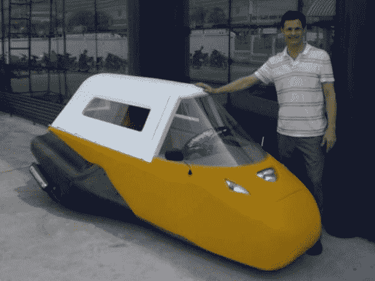

# Spira4u:泡沫制成的汽车跑得快，跑得远，还能漂浮 TechCrunch

> 原文：<https://web.archive.org/web/https://techcrunch.com/2009/05/15/spira4u-car-made-of-foam-goes-fast-far-and-floats/>

# Spira4u:泡沫制成的汽车跑得快，跑得远，还能漂浮

与其依靠超人的力量，通过恐慌引起的肾上腺素激增来把你的车抬离地面，为什么不一开始就买一辆只有 300 磅重的车呢？“Spira4u”就是这样一辆车，大部分(90%)由 6 英寸的泡沫制成，最高时速为 70 英里。哦，一加仑能跑 100 英里。

如果这还不足以达成交易，你应该知道 Spira4u 可以浮动。并不是说你真的可以用它在湖里开车，但是如果你从天桥上掉到湖里，你和你的车不会沉到底。

如果 10 英尺长，5 英尺宽，4.3 英尺高的汽车看起来有点拥挤，你可以拆除 30 磅重的车顶来呼吸新鲜空气。以免你认为这不是一辆家用车，Spira4u 有双人座位安排的空间。确保你的家庭最多只有两个人。

Spira4u [目前正在参加](https://web.archive.org/web/20221210053341/http://www.progressiveautoxprize.org/teams/spira)的进步汽车 X 大奖(Progressive Automotive X Prize)竞赛，创造者 Lon Ballard 计划在他在台湾拥有的一家工厂生产这款车。不过，还没有确切的价格或可用性的消息。

这是 Spira4u 像甜甜圈一样倾斜的视频:

【YouTube http://www.youtube.com/watch?v=LSeYDknknpo&hl=en&fs=1]

[spira 4u【Spira4u.com】经由](https://web.archive.org/web/20221210053341/http://spira4u.com/index.html)[连线](https://web.archive.org/web/20221210053341/http://www.wired.com/autopia/2009/05/foamy/)