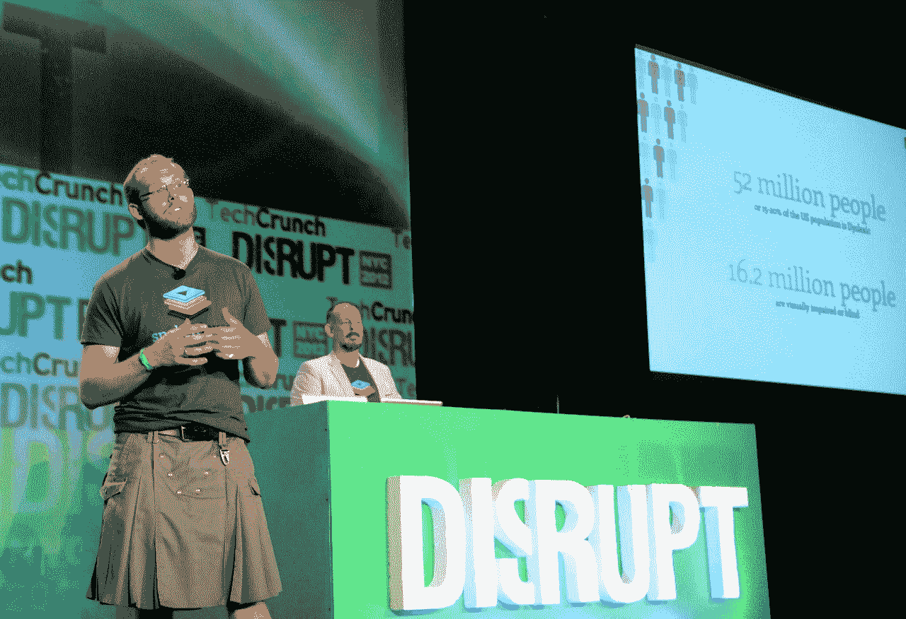

# 发言人希望在网络上增加声音 TechCrunch

> 原文：<https://web.archive.org/web/https://techcrunch.com/2012/05/21/spokenlayer-wants-to-add-voice-to-the-web/>

如果你不能只是在你最喜欢的博客或新闻网站上阅读一篇文章，还能听到作者或专业配音人员大声朗读它，那会怎么样？这就是今天在 [TechCrunch Disrupt](https://web.archive.org/web/20221224192332/https://techcrunch.com/events/disrupt-ny-2012/live-video/) 发布公开测试版的[发言人](https://web.archive.org/web/20221224192332/http://spokenlayer.com/)正在做的事情。这家总部位于纽约的初创公司与许多知名出版商合作，包括《大西洋月刊》、《国家日报》、Engadget 和 TechCrunch。SpokenLayer 目前只能作为 iOS 应用程序使用，但该公司计划很快添加其他平台。

speaken layer 与你的普通文本到语音引擎不同的是，该公司与专业的语音人才合作，并且还让作者录制自己的文章。作家可以使用该公司的 iOS 应用程序来记录他们的文章，或者如果他们家里有更好的音频设备，可以通过 SpokenLayer 的网站进行记录。

正如该公司的创始人兼首席执行官威尔·梅奥上周告诉我的那样，SpokenLayer 计划在不久的将来与更多的优质出版商签约，但同时也在开发其自助服务平台。毕竟，从长远来看，与语音人才合作并不是一件好事(尽管该公司可以从纽约的本地人才库中汲取大量人才)。该公司还鼓励作者录制自己的文字。梅奥说，这可以让读者与作者建立更亲密的联系，作者也可以使用这个工具来强调文本中的一些细微差别。

由于在一篇文章发表的时间和发言人可以录制它的时间之间显然有一点滞后，该公司首先向听众提供一篇文章的基本文本到语音的版本，并在录音可用时立即替换它。梅奥告诉我，他非常清楚如今故事在网络上传播的速度，并承诺在故事有机会传播之前就发布高质量的录音。

正如梅奥告诉我的，代言人背后的想法是出于他自己的需要。他自己就患有诵读困难症，他是听着书籍和教科书的音频长大的。然后，在完成研究生学业后，他开始从事 SpokenLayer 的工作，他希望这将使“一些[他]发现对有史以来出版的最大的内容体——网络——非常有用的东西。”

到目前为止，SpokenLayer 已经启动，目前有四名员工。

## 扰乱问答:

**问**:你们支持多少种语言？

目前它只有英文版本。

问:为什么你认为播客从未实现他们的承诺？

发行是个问题，它从未真正成为主流

**问**:添加到出版商的网站有多难？

**答**:发布者可以使用收听按钮，但最简单的方法是发布者向发言人提供他们的 RSS 源，并在应用程序中出现。

问:录制他们的文字需要出版商的许可吗？

答:这是一个灰色地带，但这就是为什么 SpokenLayer 与一小群出版商合作。

**问**:创始人是怎么认识的？

我们偶然相遇，并在各种黑客马拉松和其他活动中相遇。