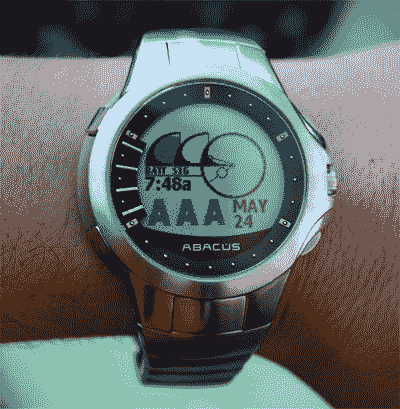

# 现货手表已死 TechCrunch

> 原文：<https://web.archive.org/web/https://techcrunch.com/2008/04/24/spot-watches-dead/>

抱歉，现货粉丝。MSN Direct 不再在手表上添加 SPOT 技术(T2 ),并且基本上取消了智能手表(T4)项目。该项目多年来一直在慢慢消亡，随着 MSN Direct 加入 GPS 和移动设备，他们似乎正在专注于使用网络来开发更强大的产品。现场服务仍将传输到手表，但不会制造新的手表。

> 截至最近，带有 MSN Direct 的智能手表已经售罄，不再出售。虽然我们继续推进 MSN Direct，并为将从 MSN Direct 服务中受益的设备寻找新的机会，但我们和我们的手表合作伙伴没有立即开发新版本智能手表的计划，因为我们专注于我们业务的其他领域。我们将继续支持我们的手表客户，并继续向手表提供信息，但我们不打算增加对手表业务的投资。

([通过美国在线](https://web.archive.org/web/20230131162051/http://www.engadget.com/2008/04/23/spot-watches-r-i-p-2004-2008/))