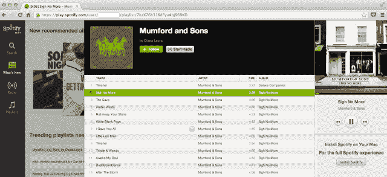
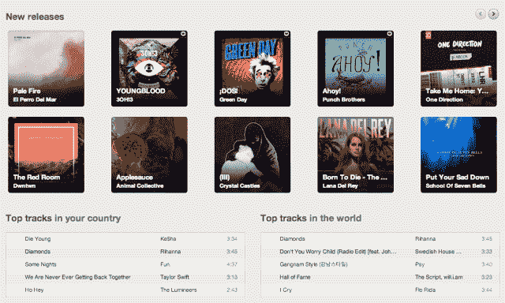
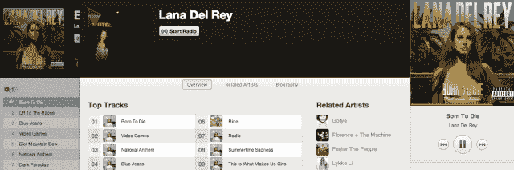

# 与 Spotify 合作开发浏览器:速度很快，但 Discovery 失败了 

> 原文：<https://web.archive.org/web/https://techcrunch.com/2012/11/15/spotify-browser-review/>

它的速度很快，对于像 Spotify 这样的流媒体音乐服务来说，从桌面软件 T2 跳到浏览器 T3 是非常重要的。这只是明年将推出的早期测试版，所以我会原谅缺失的功能，并说我对这种感觉印象深刻。但是探索仍然有很长的路要走，以释放近乎无限的音乐潜力。

为了搭建平台，9 月份我爆料称，多个行业消息来源证实 S [potify 正在开发一个浏览器版本](https://web.archive.org/web/20221129204359/https://beta.techcrunch.com/2012/09/08/spotify-browser/)。昨天，该公司据称完成了一轮超过 1 亿美元的融资，估值超过 30 亿美元。今天, [The Verge](https://web.archive.org/web/20221129204359/http://www.theverge.com/2012/11/15/3649068/spotify-browser-player-web-app) 透露，浏览器版本的测试版现已对部分用户开放。Spotify 已经向我们证实，它将在未来几周和几个月推出测试版，明年在 Q1 会有更多消息。

浏览器版本可能是 Spotify 的一大福音，因为这意味着无论你在什么电脑上，你都可以听你的播放列表或几乎任何歌曲。这包括不能安装软件的工作或公共计算机，或者在朋友家的笔记本电脑上玩无广告订阅的功能。如果 Spotify 要说服人们每月支付 5 美元或 10 美元，他们就会想从任何地方访问。这就是浏览器版本所提供的。

那是什么感觉？我争取了一个邀请链接来尝试一下。这个链接[play.spotify.com](https://web.archive.org/web/20221129204359/https://play.spotify.com/)目前也允许一些人访问，所以试试吧。但以下是我对浏览器版 Spotify 的看法。

它的表现很像桌面软件，这是个好消息。我最大的担心是，搜索世界音乐目录或开始播放一首歌曲的时间会比下载版本慢得多。我发现的不是这个。它基于 Flash，通过不错的 wi-fi 连接，我看到歌曲在不到一秒钟的时间内就开始播放了。唯一的延迟是你第一次打开它时的几秒钟。

至于设计，它有类似于 Spotify 的 iPad 应用程序的层叠导航。这意味着如果一个乐队吸引了你的注意力，你点击它，他们的艺术家页面就会出现在最上面。如果你不去挖掘它们，上一个屏幕的边缘仍然可见，这使得你可以很快跳回那里。

导航到搜索、新闻、广播和播放列表比在桌面上容易得多，因为 iTunes 风格的小链接已经被更大的按钮所取代。永久可见的“正在播放”部分更大，也更容易控制。你不用眯着眼睛就能找到暂停按钮。一个不错的小奖励是歌曲名称和曲目时间出现在浏览器标签中。

奇怪的是，似乎没有办法全屏查看专辑封面。还有，为什么音乐服务没有一个“放松模式”来帮助你不坐在电脑前做 DJ。我喜欢有巨大的封面，控件和播放队列，但搜索和导航最小化的视图。

一个明显的缺失是播放队列部分，它让我们看到你接下来会得到什么，以及你的收听历史。还有一个是 Spotify 第三方 app 平台。你不会找到 Pitchfork 的精选播放列表或 Last.fm 的个性化推荐。然而，我认为应用平台最终可能会移植到浏览器版本。

不幸的是，这些应用解决了 Spotify 最大的问题:发现。当你手边有世界上大多数的音乐目录时，它会导致决策瘫痪。“如果我能听任何东西，我会听什么？嗯嗯。”遗憾的是，Spotify 的浏览器版本并没有发挥应有的作用。

在这里，您可以从桌面上获得所有相同的最新建议，包括新推荐的专辑、您附近的热门播放列表、新发行的歌曲以及您附近和您所在国家的 5 首热门歌曲。

“最新消息”部分的一个很好的补充是“世界顶级曲目”。在那里你可以找到你最喜欢的马舞演员 PSY 的《江南 Style 》,与美国人对乡村音乐的热爱形成鲜明对比。不过，浏览器版本目前缺少顶级列表部分。这可以让你跳过前 5 首歌曲，探索任何国家或世界上前 100 首歌曲或专辑。

最让我失望的是，我听说没有真正创新的新发现选项。甚至没有从 [Rdio 的改变游戏规则的重旋转部分](https://web.archive.org/web/20221129204359/https://beta.techcrunch.com/2012/03/26/mog-spotify-rdio-comparison/)偷来的，这表明你最近一直在颠簸。点播音乐服务的一个核心乐趣是获得你脑海中挥之不去的那首歌。如果没有查看收听历史的选项，你就不得不将这些耳虫添加到播放列表中，或者在每次登录时搜索它们。

也没有更好的方法来关注有影响力的人。我看到名人、艺术家和音乐专家通过点播服务成为大众的异步 DJ。你可以订阅这些人的播放列表，查看他们添加的任何新曲目，而不是收听电台。有 555，000 人关注肖恩·帕克的播放列表“国际潮人”,这表明显然有这方面的需求。在浏览器版本中找到像肖恩这样的人并不容易。你知道什么会很可爱吗？根据我的倾听习惯推荐谁。

我在玩了几个小时 Spotify 的浏览器应用程序后写了这篇评论，但请记住这是一个测试版——不是你通常会评论的东西。虽然我是根据桌面软件来判断的，但 Spotify 不一定会这样做。角落里的一个小盒子告诉我“在你的 Mac 上安装 Spotify 以获得完整的 Spotify 体验”。显然这是 Spotify Lite。

不过，如果幸运的话，我们没有看到播放队列、收听历史、应用程序、更好的音乐发现和更简单的影响者追随是有原因的。Spotify 有望彻底改革这些功能，这样当它们首次亮相时，这将不仅仅是桌面软件的一个不完整的移植。相反，它可能是一个扩展我们音乐意识的入口。我们的祖先只能梦想着在一瞬间探索来自地球各个角落的最伟大的声音。是时候让 Spotify 实现这个梦想了。