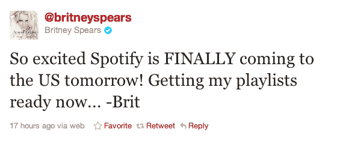
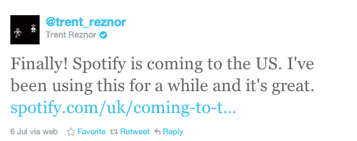

# Spotify 在高层有一些名人朋友 

> 原文：<https://web.archive.org/web/http://techcrunch.com/2011/07/14/spotify-has-some-celebrity-friends-in-high-places/>

# Spotify 有一些身居高位的名人朋友

音乐服务 Spotify 终于跨过了池塘；今天早上抵达美国。这项服务在 T2 提供数量有限的免费邀请，但是任何人只要每月支付 4.99 或 9.99 美元就可以开始使用这项服务。Twitter 实际上是[随着该服务的](https://web.archive.org/web/20230203044700/http://twitter.com/#!/search/spotify%20)被提及而爆炸式增长。考虑到这家欧洲初创公司背后的大肆宣传，Spotify 已经获得一些名人和音乐人的支持就不足为奇了。

[布兰妮·斯皮尔斯](https://web.archive.org/web/20230203044700/http://twitter.com/#!/britneyspears) [在推特上](https://web.archive.org/web/20230203044700/http://twitter.com/#!/britneyspears/status/91305758565728256)表达了她对 Spotify 昨天下午到来的兴奋，并在今天早上[发了一条消息](https://web.archive.org/web/20230203044700/http://twitter.com/#!/britneyspears/status/91524841433341952)邀请使用这项服务。

九寸钉乐队[特伦特·雷诺](https://web.archive.org/web/20230203044700/http://twitter.com/#!/trent_reznor)(他也[为《社交网络》写了配乐](https://web.archive.org/web/20230203044700/https://techcrunch.com/2010/07/02/trent-reznor-facebook-movie/))[发推文](https://web.archive.org/web/20230203044700/http://twitter.com/#!/trent_reznor/status/88652801588207616)“终于！Spotify 即将登陆美国。我已经用了一段时间了，非常棒。”像斯皮尔斯一样，Reznor 慷慨地向追随者发出免费邀请。

不出所料，演员兼科技投资人阿什顿·库彻[今天早些时候对 Spotify 大加赞赏](https://web.archive.org/web/20230203044700/http://twitter.com/#!/aplusk/status/91558347609866241)，在推特上写道“真是松了一口气，现在它在美国是合法的，我终于可以公开谈论我的#Spotify 瘾了。”

正如我的同事 Alexia Tsotsis 几周前写的那样，对于许多初创公司来说，[“名人时刻”](//web.archive.org/web/20230203044700/http://techcrunch.com/2011/06/26/the-celebrity-moment/)是公司服务的一个重要里程碑。Spotify 可能就是这种情况。

显然，许多名人已经是这项服务的粉丝了。考虑到名人播放列表在 Spotify 上的受欢迎程度，看看美国音乐家和名人是否会涌向这项服务来创建播放列表并与美国用户互动，应该会很有趣。Lady Gaga 或贾斯汀比伯的推广可能有助于为平台带来更多流量。我敢打赌，布兰妮、特伦特和阿什顿的代言只是 Spotify“名人时刻”的开始。

