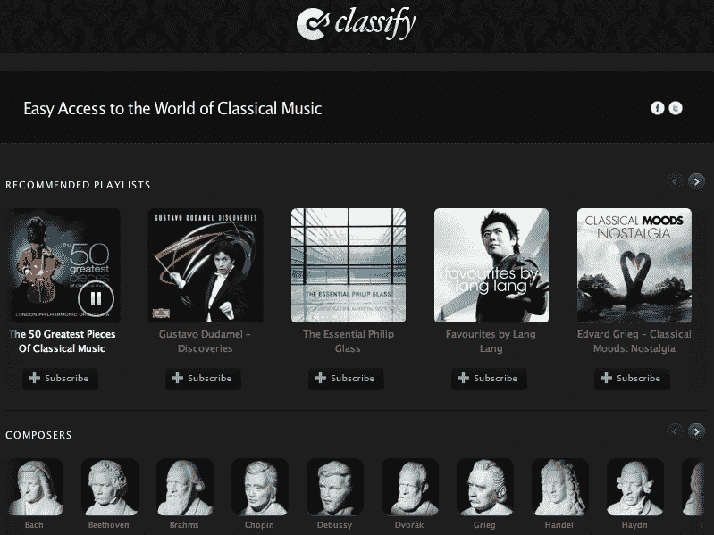

# Spotify 播放可以增加 iTunes 的销量。这里有证据！

> 原文：<https://web.archive.org/web/https://techcrunch.com/2012/05/06/spotify-increase-itunes-sales/>

尽管人们担心流媒体服务会侵蚀销量，但古典音乐唱片公司 X5 告诉我，当它在 Spotify 中推出一款应用程序，看到一张专辑的流量在一个月内增长了 412%时，该专辑在 iTunes 中的销量飙升了 50%。瑞典唱片公司的“50 首最伟大的古典音乐”很快就登上了 iTunes 古典音乐排行榜的第一名，并首次闯入 iTunes 前 200 名专辑排行榜，达到了第 152 名。

这些数据支持了[一些唱片公司](https://web.archive.org/web/20221208152630/http://www.thecmuwebsite.com/article/spotify-launches-new-apps-as-universal-again-defends-the-service/)和 [Spotify 首席执行官 Daniel Ek](https://web.archive.org/web/20221208152630/http://www.telegraph.co.uk/technology/news/9078994/Spotify-chief-streaming-services-boost-music-sales.html) 的说法，即没有证据表明 Spotify 或其他流媒体服务对音乐销售产生负面影响。更多这样的数据可能会鼓励艺术家和唱片公司推广他们的流媒体音乐，并推动黑键和保罗·麦卡特尼(Paul McCartney)等从 Spotify 上撤下目录的行为回归。

X5 的首席执行官 Johan Lagerlof 向我解释了正在发生的事情:“人们使用 Spotify 免费服务作为发现工具，然后去 iTunes 购买他们的音乐。“ [50 首最伟大的古典音乐”](https://web.archive.org/web/20221208152630/http://open.spotify.com/album/6bT2a1Pf9bLkh0dOoempKR)最近的销售飙升遵循了我们在瑞典看到的相同趋势，在瑞典，Spotify 流媒体和数字销售之间存在正相关关系。”

流媒体音乐评论家说，每首歌曲微薄的版税不足以支持艺术家或补偿他们蚕食的销售额。然而，拉格洛夫的声明与埃克的一致，埃克在 2 月份告诉《每日电讯报》，“绝大多数艺术家从 Spotify 获得 50%至 60%的收入”。

那些对流媒体访问的影响力更乐观的人认为，Spotify 这样的服务让听众更容易发现艺术家并爱上他们。虽然从 CD 时代到今天的数字时代，唱片销售大幅下降，但损失的收入可以通过音乐会门票和商品销售来弥补。

【T2

那么，成立于 2005 年的 X5 是如何提高其目录的可发现性并促进销售的呢？不是通过付费营销，X5 没有这样做。Spotify 在 11 月份开放了一个应用平台,让开发者为听众建立寻找和播放音乐的新方式。X5 发布了它的[分类应用](https://web.archive.org/web/20221208152630/http://open.spotify.com/app/classify)，它可以让你按照作曲家、时代、情绪或流派浏览一个智能组织的古典音乐库，这是三月份推出的第二批 Spotify 应用的一部分。与其在 Spotify 庞大的图书馆中搜寻历史上顶尖的交响乐家，不如将他们分类，以便快速浏览。

拉格洛夫认为，Spotify 的流媒体用户，尤其是有广告支持的免费用户，会去 iTunes 购买专辑。(是的，这些数据是相关的，但除了 Spotify 之外，没有任何其他已知因素会导致这张最初于 2009 年发行的专辑销量突然飙升)。

X5 的收藏和“50 首最伟大的古典音乐”可能尤其会从 Spotify 中受益。这是因为它们包含一些著名的歌曲，这些歌曲可能很难被喜欢数字音乐的年轻人通过搜索发现，因为它们的标题很长，很模糊。哦，他们的大多数艺术家都去世了，所以他们没有积极宣传自己。尽管如此，Spotify 现在有超过 1800 万用户，任何唱片公司或艺术家都可以抓住他们的耳朵。

不过，拉格洛夫告诉我，他们可能误解了流媒体和数字销售收入周期的不同。“有了流媒体服务，艺术家可以在每次听音乐时获得报酬，而不仅仅是下载一次。收入分散的时间要长得多。”因此，在专辑发行后的头几周，艺术家从流媒体获得的收入可能比销售少，但在他们的一生中，粉丝反复播放这些歌曲可能会比一次性购买获得更多的收入。“对一些营销人员来说，情况可能更好，对一些人来说，情况可能更糟”。

因此，尽管 Spotify 和其他流媒体服务，如 T2 的 MOG 和 T4 的 Rdio 对 X5 这样的唱片公司来说可能是一个福音，但他们需要提供统计数据，表明他们可以对当前的主流艺术家产生同样的好处。你知道，那些活着的。

*[ [图像信用](https://web.archive.org/web/20221208152630/http://www.jewishmag.com/111mag/charity/charity.htm) ]*