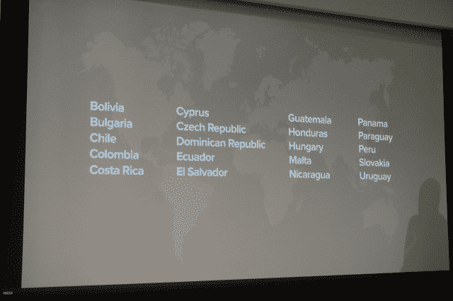

# Spotify 在平板电脑上实现免费增值，在智能手机上推出免费 Shuffle 产品

> 原文：<https://web.archive.org/web/https://techcrunch.com/2013/12/11/spotify-launches-spotify-free-for-tablets/>

# Spotify 在平板电脑上实现免费增值，在智能手机上推出免费 Shuffle 产品

Spotify 首席执行官丹尼尔·埃克刚刚宣布，自发布以来，Spotify 首次在 iOS 和 Android 智能手机和平板电脑上提供免费的流媒体音乐目录。该服务的移动接入服务将因设备而异。平板电脑将可以在桌面上获得用户熟悉的免费增值体验。与此同时，Spotify 将为 Android 和 iOS 智能手机提供免费的“随机播放”服务——基本上是一种互联网广播。

上周，当我们发现 Spotify 将推出有一定限制的有限免费移动接入服务时，这份声明证实了[我们的独家新闻](https://web.archive.org/web/20230404085855/https://techcrunch.com/2013/12/05/free-spotify-mobile/)。[华尔街日报](https://web.archive.org/web/20230404085855/http://online.wsj.com/news/articles/SB10001424052702304096104579240432005003354)此前报道称，Spotify 已经与主要唱片公司就免费移动层进行了谈判。

什么是 Spotify Shuffle？在这一点上，它很像 Pandora、iTunes Radio 或其他基于电台的流媒体服务，但 Spotify 的 Shuffle 产品让你可以更多地控制播放列表。换句话说，如果你选择播放 Lady Gaga 的歌曲，你只会得到 Lady Gaga 的音乐，而不是 20%的 Gaga 和 80%的 Gaga 风格的音乐。还有 Songza 风格的播放列表——圣诞节、周五晚上等。Spotify 将策划。

用户可以在 shuffle 模式下访问所有预编译的播放列表，或者使用独立的 shuffle 产品。但是，您不能执行无限制的搜索和监听查询。从今天开始，所有新的免费服务都可以使用。

最初，Spotify 要求用户支付 4.99 美元获得无广告的网络体验，并支付 9.99 美元在桌面以外的多个设备上收听。顶层也有离线访问。

在新模式下，Spotify 将允许平板电脑上的免费增值服务，以及移动设备上非常有限的免费产品。新的免费产品仍将包括广告，就像 Spotify 的桌面产品一样。

在大约 2600 万用户中，只有 600 万是付费用户。但是自从 Spotify 宣布他们桌面优先的商业模式以来，时代已经变了。

Ek 还宣布了 20 个新市场，将应用可用性从 35 个市场扩大到 55 个市场。所有的新地区，主要是南美洲，都将可以使用新发布的移动产品。

