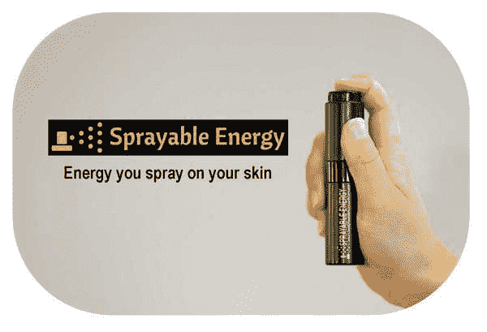

# Thiel Fellow 推出局部能量喷雾，通过皮肤吸收咖啡因 

> 原文：<https://web.archive.org/web/https://techcrunch.com/2013/08/20/sprayable-energy/>

# Thiel Fellow 推出一款局部能量喷雾，通过皮肤吸收咖啡因

在摇滚明星和红牛之间，Thiel fellow Ben Yu 和 Deven Soni 认为有一个 450 亿美元的市场可供争夺。

他们不打算用另一种可消耗的饮料来对付它，而是用一种你可以通过皮肤吸收的喷雾形式的咖啡因。

这种被称为[的可喷射能量](https://web.archive.org/web/20221007040107/http://www.indiegogo.com/projects/sprayable-energy)，是咖啡因、水和酪氨酸衍生物的无味混合物，酪氨酸是人体细胞用来合成蛋白质的 22 种天然氨基酸之一。他们[在 Indiegogo](https://web.archive.org/web/20221007040107/http://sprayable.co/campaign) 上筹集了至少 15000 美元，这样他们就可以以每瓶 15 美元的价格订购第一批瓶子。

每瓶大约有 160 次喷射，每次喷射相当于四分之一杯咖啡。所以你看到的是大约 40 份咖啡大小的咖啡因，价格大约为 15 美元。

于是“20 个 20 岁以下青年”的成员之一，他说他开始研制这种产品是因为他对咖啡因太敏感了。

“我一直对现有的能量饮料很失望，”他说。“我会喝下它们，让咖啡因进入我的身体，然后产生这种神经过敏的感觉。当我喝它们的时候，我无法集中注意力，然后就崩溃了。”

他开始研究咖啡因的结构，并注意到它与尼古丁有一些相似之处，尼古丁已经被用于皮肤贴片以对抗吸烟习惯。他在自己身上做了一些测试，并开始与他的父亲俞崇熙合作，俞崇熙是一名化学博士，已经拥有几项药物输送专利。通常情况下，咖啡因不是那么容易溶解，但是水和酪氨酸的加入使它更容易被身体吸收。

大约在同一时间，俞开始与索尼合作，索尼在创办一只欧洲种子期基金之前曾在 Highland Capital Partners 工作。他们点击了南极之旅，然后在启动智利计划期间开始合作。

“我们都比较购物，甚至使用相同的牙线，”索尼说，她比余大 10 岁，也在投资银行工作。

他们希望将该产品销售给那些对咖啡因非常敏感的人，或者那些希望精确控制每日咖啡因摄入量的量化自我上瘾者。

他们说喷雾通常需要 15 到 30 分钟才能生效。虽然还没有任何关于通过皮肤摄入咖啡因与摄入咖啡因相比如何的长期研究，但该公司确实遵循了 FDA 的指导方针，并在受监管的设施中生产其喷雾剂。他们还指出，一些研究表明咖啡因实际上可以预防皮肤癌。

【YouTube = http://www . YouTube . com/watch？v=KgSHTfSOOVw&w=420&h=315]