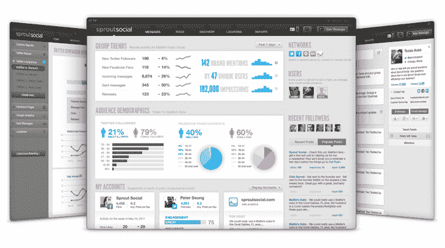

# 萌芽社交升级支持 iOS 的社交媒体管理平台、个性化仪表盘等 TechCrunch

> 原文：<https://web.archive.org/web/https://techcrunch.com/2011/11/09/sprout-social-upgrades-social-media-management-platform-with-ios-support-personalized-dashboards-and-more/>

# 萌芽社交升级支持 iOS 的社交媒体管理平台、个性化仪表盘等

总部位于芝加哥的初创公司 [Sprout Social，](https://web.archive.org/web/20230203090525/http://sproutsocial.com/)是一家面向企业的综合社交关系管理平台的开发商，已经从头开始重建其产品，增加了对个性化仪表盘多用户、完整 iPhone 功能等的支持。

作为背景，这家初创公司的平台是[去年向公众推出的](https://web.archive.org/web/20230203090525/https://techcrunch.com/2010/08/26/sprout-social-debuts-social-media-management-platform-for-businesses/)，它允许企业利用社交媒体工具联系客户，监控关键指标和整体竞争格局。Sprout Social 整合了脸书、Twitter、Yelp、Foursquare、Gowalla 和 LinkedIn 等社交网络，包括线索挖掘、商业智能、报价和促销分销服务，以及品牌监控和分析。

企业用户可以将组织的所有社交媒体消息聚合到一个活动流中，自动跨网络发布促销消息，有针对性地搜索新客户等。

因为新版本支持多个用户、团队和组，所以用户现在可以拥有个性化的仪表板，显示他们有效工作所需的流和模块。销售、营销、产品开发和客户服务部门可以有不同的简档和权限，而社区经理或其他人可以被分配管理角色。

新的分配功能允许将任务放在用户任务队列中，并且整个平台已经重新设计了新的 UI。Sprout 社交用户现在可以通过 iPhone 应用程序访问该应用程序，并可以监控他们的社交媒体收件箱，发送回复，创建和安排新消息，在旅途中查看任务。创始人 Justyn Howard 表示，Android 即将推出。

定价从每月 9 美元起。正如霍华德解释的那样，新版本的目的不仅仅是监测，而是衡量和创造品牌参与度，帮助他们扩大社交媒体的影响力，并找到他们应该听谁的。

萌芽社会已经从[银行](https://web.archive.org/web/20230203090525/http://www.crunchbase.com/financial-organization/lightbank)和 NEA 筹集了超过 11 美元的资金。

