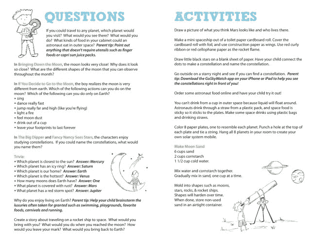

# 斯普劳特金推出“儿童书籍的网飞”

> 原文：<https://web.archive.org/web/https://techcrunch.com/2013/03/07/sproutkin-launches-a-netflix-for-childrens-books/>

新推出的儿童书籍订阅服务 Sproutkin 已经从投资者那里筹集了不到 100 万美元的初始(但未披露，仍在进行中)种子资金，投资者包括 500 Startups、TechFellow Fund 和其他天使投资者。正如标语所暗示的那样，这家初创公司正在推出儿童书籍的网飞——也就是说，这是一种租赁服务，你可以定期付费接收新书，但你不一定要保留它们。

该公司由 Raelyn Bleharski 创建，她是一名前律师，有两个自己的孩子，还有前 Airtime 成员 Alda Dennis 和 Mark Jen。像大多数儿童或家庭应用领域的初创公司一样，Bleharski 说她是出于个人需要才创建 Sproutkin 的。她解释说，当孩子们还小的时候，你几乎每天晚上都给他们读书，这就很难保持高质量的新书的持续供应。“这需要很多时间——我认为人们没有意识到这一点，”她谈到自己去当地图书馆和商店的经历。另外，她补充道，“当你在亚马逊上订购时，你不知道你会得到什么。一旦你读了它，它就差不多完成了。”

Sproutkin 与一个小型教育咨询委员会合作选择书籍，该委员会包括一名现任学前教师和两名经验丰富的前教育工作者，他们都有 30 年的教学经验，过去也曾在不同的州开发课程和标准。

3 至 6 岁儿童的父母可以订阅 Sproutkin 的服务，一次收到 10 本书，通常围绕一个主题。比如公司给我和我女儿发了一个出货样本，重点是解决问题。盒子里有一些更古老和经典的故事，如“[出售帽子](https://web.archive.org/web/20221207151234/http://www.amazon.com/Caps-Sale-Peddler-Monkeys-Business/dp/B008Q3ID5W/ref=sr_1_2?s=books&ie=UTF8&qid=1362675762&sr=1-2&keywords=caps+for+sale)”和“[哈利和隔壁的女士](https://web.archive.org/web/20221207151234/http://www.amazon.com/Harry-Lady-Next-Door-Read/dp/0064440087)”，以及更新的书籍，如“[大南瓜](https://web.archive.org/web/20221207151234/http://www.amazon.com/Big-Pumpkin-Erica-Silverman/dp/0689801297/ref=sr_1_1?s=books&ie=UTF8&qid=1362675779&sr=1-1&keywords=witch+pumpkin+children%27s+book)”和“[我的爸爸打鼾](https://web.archive.org/web/20221207151234/http://www.amazon.com/My-Daddy-Snores-Nancy-Rothstein/dp/0545028345/ref=sr_1_1?s=books&ie=UTF8&qid=1362675822&sr=1-1&keywords=daddy+snoring+children%27s+book)”，让你有一个想法。我可以报告我的孩子非常爱他们。(我厌倦了反复阅读它们，这说明了 Sproutkin 满足了家长们的需求。)

这批书还包括一张卡片，上面有后续活动、琐事和其他妈妈或爸爸可以问的问题，以激发孩子的想象力。在盒子的底部，有一个退货标签，所以当你看完的时候，你可以把它放在邮箱里，得到一批新的书。布莱哈斯基指出，与网飞不同，父母可以在旧书寄出之前，在网上申请新书，这样就不会有一个你没有书读的时间框架。此外，父母可以选择购买孩子真正喜欢的任何书籍，而不必将它们寄回。

还提供新推出的婴儿图书垂直版(0-2 岁)，但因为婴儿喜欢咬、嚼和撕毁他们的书，所以它不是租赁服务。相反，父母会收到两三本书和一个婴儿玩具来保存。这些书不是围绕一个主题，而是侧重于一个发展阶段，比如刺激孩子的视觉。婴儿/学步儿童服务处有大约 100 本书，而针对较大儿童的服务处目前有 300 至 400 本书。

**定价问题？**

两种服务都是每月 24.99 美元，但 Bleharski 告诉我们，该公司可能会调整价格点——可能会提供更少的书籍或限制每月订购一次以降低成本。作为一个(可以说有点节俭的)家长，我认为斯普劳特金必须找到一种方法来降低成本，让更多的主流观众看到这样的东西。虽然这肯定比在当地书店或图书馆花费时间更容易，也比以零售方式购买 10 本新书更实惠，但考虑到你甚至没有保留这些书，价格仍然很高。当地的旧货店和庭院销售充斥着二手儿童书籍，通常价格低得离谱，每本 25 美分。如果你能处理一点磨损(孩子也能)，这是一种以更少的成本保持书籍选择新鲜的方法。

此外，Sproutkin 与另一个新推出的基于订阅的儿童图书服务竞争，该服务名为 [The Little Book Club](https://web.archive.org/web/20221207151234/https://www.thelittlebookclub.com/) ，它向父母发送他们可以以 24.95 美元拥有的 3 本书。也有其他“儿童书籍网飞”服务，例如 [Bookpig](https://web.archive.org/web/20221207151234/http://www.bookpig.com/) 。(与此同时，早期的竞争对手[像 Excite！书](https://web.archive.org/web/20221207151234/http://theohanamama.com/2008/12/10/excite-books-the-new-netflix-for-childrens-books-review-and-giveaway/)和[和书一起长大](https://web.archive.org/web/20221207151234/http://www.growupwithbooks.com/)没做成。)

很难不指出，Sproutkin 也在与 iPad 和其他平板电脑竞争，许多公司和初创公司都提供数字图书，包括 [iStoryTime](https://web.archive.org/web/20221207151234/http://www.istorytime.com/) 、 [MeeGenius](https://web.archive.org/web/20221207151234/https://beta.techcrunch.com/2012/08/10/meegenius-2-4-million/www.MeeGenius.com) 、 [MeMeTales](https://web.archive.org/web/20221207151234/http://memetales.com/) 、 [Nosy Crow](https://web.archive.org/web/20221207151234/http://nosycrow.com/) 、 [Bookboard](https://web.archive.org/web/20221207151234/http://bookboard.com/) 、 [StoryBots](https://web.archive.org/web/20221207151234/http://www.storybots.com/storybooks) 、 [StoryPanda](https://web.archive.org/web/20221207151234/http://storypanda.com/storypanda-app/) 和[farfara RIA](https://web.archive.org/web/20221207151234/http://www.farfaria.com/)(仅举几个例子——hold 我知道有很多！)，不去[提](https://web.archive.org/web/20221207151234/http://imaginationsoup.net/2011/06/best-childrens-books-for-the-ipad/) [那几十个独立的图书 app](https://web.archive.org/web/20221207151234/http://gadgetwise.blogs.nytimes.com/2011/03/28/the-best-childrens-books-on-the-ipad/)。其中一些还采用了类似网飞的订阅模式。

然而，Bleharski 说 Sproutkin 也将参与数字领域的竞争。“我发现我女儿在 iPad 上买书的主要问题是，它的质量总是很低，不是她继续感兴趣的东西，”Bleharski 说。“我希望她能够在 iPad 上阅读她真正喜欢的书籍。”

该公司计划利用这笔资金开发一个数字应用程序，父母可以将其添加到主服务中，也可以单独订阅。她告诉我们，与出版商的谈判正在进行中。希望这款数字应用足够好，能让孩子们选择一本书而不是一个游戏。

数字应用程序还没有推出，但是家长可以在这里通过邮件服务注册订阅图书。