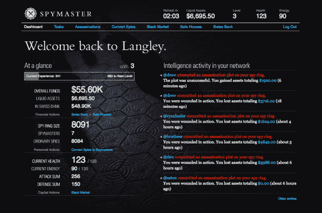
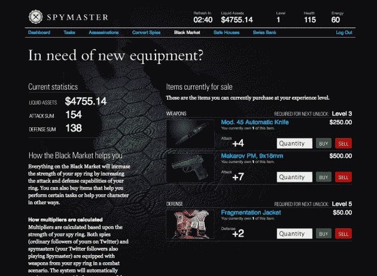
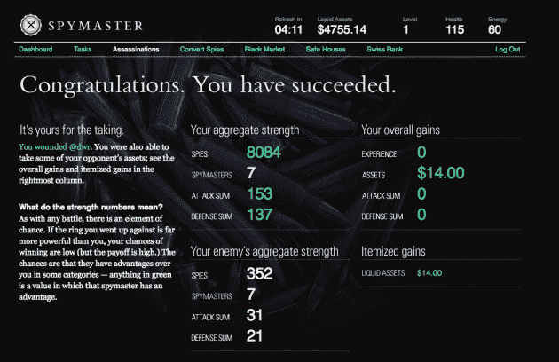

# 间谍大师:将会暗杀你的时间的 Twitter 游戏

> 原文：<https://web.archive.org/web/https://techcrunch.com/2009/05/28/spymaster-the-twitter-game-that-will-assassinate-your-time/>

在过去的几天里，也许你已经看到你关注的人在你的信息流中弹出了一些带有“间谍大师”标签的推文。如果没有，很可能很快就会有了。间谍大师是一款基于 Twitter 的新社交游戏，在游戏中你可以做类似间谍的事情，比如在黑市买东西、暗杀以及将钱存入瑞士银行账户。

完成所有这些不同的任务，你会得到游戏中的假钱，和/或点数来升级成为更好的间谍大师。但是如果你尝试做太多，太频繁，它会磨损你的身体，你会失去能量点。另外，如果你在暗杀或其他任务中失败，你可能会受伤和损失金钱。但这个游戏的天才之处在于它与 Twitter 的结合。你使用 OAuth 用你的 Twitter 名字注册游戏，你的间谍同伴是其他 Twitter 用户。因此，当你试图暗杀其中一人时，它会在推特上向你的所有粉丝发布，包括你的两个名字——以及你试图暗杀的人的粉丝，如果他们打开了设置。

这些 Twitter 通知是游戏的真正关键。Spymaster 中有许多活动，您可以设置这些活动，以便在您执行时自动发布推文。这些包括获得一个新的安全屋，在黑市上购买一些东西，甚至在试图暗杀某人时失败，等等。你选择在推特上发布的越多，你做事情赚的钱就越多。但这是一个微妙的平衡，因为如果你在推特上发布太多你的活动，你就冒着惹恼其他推特粉丝的风险。

联合创始人 [Eston Bond](https://web.archive.org/web/20230305190043/http://www.crunchbase.com/person/eston-bond) 显然意识到了这一点，他说，由于用户群非常小，一些人已经发现推文更新“有点吵”但是在游戏网站上很容易打开和关闭它们。在玩了一些不同的设置后，我发现“暗杀用户”、“T2”、“保护一个新的安全屋”和“间谍大师级别增加”是一些很好的设置，因为它们不会轰炸你的用户，因为你不会经常做这些事情(也许是暗杀，但这只是一个有趣的推文)。如果你打开了你做的每一项任务或者你做的每一笔黑市交易，你的推文流会变得很难看——很快。

但它真的很巧妙。因为游戏依赖于这些推文，每条推文都有标签，并附有游戏的 URL，所以关于游戏的消息在只有少数测试用户的情况下疯狂传播。邦德告诉我，这款游戏将在明天公开测试。当它被打开时，它应该会传播得更快，因为一个很大的组成部分是“转化间谍”，这是把你的 Twitter 追随者(常规“间谍”)和发送直接消息给[加入你的间谍网络](https://web.archive.org/web/20230305190043/http://playspymaster.com/invite)，把他们转化为“间谍大师”你的间谍网越大，你的间谍头子在暗杀这类事情上就越擅长。

《间谍大师》的魅力肯定在于整个间谍活动——这太搞笑了。报名成为间谍头子的间谍选择加入各种间谍机构之一——要么是中央情报局，要么是英国情报局，要么是俄罗斯联邦安全局。你加入哪个组织也有助于确定你的间谍网络。根据你所在的网络，你可以把钱汇给其他网络的间谍头子，但你会有不同的(假)货币。邦德告诉我，但这些钱都是按照实时汇率兑换的。太棒了。

Spymaster 是 [iList](https://web.archive.org/web/20230305190043/http://ilist.com/) 的一个副业，是一个[为你的朋友](https://web.archive.org/web/20230305190043/https://techcrunch.com/2008/10/21/ilist-debuts-social-classifieds-across-facebook-twitter-friendfeed-and-pownce/)提供的分类列表网站。除了邦德，它还由[克里斯·阿巴德](https://web.archive.org/web/20230305190043/http://www.crunchbase.com/person/chris-abad) (iList 的首席执行官)，阿尔伯特·蔡和本·迈尔斯创建。我有一种感觉，我们明天将会在 Twitter 上看到很多间谍大师的标签——希望用户能找到如何限制他们的噪音。但如果他们不这样做，请随意暗杀他们。

这个方面是游戏的另一个精彩部分——就在我认为我玩完了的时候，我收到一条有人试图杀我的消息，所以我很自然地跳上去试图杀死他们。太美了，真的。或者，正如我的间谍搭档德鲁·奥拉诺夫所说，“就在我试图离开的时候。他们把我拉了回来。这是几乎所有间谍电影的主题。

