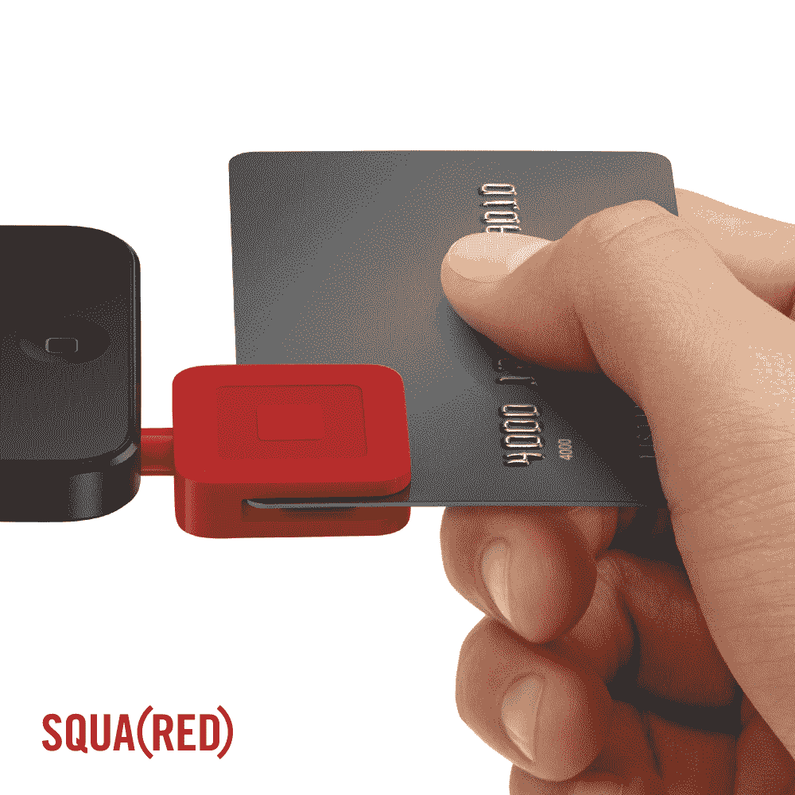

# Square 和(RED)与特别版 Reader 一起抗击艾滋病并捐赠收据中的链接 

> 原文：<https://web.archive.org/web/https://techcrunch.com/2014/02/19/square-and-red-fight-aids-with-special-edition-reader-and-donate-links-in-receipts/>

# 广场和(红色)抗击艾滋病与特别版读者和捐赠收据中的链接

Square 与艾滋病组织[(红色)](https://web.archive.org/web/20221209023924/http://www.red.org/en/)合作推出特别版阅读器。新的“SQUA(RED) Reader”是红色的，通过该设备的每一笔订单，10 美元捐款中的 97.25%将捐给抗击艾滋病基金。当消费者在(红色)上刷卡时，顾客也可以直接从他们的电子邮件收据中捐款。

美国的卖家可以在 mkt.com/red.的[在线获得一个特别版的 SQUA(红色)阅读器](https://web.archive.org/web/20221209023924/https://squareup.com/market/squared/reader)

Square 首席执行官杰克·多西在一份新闻稿中表示:“Square 已经帮助数百万当地卖家运营和发展他们的业务，现在有了 SQUA(RED) Reader，我们可以让他们提高对一项重要事业的认识，并在这个过程中帮助拯救生命。”。

考虑到多尔西最近关于收据背后的机会的评论，从收据本身捐赠的能力是很有趣的。

这不是第一个特别版的 Square reader。几年前，该公司与[谭燕玉合作推出了品牌阅读器](https://web.archive.org/web/20221209023924/https://beta.techcrunch.com/2011/02/09/square-goes-high-fashion-with-vivienne-tam-branded-double-happiness-device/)。

苹果也是(RED) 的[长期合作伙伴，去年宣布其品牌产品已经帮助该组织筹集了 6500 万美元。其他(红色)合作伙伴包括星巴克、美国运通和 Beats。](https://web.archive.org/web/20221209023924/https://beta.techcrunch.com/2013/09/26/red-partner-apple-has-raised-over-65m-for-aids-research-in-total/)