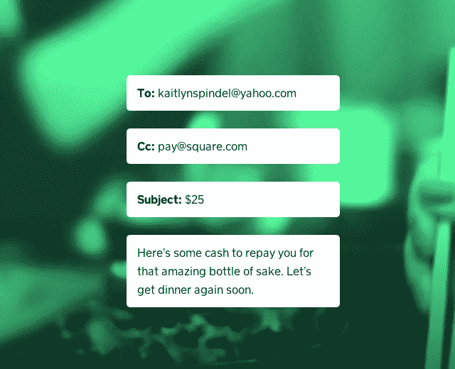
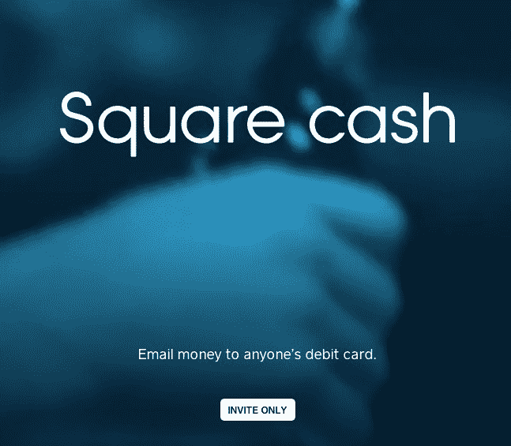
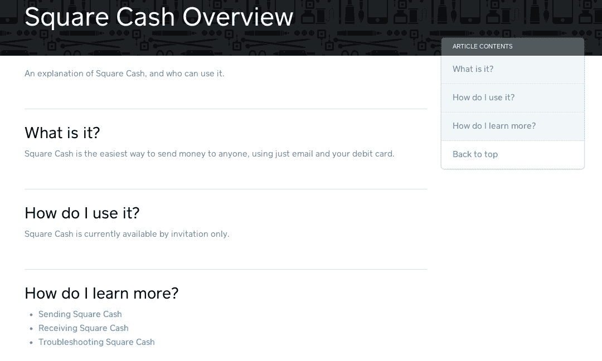

# Square Cash 将允许您通过电子邮件向朋友汇款 

> 原文：<https://web.archive.org/web/https://techcrunch.com/2013/05/20/square-cash-will-let-you-send-money-to-your-friends-by-email/>

# Square Cash 可以让你通过电子邮件给你的朋友汇款

显然，Square 不仅仅面向企业，因为一个名为“Square Cash”的产品的邀请页面已经出现。目前还不知道太多细节，但我们已经联系了该公司进行评论。

**更新:**一名 Square 代表向我们发送了以下关于 Square Cash 的声明:“我们很高兴能与我们的朋友分享 Square Cash。未来几周，我们将继续邀请其他人试用。”

[引人注目的动画页面](https://web.archive.org/web/20221006185106/https://squareup.com/cash)显示了一封支付 25 美元给朋友的电子邮件，抄送行中有一个方形的电子邮件地址:

目前只有发送电子邮件的承诺，但你可以想象这可能在某个时候成为 Square 原生应用的永久部分。

这种方法类似于其他个人支付解决方案，如 [Venmo](https://web.archive.org/web/20221006185106/https://beta.techcrunch.com/2012/06/05/venmo/) 和 PayPal。谷歌想让你[通过 Gmail 和钱包](https://web.archive.org/web/20221006185106/https://beta.techcrunch.com/2013/05/15/google-folds-wallet-support-into-gmail-so-you-can-send-money-as-attachments/)向人们付款。甚至[的 Visa 也在某个时候加入了进来。你现在就可以查看页面，就这样。给朋友寄钱是一种真正尚未被破解的社交体验，像 Square 这样的服务站出来摘得桂冠是完全有道理的。空间又正式热起来了。](https://web.archive.org/web/20221006185106/https://beta.techcrunch.com/2011/03/16/visa-unveils-paypal-like-personal-payments-service-for-u-s-consumers/)

该页面承诺，你可以将钱直接打到某人的借记卡上，即使他们没有注册 Square。他们将获得一个链接，以便在收到第一笔付款时附上一张借记卡，这是一种吸引新 Square 用户的绝佳方式:

邀请被公司控制，甚至不允许你输入你的电子邮件地址。还有一个[帮助页面](https://web.archive.org/web/20221006185106/https://squareup.com/help/en-us/article/5139-square-cash-overview)已经为“现金”产品建立起来，分享说发送者每笔交易将花费 0.5 美元，而接收者将免费。你们都会收到每笔交易的收据。该公司在页面上写道:“Square Cash 是向任何人汇款的最简单方式，只需使用电子邮件和你的借记卡。”

该公司刚刚宣布了[新的、漂亮的 iPad 商业收银机](https://web.archive.org/web/20221006185106/https://beta.techcrunch.com/2012/03/04/targeting-merchants-square-debuts-register-ipad-app-and-analytics-now-processing-4b-in-payments-per-year/)，但 Square 显然希望进入我们所有人的口袋……和银行账户。

虽然很难解密首席执行官杰克·多西的推文和藤蔓，但 Square Cash 可能是最近这场小型庆祝活动的原因:

[推特 https://twitter.com/jack/status/336557531600154624]

当我们收到邀请时，我们会让你知道，但似乎那些靠近 Square 和 Twitter 的人会先动手:

[推特 https://twitter.com/Wayne/status/336579682147373056]