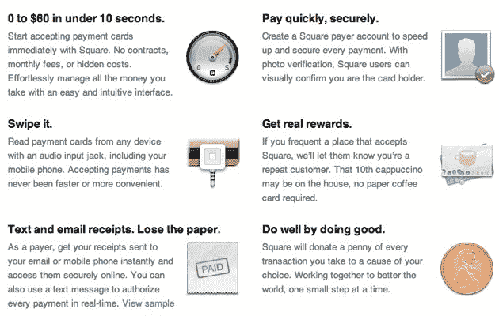
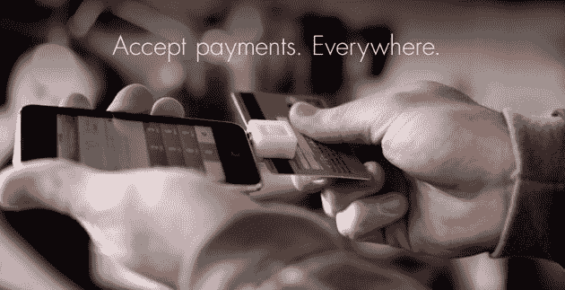
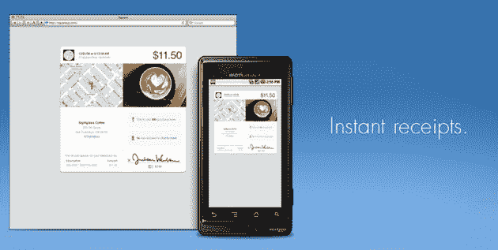
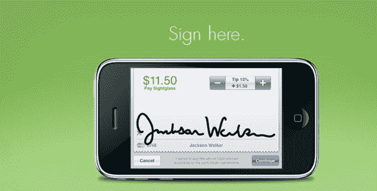
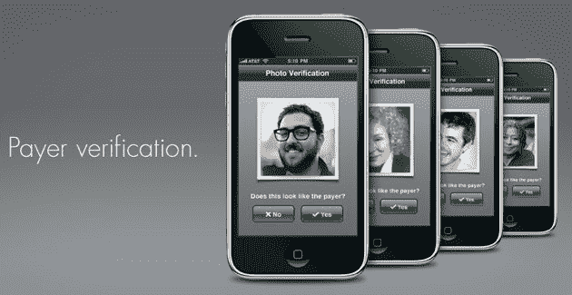

# 杰克·多西广场(几乎)开始营业 TechCrunch

> 原文：<https://web.archive.org/web/https://techcrunch.com/2009/12/01/square-jack-dorsey-launches-paypa/>

# 杰克·多西广场(几乎)开始营业了

自从五月份我们第一次了解到新的移动电话支付服务的细节，我们就一直在跟踪推特创始人[杰克·多西的](https://web.archive.org/web/20221006010956/http://www.crunchbase.com/person/jack-dorsey)广场。

今天，公司[首次公开了其网站](https://web.archive.org/web/20221006010956/http://squareup.com/)，他们继续在私人测试版中测试该产品。多尔西在推特上说这个网站刚刚上线。

这个想法——让人们能够快速方便地从手机上接受信用卡支付。一个小型设备通过耳机/麦克风插孔连接到电话。该设备通过刷卡获得向手机发送数据所需的电力，并通过麦克风连接发送信息。根据下面的照片，该设备兼容 iPhone 和 Android(或至少是最近发布的 droid)。

想想贝宝，但是现在任何人都可以接受信用卡支付。没有合同或月租费。人们通过短信和电子邮件收到收据。

我们对 Dorsey 进行了一次简短的采访，并发布了一段正在使用的产品的视频。

**更新:** [看我们关于产品如何工作的视频，以及对多尔西的采访，这里](https://web.archive.org/web/20221006010956/http://www.beta.techcrunch.com/2009/12/01/jack-dorsey-square/)。

