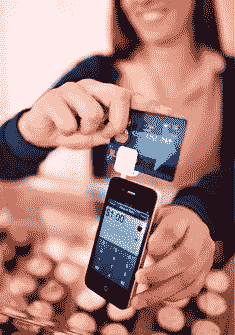

# Square 现在每周处理数百万美元的移动交易 

> 原文：<https://web.archive.org/web/http://techcrunch.com/2010/11/09/square-now-processing-millions-of-dollars-in-mobile-transactions-every-week/>

经过十个月仅限于 [5 万用户](https://web.archive.org/web/20230203004304/https://techcrunch.com/2010/06/03/dorsey-delivers-50000-squares-eyes-global-domination-video/)的私人试点，Square 终于向公众敞开了大门。Twitter 联合创始人杰克·多西和吉姆·麦克维的创意[于去年 12 月发布](https://web.archive.org/web/20230203004304/https://techcrunch.com/2009/05/08/nuts-twitter-inventor-about-to-launch-his-next-project-code-named-squirrel/)[，这是一款小型信用卡读卡器，可以将任何 iPhone 变成移动收银机。这家初创公司已经发布了适用于](https://web.archive.org/web/20230203004304/https://techcrunch.com/2009/12/01/jack-dorsey-square/) [iPad、](https://web.archive.org/web/20230203004304/https://techcrunch.com/2010/04/03/square-ipad/) Android 和 [iPhone 的应用。](https://web.archive.org/web/20230203004304/https://techcrunch.com/2010/05/10/squares-iphone-app-hits-the-app-store/)和多西[在 8 月份把](https://web.archive.org/web/20230203004304/http://latimesblogs.latimes.com/technology/2010/08/square-hires-silicon-valley-veteran-investor-keith-rabois.html)放在 PayPal 和 Slide 老将 [Keith Rabois](https://web.archive.org/web/20230203004304/http://www.crunchbase.com/person/keith-rabois) 任总经理。随着 Square 退出试点，这家初创公司正在达到一个令人印象深刻的里程碑:Square 现在每周处理数百万美元的移动交易。

那么 Square 在哪里最受欢迎呢？毫无疑问，小企业、独立工作者和商人构成了 Square 快速增长的用户群的大部分。这项技术只需要它的微型信用卡扫描仪，就可以安装到你的音频插孔和 Square 的应用程序中。该设备和软件是免费的，但 Square 从每笔交易中收取一小部分费用(刷卡交易收取 2.75%外加 15 美分)。

虽然商家必须获得该应用的资格，但 Square 的资格规则比标准信用卡处理商更宽松，没有加盟费和每月最低限额，当商家申请阅读器时，Square 不仅仅关注信用检查，还会考虑一家公司在 Yelp、Twitter 或脸书上的影响力。

拉布瓦告诉我，那个方块是“真实世界的贝宝”他还将 Square 比作“金融服务的苹果”，因为它开箱即用非常容易。事实上，当我与商家和 Square 用户交谈时，易用性和简单性是对该设备无处不在的描述。

尼科尔·威斯特摩兰(Nicole Westmoreland)是奥克兰克罗克高地小学家长教师协会(Crocker Highlands Elementary PTA)的联合主席，她从 9 月中旬开始在 iPhone 上使用 Square，通过为该组织出售礼品和门票来筹集资金。在一个多月的时间里，家长会已经募集到了 4500 美元，威斯特摩兰坚持认为，如果没有 Square，她只能募集到 1000 美元。“这是一个强迫人们当场付款的简单方法，”威斯特摩兰说。

另一个有趣的用例涉及到约翰·霍宁医生，他是一名在湾区出诊的医生。因为他的工作是完全移动的，一个易于使用的支付系统是必须的。由于他的业务性质，付款往往很大，所以信用卡往往是病人支付的首选方式。他以前使用有线信用卡扫描仪，但发现它很笨重，难以使用。另一方面，Square 适合放在他的医疗包里(他在 Android 手机上使用它)，并且对他的员工来说也是一个容易学习的系统。

对于一些企业家来说，Square 是一种既能创收又能省钱的方式。对三藩市纸杯蛋糕店 [Mission Minis 来说，](https://web.archive.org/web/20230203004304/http://www.missionminis.com/) Square 是避开昂贵收银机的一种方式。Brandon Arnovik 说，销售点系统是他在启动面包店时最不想做的事情；当他看到系统的价格时，他被淹没了。他听说过 Square，实际上他买了一台 iPad，这样他就可以在设备上使用卡片扫描系统。他说，使用该系统的一个好处是，它可以用来提供详细的销售指标。例如，Arnovik 可以知道某一天卖出了多少个红色天鹅绒纸杯蛋糕。

拉布瓦说，自从向公众开放以来，Square 现在已经有超过 50，000 名用户，但考虑到 Square 的大部分增长都是有机的和通过口碑传播的，这个数字令人印象深刻。事实上，该公司上周才雇佣了第一批营销人员。

当然，对 Square 来说，事情并不完全乐观，该公司面临着大多数初创公司在创业第一年都会遇到的同样问题。这家初创公司面临着[兼容性问题](https://web.archive.org/web/20230203004304/http://www.businessinsider.com/square-starts-shipping-new-iphone-4-compatible-credit-card-reader-2010-10)和实际设备的发货[因信贷处理问题在夏季被推迟](https://web.archive.org/web/20230203004304/https://techcrunch.com/2010/06/18/square-delays/)。为了防止信用欺诈，Square 限制交易次数，但客户抱怨限额太低。VeriFone [通过与 PayPal 的](https://web.archive.org/web/20230203004304/https://techcrunch.com/2010/01/28/verifone-iphone-square/)[交易进入了这个领域](https://web.archive.org/web/20230203004304/https://techcrunch.com/2010/10/26/verifone-paypal/)。

Rabois 说，PayPay 对于在线销售产品的人来说是一个很好的产品，但是 Square 相对于 Verifone 这样的竞争对手的一个优势是神奇的品牌依附性。“如果你看看使用 Square 的人，”他说，“他们对品牌和设备都充满热情。”而且他并不太担心 VeriFone，称不清楚 VeriFone 的定价是否对 Square 的机型有竞争力。

此外，他说，Square 非常适合面对面交易，事实证明它确实有助于增加小企业的销售额。他最喜欢的一个 Square 用例是当地一家名为 [San Franola 的格兰诺拉麦片公司。](https://web.archive.org/web/20230203004304/http://www.sanfranolaco.com/home/index.php?location=home)这个自举团队开始使用 Square 在农贸市场和办公楼销售，收入增加了 20%。

但如果 Square 的用户主要是小企业，它就能起飞吗？大概吧。今年 5 月，多尔西告诉我们，在年收入低于 10 万美元的大约 3000 万美国商户中，只有 600 万目前在处理信用卡。其余的 2400 万家企业都是潜在的 Square 客户，他们正在寻找一种低成本、简单的信用卡处理方式。

然而，尽管拉布瓦表示，虽然针对大型零售商和商家不是既定的战略，但我们可能会预计该公司未来将形成一些更大规模的战略合作伙伴关系。Zappos 实际上正在利用 Square 内部进行额外库存的样品销售，销售所得将捐给慈善机构。在最近的一次高尔夫锦标赛上，该公司利用 Square 为 LiveStrong 筹集资金。Zappos 的业务发展总监 Sean Kim 说，“人们继续对它的便利感到惊讶。”Kim 表示，毫无疑问，Square 的使用有助于为慈善活动筹集更多资金。

至于未来，拉布瓦表示，Square 面临的挑战之一是，移动支付是一个快速发展的行业。“我认为没有人能够预测十年后它会是什么样子。他说:“我们必须同时具备真正的灵活性、创造性和创新性。

他说，就员工数量而言，Square 将继续增长；这家初创公司平均每月招聘三到六人。当我们问及未来是否会有新一轮融资时(Square 去年从科斯拉风险投资公司(Khosla Ventures)和其他一些知名天使投资者那里筹集了 1000 万美元)，拉布瓦没有明确回答是或不是。“我们每天都会收到感兴趣的投资者的电子邮件，如果有更多的资金，肯定会有很多有趣的事情可以做。”

图片来源/ [戴夫·盖兹希曼](https://web.archive.org/web/20230203004304/http://www.davegetzschman.com/)