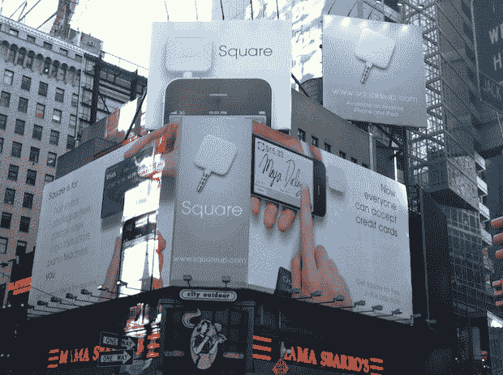

# 广场迎来两周年纪念日，用巨大的时代广场广告牌庆祝

> 原文：<https://web.archive.org/web/https://techcrunch.com/2011/02/11/square-turns-two-and-celebrates-with-a-massive-times-square-billboard/>

# 广场迎来两周年纪念日，并用巨大的时代广场广告牌来庆祝

[杰克·多西的](https://web.archive.org/web/20230324061342/http://www.crunchbase.com/person/jack-dorsey)移动支付初创公司[广场](https://web.archive.org/web/20230324061342/https://squareup.com/)今天迎来了它的两周岁生日，同时也开始了一项大规模的市场推广活动——在纽约时代广场的广告牌。这个巨大的、多角度、多面板的广告牌显示了在 iPhone 上使用 Square 是多么容易，标语是“现在每个人都可以接受信用卡”

我们被告知，Square 没有支付广告牌的费用，但它是由一位“慷慨的支持者”资助的。对公司来说，这是重要的一周。Square [刚刚与设计师](https://web.archive.org/web/20230324061342/https://techcrunch.com/2011/02/09/square-goes-high-fashion-with-vivienne-tam-branded-double-happiness-device/)[谭燕玉](https://web.archive.org/web/20230324061342/http://www.viviennetam.com/)联手推出了一款限量版的品牌 Square 信用卡读卡器。

Square 刚刚筹集了 2750 万美元的新资金，作为小企业的简单支付选择，它已经稳步获得了吸引力，每周处理数百万美元的交易。这个广告牌应该会把这个数字推高。

最近在时代广场展示广告牌的其他科技公司包括 Foursquare 和 Gowalla。