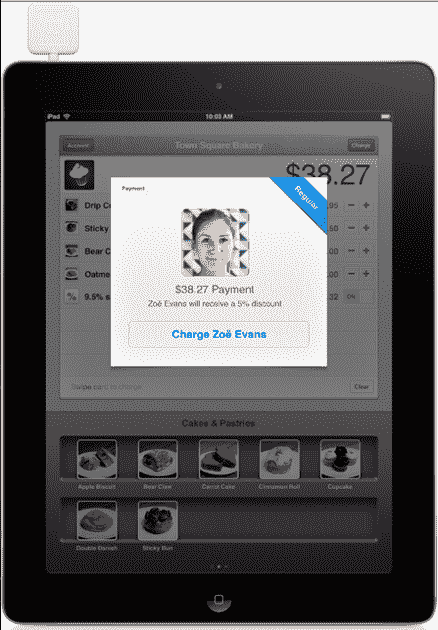
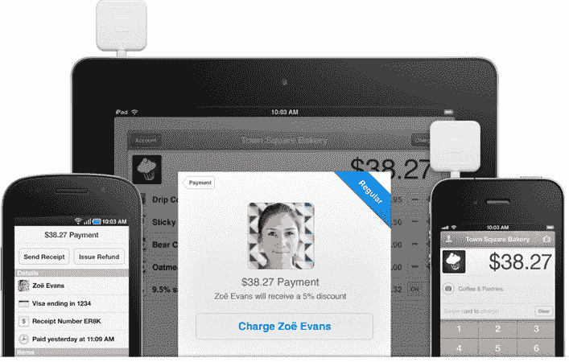

# Square 为商户更新移动支付应用，提供忠诚度功能、打印收据等 

> 原文：<https://web.archive.org/web/http://techcrunch.com/2011/11/15/square-updates-mobile-payments-app-for-merchants-with-loyalty-features-printed-receipts-and-more/>

在达到每天 1100 万美元的移动支付量后，Square 宣布了更多消息——这家初创公司的旗舰 iOS 和 Android 支付应用的更新。您可能知道，Square 读卡器和配套应用程序可以将任何 iPad、iPhone 或 Android 手机转变为完整的销售点系统。

该应用程序 2.2 版本的主要新增内容之一与客户忠诚度有关。现在，商家可以奖励他们的常客一个新的应用内忠诚度功能，允许商家在他们进入商店时识别他们最常光顾的顾客。这项新功能还允许商家向回头客提供折扣，顾客将看到折扣体现在他们的方形卡盒上。

正如我们过去所写的，Square Card Case 是[的一款移动应用](https://web.archive.org/web/20230203070631/https://techcrunch.com/2011/11/02/squares-card-case-ios-app-adds-support-for-geofencing-twitter-integration-for-merchants-and-more/)，消费者可以在其中填写他们访问过的所有接受 Square 的商家的“卡”。这些移动卡包括位置、商家联系信息、优惠券、订单和购买历史等。

在消费者方面，Square 在忠诚度方面投入了大量资金。通过 Card Case 应用程序，一旦 Square 的技术检测到你在商家支持的商店附近，商家的 Square 应用程序将为客户打开一个标签，并显示该客户的帐户、姓名和照片就在附近。当顾客购买商品时，他们说出自己的名字，收银员可以验证照片是否与顾客相符，然后按下交易按钮，费用就会支付。客户还会收到一条推送通知，告知费用金额。

现在，Square 允许商家定义一个“常客”(例如，过去一个月中有 10 次访问)，他们可以选择将此设置为默认设置，自动奖励常客。每当“熟客”来到商店，商家将在屏幕上看到“熟客”,并在支付系统中提供折扣。

Square 2.2 还允许商家在签名屏幕上创建自定义小费选项。

最新版本的 Square 现在无线连接了现金抽屉和收据打印机。当商家点击“付款”时，现金抽屉将弹出打开，收据可以打印商家的地址和交易明细。(以前 Square 只提供文本和电子邮件收据)。

Square 还表示，最新版本包括改进的搜索和销售历史，因此商家可以更好地跟踪销售历史，重新发送收据，并从他们的销售点系统提供退款。

Square 最近一直表现良好，每年处理超过 20 亿美元的支付，并与 80 万商家签约使用其技术。今年，该公司还与苹果、百思买、RadioShack、Target 以及最近的沃尔玛零售店签署了零售协议。Square 最近迎来了新的投资者 Richard Branson，紧接着该公司最近获得了由凯鹏华盈(Kleiner Perkins Caufield)和拜尔斯(Byers)牵头的 1 亿美元融资。

显然，这次更新对于 Square 来说只是一个开始。你可以预计，该公司将很快增加其他一些商家功能，但肯定忠诚度，无线同步收银机等是一个良好的开端。

在不久的将来，我们可能不会在 Square 上看到 NFC。正如联合创始人杰克·多西本周所说，这项技术缺乏通信层。“NFC 只是在交易后给商家(消费者)身份，”他在本周的 Techonomy 会议上解释道。

