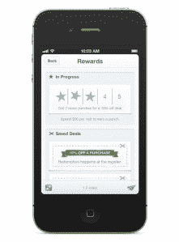

# Square Ventures Beyond Payments 首次推出客户忠诚度打孔卡计划 TechCrunch

> 原文：<https://web.archive.org/web/https://techcrunch.com/2012/06/19/square-ventures-beyond-payments-with-debut-of-customer-loyalty-punchcard-program/>

移动支付初创公司 [Square](https://web.archive.org/web/20221206221748/https://squareup.com/) 今天推出了一项广受欢迎的功能，即客户忠诚度打孔卡计划。Square Register iPad 应用程序和 Pay with Square 移动应用程序的更新中将包含新的数字积分卡。

通过更新，Square 客户将为他们经常光顾的每个 Square 商家收到传统纸质穿孔卡的数字版本。作为回报，商家将能够更好地跟踪他们的忠实客户，并能够以特别优惠或折扣来吸引他们。

该计划还包括一些旨在吸引新客户的功能，推出了“首次访问”特价。例如，这些可以包括像百分之几的折扣或免费赠品。此外，当客户经常光顾 Square 商户时，他们将能够在应用程序内的打卡上跟踪这些访问，以了解他们在下一笔交易中的进展情况。

 在商家方面，有应用内报告机制和为商品配置金额和折扣的能力，以针对忠诚的顾客。

还有一些工具可以让商家看到他们销售的详细分析，甚至可以按小时、天或周细分。这种按小时深入销售的能力对于在农贸市场或其他高交易量的固定地点使用 Square 的商家来说尤其有用。这将让他们看到哪些时间有最繁忙的交通，使他们能够相应地安排人员和日程。今天更新的另一个新项目是改进的库存管理功能，现在提供了一个库存库，可以对项目进行分类，以便于访问和排序。

Square 表示，自从 3 月份推出 Register 应用程序以来，Register 商家每周的活跃程度是那些只使用读卡器应用程序的商家的五倍，他们的收入也是后者的两倍。然而，这不一定是证明该应用程序生产能力的指标，而是反映了需要 iPad 应用程序提供的更强大系统的商家类型。

当然，今天最大的新闻是忠诚度计划的推出。公平地说，以前也有使用 Square 表示忠诚的方法，但这个过程要手工得多。随着功能更加丰富和自动化的程序，Square 现在与其他几个新的数字忠诚度玩家竞争，包括 [Belly](https://web.archive.org/web/20221206221748/https://beta.techcrunch.com/2012/05/25/loyalty-startup-belly-hits-1-millionth-check-in-active-merchants-say-belly-check-ins-top-foursquare/) 、 [Punchcard](https://web.archive.org/web/20221206221748/https://beta.techcrunch.com/2012/04/27/barely-3-months-post-launch-loyalty-app-punchcard-live-in-15m-locations-nears-profitability/) 、 [Cardify](https://web.archive.org/web/20221206221748/https://beta.techcrunch.com/2012/05/22/with-mobile-app-cardify-the-founder-of-ad-ly-takes-on-his-next-challenge-improving-customer-loyalty/) 等等。Square 和忠诚度系统之间的区别在于，虽然 Square 的功能集相比之下可能更少，但它已经与商家的支付处理基础设施联系在一起，这使得跟踪忠诚度更加顺畅，因为它不像销售点那样依赖于客户行为或输入(例如，点击支付、条形码扫描)。仅此一点就能让 Square 的项目在采用率上领先一步。

【YouTube = http://www . YouTube . com/watch？v=XyjFNbUmDMU&w=640&h=360]