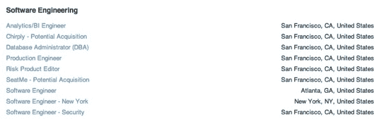

# 出于某种原因，Square 的招聘页面将 Chirply 和 SeatMe 列为“潜在收购对象”

> 原文：<https://web.archive.org/web/https://techcrunch.com/2013/06/15/squares-hiring-page-snafu/>

# 出于某种原因，Square 的招聘页面将 Chirply 和 SeatMe 列为“潜在收购对象”

所以，这很奇怪。今天早些时候，如果你访问 Jobvite 上的 [Square 招聘页面](https://web.archive.org/web/20221207054629/http://hire.jobvite.com/CompanyJobs/Careers.aspx?c=q8Z9VfwV)，会看到两个不同寻常的职位列表，一个是“chirp ly——潜在收购”,另一个是“seat me——潜在收购”

如果这些说法是准确的，那么，以这种方式宣布一对悬而未决的交易是相当奇怪的。但在你开始发送那些祝贺的推文和电子邮件之前，我应该注意到，一位知情人士告诉我，Square 是*而不是*在这个时候寻求收购这些公司。(公司发言人拒绝置评。)

那么，他们的名字怎么会出现在求职网站的“潜在收购”页面上呢？嗯，如果真的有谈判，他们可能会以同样的方式出现——公司某个地方的某个人搞砸了。不管是什么原因，这个错误已经被纠正了——在我联系 Square 之后，列表就消失了。(你可以在下面的截图中看到它们。)

至于那些初创公司做什么，Chirply 是一个众包卡片设计网站(至少，当我两年前[写它的时候它是这样做的](https://web.archive.org/web/20221207054629/http://venturebeat.com/2011/04/07/chirply-launch/)——[当前的网站](https://web.archive.org/web/20221207054629/http://www.chirply.com/)是那些神秘的测试页之一。)和 [SeatMe](https://web.archive.org/web/20221207054629/http://www.seatme.com/) 是一家试图[挑战 OpenTable](https://web.archive.org/web/20221207054629/http://www.7x7.com/tech-gadgets/seatme-looks-dethrone-sf-based-opentable) 的预订初创公司。(我给两家公司都发了电子邮件征求意见，如果有回音，我会及时更新。)

人们似乎并不完全相信 Square 对这些公司感兴趣，尤其是在人才收购方面。但这距离进行严肃的对话还有很长的路要走。

感谢阿明·伊萨的提示。