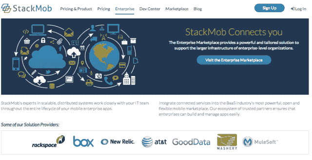

# StackMob 通过推出新市场、增加合作伙伴关系来吸引企业 

> 原文：<https://web.archive.org/web/https://techcrunch.com/2013/02/19/stackmob-courts-the-enterprise-with-launch-of-new-marketplace-added-partnerships/>

移动后端即服务(MBaaS)平台 [StackMob](https://web.archive.org/web/20221210052417/http://www.stackmob.com/) 在[早期推出的第三方服务市场](https://web.archive.org/web/20221210052417/https://beta.techcrunch.com/2012/11/13/stackmob-ratchets-up-the-competition-makes-api-calls-free-launches-a-marketplace-for-third-party-mobile-services/)的基础上进行扩展，推出了针对企业客户的市场。通过一系列的合作关系，marketplace 允许 StackMob 促进其与其他软件和平台即服务公司、API 基础设施提供商等的集成，最初包括来自 AT & T、Alfresco、Box、Braintree、GoodData、Mashery、Mulesoft、New Relic 和 Rackspace 的服务。

此举标志着 StackMob 的目标是吸引更多企业客户使用其平台。这是一个被首席执行官 Ty Amell 形容为“小”的客户群。目前，大约有 15 到 20 家企业公司与 StackMob 合作开发应用程序，从处于概念验证阶段的公司到处于积极开发阶段的公司。StackMob 是 NDA 旗下的企业客户，所以 Amell 不能提供名称，但表示所有应用程序都是“关键任务型”的

“不是这些一次性的营销 apps 这不是企业公司的游戏，”他解释道。“这是一个非常有趣的转变，因为它表明企业真的开始在这个领域信任 StackMob，”他补充道。“到目前为止，如果你看看大多数其他 MBaaS 提供商，你可能会看到一些企业，但通常是通过代理机构，通常不是关键任务。”

Amell 告诉我们，为企业服务一直是 StackMob 的长期路线图，但在近期，该公司一遍又一遍地听到企业提出同样的问题。例如，“我如何安全地将您连接到我的遗留系统？”“我如何集成这个第三方 API？”“我如何控制内部数据与外部数据的对比？”“我如何进行支付处理？”等等。这个想法是将 StackMob 可以为企业做的所有事情集中在一个保护伞下。

虽然[之前推出的](https://web.archive.org/web/20221210052417/https://beta.techcrunch.com/2012/11/13/stackmob-ratchets-up-the-competition-makes-api-calls-free-launches-a-marketplace-for-third-party-mobile-services/)和以开发者为中心的 StackMob 市场提供了可点击的模块，用于添加来自 Apsalar、Kontrol.io、Crittercism、PubNub、SendGrid、Urban Airship、UserVoice 等合作伙伴的服务，但企业市场是不同的，因为它不是一键集成。如果有的话，它更多的是宣传 StackMob 的企业能力和合作伙伴关系，而不是提供注册流量和交易。

不过，Amell 也指出，企业客户的成本比他们单独去各种服务要低。然而，今天市场上唯一可能的“行动”是能够填写一个表单，请求 StackMob 的某个人回电。这是非常超前的。

向企业进军非常重要，因为在这个过度饱和的 MBaaS 公司市场，随着群体的减少，最终将只有少数幸存者。在接下来的一两年里，规模较小的公司可能会一败涂地。

与 StackMob 的竞争对手 Y Combinator 支持的 Parse 不同，Amell 拒绝分享说明 StackMob 吸引力的硬性指标。相反，他只是说，“我们有收入；我们将不得不筹集另一轮。”他表示，这一轮融资将有助于扩大销售团队，加快扩张速度。“后端即服务的肮脏秘密在于它需要大量的时间和金钱，尤其是当您谈论企业时。他表示:“实现盈利需要很长时间。“我们在这方面进展不错，但我们的收入并不乐观。”

Amell 还称 StackMob 是这一领域的创始公司，这是事实——作为一家成立三年的公司，它是首批公司之一。他吹捧说 StackMob 在某些领域领先。“每次我们做一件事，其他人都会跟着做，”阿梅尔声称。他甚至特别提到了 Parse 的第三方集成(称为“云模块”)，称在 Parse，他们不为用户提供帐户，也不做所有使其成为 marketplace 而不是 StackMob Marketplace 的事情(尽管似乎不一定是这个企业版)。另外，他补充道，StackMob“永远”在做定制代码，而不是 [Parse 最近的支持](https://web.archive.org/web/20221210052417/https://beta.techcrunch.com/2012/09/11/parse-cloud-code/)。

然而，众所周知，“第一”并不总是意味着最后一个站着的人。Parse 和 StackMob 一直在争夺开发者的份额。10 月份，Parse 拥有 40，000 名开发者和差不多同样数量的应用。今天，它有 60，000 个应用程序和大约相同数量的开发者。11 月份的时候，StackMob 有 15000 名开发者和 40000 个应用程序，这些仍然大致相同。话虽如此，两家公司都在经营[免费增值](https://web.archive.org/web/20221210052417/https://parse.com/plans) [服务](https://web.archive.org/web/20221210052417/https://www.stackmob.com/pricing/)，所以归根结底，这不是原始数字，而是*谁*付费*多少*。这些数据都没有透露。