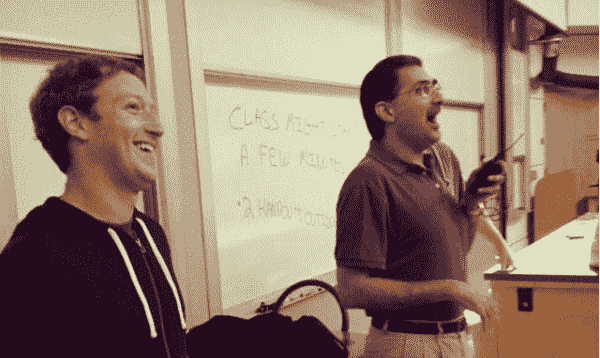
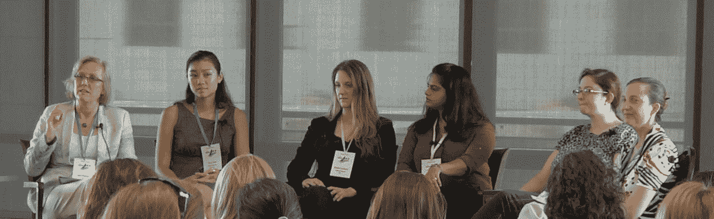

# CS 里没有女人？嗯，不会太久

> 原文：<https://web.archive.org/web/https://techcrunch.com/2012/12/27/stanford-bridging-gender-gap/>

“老兄，我觉得坐在我们前面的那个女孩是计算机科学专业的。”

*“不，看她头发上闪闪发光的东西。”*

[邦妮·麦克林登](https://web.archive.org/web/20230328135451/http://www.linkedin.com/pub/bonnie-mclindon/5b/93/1a6)，斯坦福大学计算机科学专业的大三学生，在办公时间，在她在斯坦福大学最难的课程 CS 103 中工作时，发出阵阵烟雾。坐在她后面的两个家伙指的是她头发上的金属箔片，这是斯坦福大学百臂巨人太塔女生联谊会的传统。尽管担任部门领导并在苹果公司实习，麦克林登仍与女孩，尤其是女生联谊会的女孩，不主修计算机科学的刻板印象作斗争。

在斯坦福大学，不到 21%的本科计算机科学专业(该校最受欢迎的专业)是女性。

这所学校坐落在硅谷的中心，那里急需有才华的工程师；公司积极招聘拥有编程技能的斯坦福本科生，以获得高薪实习和全职工作。

红杉资本(Sequoia Capital)的吉姆·戈茨(Jim Goetz)告诉我:“让更多的女孩参与 CS 可能是我们能够解决人才短缺问题的最有影响力的事情。”。

**

2009 年，[斯坦福大学计算机科学系](https://web.archive.org/web/20230328135451/http://cs.stanford.edu/)修改了其本科课程，扩大了项目范围，这样学生就可以专注于他们最感兴趣的领域。斯坦福大学教授 Mehran Sahami 表示，多学科领域的加入，如与心理学、产品设计和其他领域的合作，有助于为潜在的计算机科学专业学生撒下更广阔的网。

萨哈米说，自 2009 年修订以来，该系已经全面增长，女性入学率相对增长更快。自 2009 年以来，斯坦福大学主修计算机科学的女本科生人数增加了 9.5 个百分点。

CS 106A 这门入门课程已经大受欢迎，几乎成了名人。大约有 600 名学生(占本科生总数的 10%)每个季度都要上这门课，超过 90%的本科生将在毕业前至少上一门计算机科学课，通常是 106A。去年秋天，如此多的学生注册了这门课，以至于他们坐在拥挤的礼堂的地板上和走廊里。

*马克·扎克伯格和萨哈米每年都会在 106A 大学做客座演讲，这让这门广受欢迎的课程更加出名。(由 Jacob Chen/ [提供)【每日一菜](https://web.archive.org/web/20230328135451/http://www.thedishdaily.com/news/2012/12/06/facebook-ceo-mark-zuckerberg-guest-lectures-stanfords-cs106a-class)*

或许最令人印象深刻的是，这门课程已经实现了性别平等。

许多学生从 106A 继续在 CS 106B 中进一步发展他们的技能。但那些想主修计算机科学的人必须从 106B 继续到令人生畏的 107，这通常被认为是一个“除草”班，在学生可以参加更高水平的课程之前，将小麦从谷壳中分离出来。

女性在 CS 106A 和 106B 中的表现和男性一样好，但继续上 107 的人数要少得多。尽管许多学生，无论男女，都放弃了这门课，但一些学生说，陈规定型观念、误解和缺乏信心导致女性大量放弃这门课。这种反社会的、男性主导的文化以 107 的非官方口号“在上课前甩掉你的女朋友”为特征

进一步扩大差距的事实是，平均而言，斯坦福大学的女性第一次上计算机科学课的时间比男性晚，这通常是因为她们来到斯坦福大学时，中学阶段的计算机科学经验较少。

Sophia Westwood 是一名 CS 专业的大四学生，曾在谷歌和 Palantir 工作，领导 CS 部门，并积极招募更多女性进入该专业。她说，她的室友在大二的冬天选修了 106A，她很喜欢这门课，如果她在本科生涯中早点选修的话，她会主修这门课。

**

尽管在高中时上过编程课，但韦斯特伍德来到斯坦福时并不认为计算机科学是一个专业，她担心自己会整天在小隔间里打字，她的所有同学都会成为社交网络中的刻板印象。

106 年，她的第一位教授认可了她的能力，并告诉她考虑 CS 专业，回答了她关于 CS 及其应用的问题。当她意识到她可以把学位用于社会公益时——她对帕兰蒂尔帮助救援机构为桑迪飓风做准备的工作赞不绝口——韦斯特伍德被卖了。

2011 年秋天，Westwood 组织了一群 CS 106A 部门负责人，确定了他们每个部门最优秀的女大一和大二学生，并邀请他们一对一地回答他们的问题，并鼓励他们考虑将 CS 作为一个专业。该系还赞助小型晚宴，教职员工和计算机专业的学生可以在非正式的环境下与一年级和二年级的本科生交流。为了应对高需求，他们现在每季度举办两次晚宴。韦斯特伍德估计每场晚宴会有 50-70 人参加，在该行业工作的应届毕业生会回来分享他们在斯坦福和该领域的经验。

“我们不认识 CS 中的大多数女孩，”高级部门负责人[莫莉·麦克金恩](https://web.archive.org/web/20230328135451/http://www.linkedin.com/in/mollymackinlay)说。"突然间你在课堂上认出了一些面孔。"

Bonnie McLindon 参加了 2011 年秋季的第一次晚宴，并与 CS 专业的大四和大三学生进行了交谈，了解了他们在课堂上和实习中的工作，然后宣布。她说，晚餐帮助她改变了无法处理专业或不适合的观念。

“我认为人们真的开始打破这种局面，说‘我可以成为一名女生联谊会的成员和计算机专业的学生。“我可以成为一名运动员，也可以主修计算机科学，”麦克林登告诉我。“你必须符合某种模式的想法正在消失。”

韦斯特伍德说，从这些与学生的会面中，部门领导收集了大量非正式的轶事数据，这些数据涉及近 100 名正在考虑 CS 的女本科生正在想的事情。她表示，两个最大的因素是缺乏信心——尤其是对本部门和领域没有归属感——以及不理解 CS 的真正含义及其应用。

参加这些会议的学生被他们的部门领导选为入门级课程中最有技能的一些人，但韦斯特伍德说，学生的低自信经常让人感觉他们在和班上的底层学生说话。

“聊天是一个微妙的话题，”大三 CS 专业学生、组长刘说。“我们不想强迫女性进入 CS，因为这对任何人都没有好处。这不是数字游戏。”

脸书工程总监乔斯林·戈德费恩以前也参加过晚宴，他认为大学应该停止对鼓励本科生选择一个专业而不是另一个专业持保留态度。她认为，院系应该告诉学生，如果他们主修计算机科学，对他们和国家都有好处。

“我认为计算机科学专业招收女性不应该被反对，”她告诉我。“我所在的行业需要更多计算机科学专业的学生。多得多。”

**

[艾娜·阿加瓦尔](https://web.archive.org/web/20230328135451/http://www.linkedin.com/pub/ayna-agarwal/28/a92/b8a)和[埃拉·伊斯兰尼](https://web.archive.org/web/20230328135451/http://www.linkedin.com/in/elloraisrani)形容自己是“变成极客的好女孩”阿加瓦尔来斯坦福的目的是攻读兽医预科，而伊斯兰尼打算学习心理学；两位大三学生现在分别学习符号系统和 CS。

“我认为我们女性工程师如此之少的一个主要原因是缺乏具体的榜样——也就是说，缺乏我们可以指着说，‘看，如果你追求技术，有一天你可能会成为她的人，’伊斯兰尼告诉我。

两人于 2012 年 1 月成立了 she++社区，作为斯坦福科技女性社区，希望激励更多女性成为极客。与韦斯特伍德和部门领导的晚宴不同，阿加瓦尔和伊斯兰尼希望在斯坦福之外产生影响。

“我们希望看到湾区的女性技术人员组成一个自我维持的社区，相互合作，相互激励，使技术成为一个对女性和男性一样受欢迎的领域，并让这个社区成为全国和全世界类似微观世界的典范，”伊斯兰尼说。

She++于去年 4 月举行了首次发布会，并将于 2013 年 4 月 20 日在斯坦福校园举行另一次发布会。

*4 月 she++大会上的一个面板(由 she++提供)*

Goldfein 是四月份的 she++小组成员，她说她被会议上发言人的质量“震惊了”，尤其是学生。她说，她特别热衷于帮助斯坦福改善性别平衡，因为这是她的母校。

明年 1 月，she++将发布一部纪录片，讲述一些业内顶尖企业家的故事。伊斯兰尼和阿加瓦尔表示，他们希望这部将在湾区高中、大学和公司放映的电影能够让人们意识到女性在科技领域可以获得的机会。

该组织从全国各地收集了一个由教授和朋友提名的大学榜样数据库，放在他们的网站上；他们都自愿指导对技术感兴趣的年轻女孩，通过 she++联系在一起，通过电子邮件、电话聊天，甚至面对面交流经验。

She++还在开发自己的远程学习、开源 Android 课程，让首次编程的人能够编写 Android 应用程序。

LinkedIn 的全球校园招聘负责人 Tey Scott 断言:“这需要家长、高中、大学和行业的共同努力，来帮助女孩们认识到科技领域有令人兴奋的职业。”。“通过将行业领袖、学术界和学生聚集在一起，让学生有机会向技术领域的成功女性学习并接受她们的指导，she++正在帮助建立这些重要的关系和网络，这些关系和网络将在未来为我们所有人带来回报。”

Israni 和 Agarwal 表示，红杉资本是他们的主要合作伙伴，因为它为该组织提供了最多的资源，包括支持纪录片的成本。She++也是由 Andreessen Horowitz、Box、Palantir、微软、脸书、LinkedIn、Square、Getco 和斯坦福大学计算机科学系赞助的。

**

我在这篇报道中采访的斯坦福大学毕业生已经在业内一些最大的公司实习过:苹果、亚马逊、谷歌、微软、Palantir 等等。几乎每个人都谈到，在他们的项目团队和整个公司中，自己是重要的少数群体，甚至是唯一的女性。然而，他们很快补充说，仅此一点并没有让他们感到不受欢迎，他们称赞了公司吸引更多女性员工的工作。

麦克林登说，她有时担心自己会因为是女性而获得面试或工作机会。

“不要让它变得容易，”她说。“像对待其他人一样对待我们。如果你不会给一个男生机会，那就不要给女生机会，因为那只会贬低我们正在努力做的事情。”

麦金利说:“作为一名计算机系的女生，我肯定受益于面试，获得工作机会。”她补充说，她想“知道我应该得到这份工作。”

韦斯特伍德说，帕兰蒂尔强调指导和做出切实的改变，而不是“啤酒和视频游戏”的文化，并明确表示，他们想听听她是否认为帕兰蒂尔可以做得更好。

“他们所做的一切都是为了让女性生活得更好——也是为了让每个人生活得更好，”她说。

虽然这些硅谷公司正在努力改善大学层面的人口统计数据，但没有一家公司会讨论自己内部的性别统计数据。

脸书的工程总监戈德费恩表示，没有一家大公司提供公开数据，并补充说，脸书特意不做评论，因为它不想助长女性在大型科技公司没有一席之地的刻板印象威胁。

“我认为没有比这更好的数字了，”她告诉我，关于全行业的性别划分。

Palantir 高级软件工程师 Ari Gesher 说:“我们希望雇佣更多的工程师，并且希望他们中的一些或全部都是女性——我们只根据天赋和能力做出决定。“然而，我们确实采取了具体措施，通过资助奖学金项目(在大学和非传统学校，如纽约市的黑客学校)，通过面向女性的专业组织，如女工程师协会(SWE)或[WiCS(CS 中的女性)](https://web.archive.org/web/20230328135451/https://www.stanford.edu/group/wics/cgi-bin/wordpress/)促进校园活动，特别寻找女性工程师，并且一直是格蕾丝·赫柏计算机科学女性大会的赞助者。”

**

这一叙述中最令人惊讶的部分是，通过增加女性工程师的数量，所有人都赢了。很大。

萨哈米说，斯坦福大学计算机科学系经常与主要科技公司和风险投资家的高管进行交谈，因为他们需要更多的工程师，也希望有更多的斯坦福候选人。他补充道，没有吸引更多的女性来主修计算机科学，“我们正在搬起石头砸自己的脚。”然而，我们仍然没有弥合性别差距。

斯科特告诉我:“计算机专业毕业生总体申请人数的增加，使我们能够让更多的人就业，并缓解公司为争夺同一名顶尖人才而相互竞争的压力。”。“与每年拥有两倍或三倍计算机科学毕业生的国家相比，更多的计算机科学毕业生也将使美国处于更强的竞争地位。

“此外，打造优秀的产品通常与工程师和产品经理理解用户的能力密切相关，”Scott 继续说道。“拥有能代表用户思维、习惯和行为的工程师能带来更好的产品。"

戈茨解释说，女性程序员的增加对红杉的投资组合有“巨大的潜在影响”。根据红杉内部收集的经验数据，戈茨表示，女性比例较高的初创公司拥有优秀的公司文化，这在很大程度上是因为员工的思想非常多样化。

Goldfein 认为，在美国的大学中，女性计算机专业的入学率有相当大的空间增加 10%到 20 %,主要是通过鼓励和拓展。她解释说，改变更大的文化影响将是“几十年的工作”,这种文化影响使男女比例从 50%上升到 50 %,但她表示，女性工程师从 15%增加到 30%将对行业和经济产生巨大的连锁反应。

戈德费恩引用了[本·霍洛维茨](https://web.archive.org/web/20230328135451/http://bhorowitz.com/)在 TechCrunch 上的著名文章[“铅子弹”，](https://web.archive.org/web/20230328135451/https://techcrunch.com/2011/10/25/lead-bullets/)解释说没有银子弹可以解决性别差异；相反，我们需要许多铅弹。

她称赞韦斯特伍德参加的部门领导晚宴是一颗伟大的“子弹”,并希望这所大学能够成为帮助弥合世界各地性别差距的驱动力。

她解释说，如果斯坦福大学能够像一所拥有众多学生的大型非技术学校一样实现人数均等，这将对其他学校施加压力，促使它们加大努力。

“如果斯坦福能做到这一点，任何人都可以做到这一点，”戈德费恩说。“斯坦福应该是这方面的领导者。它能做到这一点。它应该这样做。它会这样做。”

斯坦福大学的计算机科学系有一个非常光明的未来，因为许多人都在努力改善性别差距；然而，从 21%的妇女到 50%的妇女还有很长的路要走。

“我们还有很长的路要走，”萨哈米警告说。

*更新:这篇报道的前一个版本引用了 Palantir 的 Billijo Jensen 的一段话，这段话应该是 Palantir 的 Ari Gesher 说的。几个小的事实错误也得到纠正。为错误道歉。*