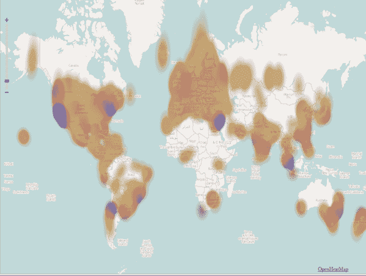

# 硅谷、伦敦、纽约:创业基因数据揭示了世界顶尖科技中心的排名

> 原文：<https://web.archive.org/web/https://techcrunch.com/2012/04/10/startup-genome-compares-top-startup-hubs/>

去年，我们报道了由三位年轻企业家 Bjoern Herrmann、Max Marmer 和 Ertan Dogrultan 创建的一个名为“Startup Genome”的雄心勃勃的合作研发项目。这个正在进行的项目的目标是(现在也是)对科技创业公司成功和不成功的原因进行全面的数据驱动研究。

其研究成果之一是[初创公司 Compass](https://web.archive.org/web/20230327061512/https://www.startupcompass.co/) :这是一款免费的基准测试工具，利用其数据让企业家评估他们相对于同行业其他初创公司的进展。根据其使命声明，该产品的首要目标是通过“利用数据驱动的反馈回路”，让创始人做出更明智的产品和商业决策。

尽管后来团队的一部分人已经分开，专注于教育项目和创业加速器 [Blackbox](https://web.archive.org/web/20230327061512/http://blackbox.vc/) ，赫尔曼和马默继续在创业基因组上辛勤工作，从注册了创业指南针的约 16K 家创业公司以及其他公司收集数据。今天，距离启动还有一年，企业家们相信创业基因组终于跨越了门槛，达到了世界顶级创业生态系统的关键数据量。

随着数据集的不断增长，Startup Genome 开始对这些生态系统进行全面的比较分析，试图让初创公司更细致地了解世界顶级创业中心是如何(以及以何种速度)演变的，以及哪些正在引领潮流。

在过去的五年中，网络(以及随之而来的数字技术的多样性)已经成熟，这成功地降低了启动一项可行业务的成本(以及所需的资本量)——或者至少是 MVP。与此同时，这导致了软件公司数量的爆炸式增长(这是马克·安德森关于软件正在吞噬世界的观点的一个内在因素),因此，新的生态系统正在全球各地涌现，以帮助这些公司成长，帮助那些跟随他们脚步的公司快速发展，并点燃区域经济增长之火。

就全球经济的整体健康而言，这些肥沃的创业生态系统至关重要，因为它们有潜力成为地区和全球创造就业的引擎。例如，在美国，成立不到五年的公司在过去三十年中创造了 4400 万个工作岗位，占同期美国所有新增工作岗位的总数。这是一股暗流，导致了两党对就业法案的不同寻常的支持*。*

 *因此，赫尔曼同意，健康的创业生态系统可以成为一种民主化的力量。通常情况下，创业公司会密切关注现有的支持网络，无论是金融资本、人力资本还是技术。创业公司会去有钱的地方——从历史上看，那是硅谷，波士顿和纽约市作为附录被提及。然而，在过去的几年里，事情一直在变化，今天这一点比以往任何时候都更加明显，因为有活力的公司正在全球各地涌现。

《企业家》杂志声称，这是今年 SXSW 的首要主题——企业家不再需要将自己定位在硅谷来建立成功的科技或消费者网络业务。鉴于这种日益丰富的选择，企业家能够回答这样的问题变得越来越重要，“特定生态系统的优势和劣势是什么？”以及“在这些生态系统中成功企业家的区别特征是什么？”

Herrmann 和 Marmer 认为，关于每个生态系统的益处，已经有了大量的定性报告，但迄今为止，支持我们集体直觉的数据很少。

在汇编数据时，该团队已经开始揭示世界创业生态系统的优势和弱点的宝贵见解，随着研究的进展，创始人表示，他们希望它将继续“为决定在哪里创办公司的企业家、决定将资本分配到哪里的投资者、寻找收购目标的大公司以及希望让创业生态系统蓬勃发展的政策制定者提供见解。”

挖掘所有那些投资于这些创业生态系统成功的人的集体理想主义，我们知道这个世界迫切需要经济复苏，因此我们都希望释放赫尔曼所说的“创业复兴”将有助于推动这种进化。

初创公司 Genome 试图发挥自己的作用，今天分享了一些关于顶级初创公司生态系统的发现，提供了一个基于数据的比较视角——从它发现的三个最活跃的初创公司中心开始:硅谷、纽约市和伦敦。

下面，你会发现一些关于这些比较的 20 多种见解，旨在让企业家思考什么是有效的，什么是无效的。读者可以在我们的报道或[的项目博客](https://web.archive.org/web/20230327061512/http://www.systemmalfunction.com/2011/05/deciphering-genome-of-startups.html)中找到更多关于该报告如何定义其术语的信息。这里还有[更多关于它如何定义“类型”的内容](https://web.archive.org/web/20230327061512/http://blog.startupcompass.co/pages/startup-personality-type-index-page)。

*   **创业吞吐量:**也许不出所料，硅谷创业生态系统继续保持领先，但差距每年都在变小。硅谷的生态系统目前比纽约市大 3 倍，比伦敦大 4.5 倍，比柏林大 12.5 倍，比博尔德大 38 倍。
*   **创业成功率:**按比例来说，硅谷生态系统中处于“规模阶段”的公司比纽约多 22%，比伦敦多 54%。
*   **资本的可获得性:**平均而言，硅谷初创公司在发展的前三个阶段[筹集的资金要多两到三倍:发现、验证和效率](https://web.archive.org/web/20230327061512/http://blog.startupcompass.co/pages/marmer-stages)。但在规模阶段，与硅谷相比，纽约市的初创公司筹集的资金多 27%，伦敦的初创公司多 30%。
*   **创造就业机会:**在效率和规模阶段，硅谷初创公司创造的就业机会比纽约初创公司多 11%，比伦敦初创公司多 38%。
*   **风险简介:**高风险公司的数量在创业生命周期中稳步下降，只有纽约例外，那里的高风险公司数量从 45%飙升至 67%，处于规模化阶段的高风险公司数量是硅谷的 4 倍。
*   **产品类型:**与纽约的企业家相比，硅谷企业家开发游戏的可能性是纽约的两倍，开发市场的可能性低 50%，开发社交网络的可能性高 23%，开发基础设施的可能性高 3.5 倍，开发金融工具的可能性低 2.5 倍。与硅谷的企业家相比，伦敦企业家开发电子商务产品的可能性要高 50%，开发社交产品的可能性低 35%，开发基于用户生成内容的产品的可能性低 3.5 倍，开发项目管理软件的可能性高 2 倍。
*   **[市场类型:](https://web.archive.org/web/20230327061512/http://steveblank.com/2009/09/10/customer-development-manifesto-part-4/)** 硅谷企业家开拓新市场的可能性比伦敦企业家高 13%，而伦敦企业家用更好的产品开拓现有市场的可能性比硅谷企业家高 21%。纽约企业家试图用利基产品重新细分现有市场的公司比例最高。他们比伦敦的企业家更有可能建立一些利基市场。
*   市场规模:硅谷的企业家比纽约和伦敦的企业家更加“雄心勃勃”。与纽约市企业家相比，硅谷企业家估计其市场规模超过 100 亿美元的可能性高出 22%，比伦敦企业家高出 120%。他们估计自己的市场规模不到 1 亿的可能性也降低了近两倍。
*   **收入来源:**订阅是最受欢迎的收入来源。与伦敦相比，硅谷企业家的主要收入流成为潜在客户的可能性是伦敦的 4.4 倍，成为虚拟商品的可能性是伦敦的 3.6 倍，成为快速衰落的许可费模式的可能性是伦敦的 2.6 倍。
*   **感知竞争优势:**与硅谷企业家相比，纽约市企业家将内容视为主要竞争优势的可能性是硅谷企业家的 4.3 倍，将内容视为利基焦点的可能性比硅谷企业家高 40%，将内容视为团队核心的可能性比硅谷企业家低 90%。与硅谷企业家相比，伦敦企业家将技术视为主要竞争优势的可能性增加了 58%，将用户体验视为主要竞争优势的可能性减少了 5.3%。
*   **产品开发:**伦敦和纽约公司外包的产品开发比硅谷公司多 34%。
*   **适应性:**硅谷更频繁地出现旋转运动。硅谷的枢纽平均比纽约多 45%，比伦敦多 33%。
*   硅谷和纽约的生态系统比伦敦的生态系统有更多有益的导师。硅谷公司的有益导师比伦敦公司多 46%。
*   **思想领袖:**在硅谷，史蒂夫·布兰克和保罗·格拉厄姆是最受欢迎的创业专家。在伦敦，保罗·格拉厄姆是迄今为止最受欢迎的专家，而纽约显示了他们的地方自豪感，投票选出弗雷德·威尔森为他们最喜欢的创业专家。
*   **职业道德:**硅谷的公司比纽约市的公司多工作 35%。在硅谷，团队平均每天工作 9.5 小时，而在伦敦是 8 小时，在纽约是 7 小时。
*   **创始团队构成:**硅谷的创始团队比纽约的创始团队技术含量高 34%。而纽约的创始团队的业务比重几乎是硅谷创始团队的两倍。
*   创始人教育背景:在伦敦，大多数创始人拥有硕士学位，而在硅谷和纽约，大多数创始人只有本科学位。但是纽约市拥有博士学位的创业者比硅谷多 2.2 倍。
*   **创始人性别:**纽约市的女性创始人几乎是硅谷和伦敦的两倍(比例分别为 80 比 20 和 90 比 10)。
*   **创始人年龄:**三个生态系统的创始人平均年龄大致相同，合计平均 33.5 岁。
*   **创始人经历:**硅谷的创始人平均创办的创业公司数量几乎是纽约和伦敦创始人的两倍。
*   **创始人动机:**硅谷想要改变世界的创始人比伦敦或纽约多 30%。与硅谷或伦敦相比，纽约想要过上好日子的创业者要多 50%。与硅谷或纽约相比，伦敦想要快速转型的创业者数量是后者的两倍。
*   **创始人挑战:**纽约市的初创公司将团队建设视为最大挑战的可能性降低了 3.7 倍，同时，他们将“事情太多、能力不足”视为最大挑战的可能性增加了近两倍。

Startup Genome 还提供了一份新的全球 25 大创业生态系统排名，按平均吞吐量排序:

1.  硅谷(旧金山、帕洛阿尔托、圣何塞、奥克兰)
2.  纽约市(纽约市，布鲁克林)
3.  伦敦
4.  多伦多
5.  特拉维夫
6.  洛杉矶
7.  新加坡
8.  圣保罗
9.  班加罗尔
10.  莫斯科
11.  巴黎
12.  圣地亚哥
13.  西雅图
14.  马德里
15.  芝加哥
16.  温哥华
17.  柏林
18.  波士顿
19.  奥斯汀
20.  孟买
21.  悉尼
22.  墨尔本
23.  华沙
24.  华盛顿特区
25.  蒙特利尔

Startup Genome 已经获得了世界各地许多创业企业的支持，包括 Endeavor、华沙的 Mamstartup、圣保罗的 Startupi、新加坡的 sgentrepreneur、希腊的 Metavallon 和 Loft2work 以及美国其他城市的 Startup America。

创始人正在寻找当地对这些生态系统的支持，有兴趣了解更多或有任何建议的读者，可以在 contact@startupcompass.co 与他们联系。要注册下一期完整的深度报道，[请点击这里](https://web.archive.org/web/20230327061512/http://blog.startupcompass.co/pages/entrepreneurship-ecosystem-report)。

这个创业公司基因组仍然是一个令人敬畏的“创业公司帮助创业公司”企业，该组织收集的数据越多，全球越多的创始人和企业家受益。因此，如果你经营一家科技公司，看看 [Startup Compass](https://web.archive.org/web/20230327061512/https://www.startupcompass.co/) ，因为它不仅能帮助你深入了解自己的业务，还能为项目的数据集做出贡献，并积累更多关于全球创业中心的高质量比较数据。

你怎么想呢?*