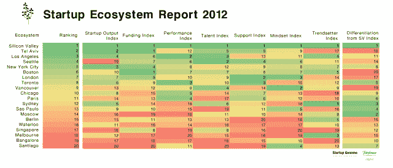

# Startup Genome 排名世界顶级创业生态系统:硅谷、特拉维夫和洛杉矶。引领潮流| TechCrunch

> 原文：<https://web.archive.org/web/https://techcrunch.com/2012/11/20/startup-genome-ranks-the-worlds-top-startup-ecosystems-silicon-valley-tel-aviv-l-a-lead-the-way/>

今天， [Startup Genome](https://web.archive.org/web/20230404225710/http://blog.startupcompass.co/) 发布了关于全球顶级创业生态系统的 160 页报告的前半部分。在该报告的许多感人部分中，最值得注意的(也是潜在的争议)是它所谓的创业生态系统指数，该指数对全球 20 大创业生态系统进行了排名，就像洛杉矶大学橄榄球赛一样。

对于那些不熟悉的人来说，雄心勃勃的合作性 R&D 项目被称为“创业基因组”，由三位年轻的企业家 Bjoern Herrmann、Max Marmer 和 Ertan Dogrultan 创建，他们开始以数据驱动的方式全面研究创业成功的原因，或者走渡渡鸟的路。

最初的研究产生了[初创公司 Compass](https://web.archive.org/web/20230404225710/https://www.startupcompass.co/) :根据其使命声明，这是一个基准测试工具，利用研究项目的数据，使初创公司及其创始人能够评估他们相对于同行业其他人的进展，并帮助他们通过“利用数据驱动的反馈回路”做出更明智的产品和业务决策。

如今，在该项目开始近两年后，该团队通过 Startup Compass 和对企业家和投资者进行的 50 多次深度定性采访，收集了全球超过 5 万家初创公司的数据。这些结果是对创始人在 4 月发布的迷你报告[的实质性更新，该报告对世界顶级创业生态系统进行了初步研究，从发现的三个最活跃的中心开始:硅谷、纽约市和伦敦。](https://web.archive.org/web/20230404225710/https://techcrunch.com/2012/04/10/startup-genome-compares-top-startup-hubs/)

这份比较分析是与加州大学伯克利分校、斯坦福大学和西班牙电信数字公司(Telefónica Digital)的附属机构合作进行的，涵盖了一系列主题，包括创业生态系统的景观如何开始超越硅谷，成为某种程度上的全球现象。该报告根据 50 个变量、8 个组成部分的指数编制了一份创业生态系统的全球排名，其中包括创业产出、资金、公司业绩、人才、支持基础设施、创业思维、潮流趋势和生态系统差异。

不出所料，排名第一的是硅谷，它仍然是企业家的圣地，并被用作与其他榜单进行比较的基准。排在第二位的是特拉维夫，接下来是洛杉矶、西雅图、纽约和波士顿，然后是横跨大西洋的伦敦——它是欧洲最大的生态系统。虽然世界上五个顶级的创业生态系统都在美国，但世界其他地方正在迎头赶上。

下面你会发现对比较数据的八个见解，旨在让企业家、创始人和整个行业考虑什么是有效的，什么是无效的，然后是实际的排名。读者可以在[我们的报道](https://web.archive.org/web/20230404225710/https://techcrunch.com/2011/09/01/a-deeper-look-at-blackboxs-data-on-startup-failure-and-its-top-cause-premature-scaling-infographic/)或该项目的博客上找到更多关于该报告如何定义其术语的信息。[这里还有一个词汇表](https://web.archive.org/web/20230404225710/http://blog.startupcompass.co/pages/glossary)。

在高层中明显缺失？亚洲创业生态系统。赫尔曼表示，这是因为尽管该项目收集了 5 万家公司的数据，但没有足够的亚洲地区数据来进行适当的比较。因此，在其他事情中，考虑这一点，作为对结果有所保留的理由，因为项目仍在开发中。

1.  即使是发达的生态系统，如纽约和伦敦，风险也降低了 70%以上
2.  在创业生命周期的早期“预生产市场适应”阶段，创业公司可以获得比硅谷更多的资本。
3.  通过流动的移民模式，硅谷在全球各地的全球创业生态系统中留下了自己的印记。柏林和圣保罗曾在硅谷生活过的创始人数量最少，分别为 4%和 7%，而新加坡和滑铁卢曾在硅谷生活过的创始人数量最多，分别为 33%和 35%。
4.  就正在发展的创业公司类型而言，悉尼、圣保罗和莫斯科是与硅谷最不同的创业生态系统。
5.  悉尼是数据驱动型创业公司的全球之都。
6.  法国私立教育系统的文化优势强烈影响了巴黎人的心态，生态系统中超过 96%的创始人在创办公司前至少完成了硕士学位或博士学位。
7.  特拉维夫的企业家很难适应新的技术趋势，因为超过 80%的初创公司使用历史上流行的编程语言 PHP、C++、Java 和。尽管这些语言在硅谷和其他地方很快就不流行了，取而代之的是 Ruby、Python 和 Javascript。
8.  即使新加坡拥有相对强大的资金环境，但那里的创始人的风险承受能力是前 20 名创业生态系统中最低的。
9.  墨尔本是一个崭露头角的创业生态系统，在采纳创业世界的新趋势方面排名很高，但它最大的一个痛点是，当地公司通过瞄准非常小的利基市场来限制他们的潜力。

以下是前 20 名，按顺序排列:

1.  硅谷
2.  特拉维夫
3.  洛杉矶
4.  西雅图
5.  纽约市
6.  波士顿
7.  伦敦
8.  多伦多
9.  温哥华
10.  芝加哥
11.  巴黎
12.  悉尼
13.  圣保罗
14.  莫斯科
15.  柏林
16.  滑铁卢(加拿大)
17.  新加坡
18.  墨尔本
19.  班加罗尔
20.  圣地亚哥

你[可以在这里](https://web.archive.org/web/20230404225710/http://blog.startupcompass.co/pages/entrepreneurship-ecosystem-report)报名报道。