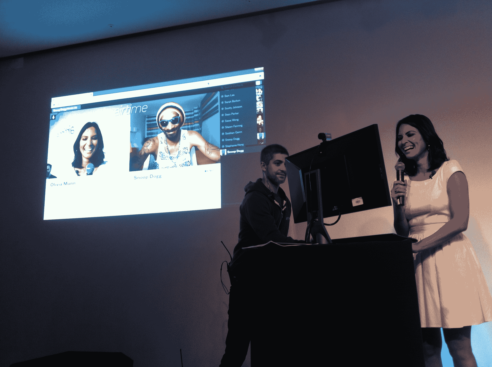
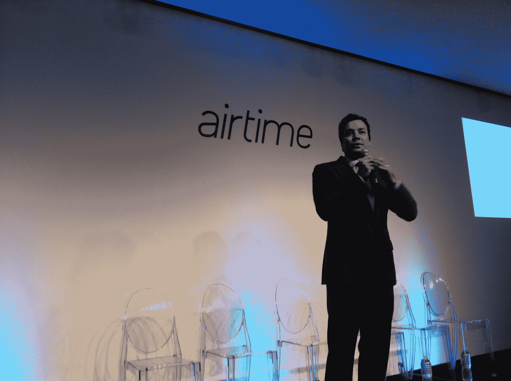

# 作为名人财富的创业启动:Airtime 的奢华、炫目、炫目的首次亮相 

> 原文：<https://web.archive.org/web/https://techcrunch.com/2012/06/05/startup-launch-as-celebrity-bonanza-airtimes-ritzy-glitzy-glitchy-debut/>

曾几何时，只需轻轻点击一个按钮，就可以发送一个 web 服务。几封电子邮件或留言板上的帖子可能足以吸引一些早期用户的兴趣。

不再是了。不知何故，在这个过程中的某个地方，某些创业发布会和演示日变得更像是明星云集的电影首映式或画廊开幕。我们都去看。我们可能会留下来。我们可能会离开。但我们都是来看表演的。

科技产业从主流文化的边缘向中心的转移在肖恩·帕克和肖恩·范宁的故事中表现得最为明显——他们首次亮相备受期待的(也更有利于家庭！)今日 ChatRoulette 版本。

15 年前，范宁和帕克还只是在聊天室里闲逛的青少年。“我们都是黑客，”帕克今天在纽约说。“我们对计算机安全感兴趣。目标是某种邪恶的行为…我们基本上是网络罪犯。”

今天，他们的生活完全不同。即使考虑到脸书最近的财富缩水，帕克也是一个亿万富翁。他们的发布会现在在切尔西的一个仓库举行，玛莎·斯图尔特坐在前排，吉米·法伦担任司仪。

“他们是互联网上的让·克劳德·云顿和杜夫·龙格尔，”法伦说，并把他们带上了舞台。在演示期间，帕克第一个打电话给电视主持人兼模特奥利维亚·芒恩。第二个是史努比·道格。

但明星们并没有从产品在演示模式下无法工作(真正的产品尚未上线)的尴尬的五分钟时长中节省播出时间。打电话给史努比·道格试了几次。当电视主持人乔尔·麦克哈尔上场时，产品失灵了几分钟。“你要炒谁的屁股？”他问台上的帕克。

“这不是它真正的运作方式，我向他妈的上帝发誓，”穆恩说。"你必须上它，使用它，然后写你的博客文章."

它最终再次开始工作，麦克黑尔与《宋飞正传》的朱莉娅·路易斯·德莱弗斯通了电话，后者又与《宿醉》的艾德·赫尔姆斯通了电话，后者又与艾丽西亚·凯斯通了电话。

在后来的一次通话中，赫尔姆斯试图拨打 Airtime 在旧金山的总部。但是他们没有接。“你自己的办公室没人接吗？!"麦克黑尔对帕克开玩笑说。他们没有展示你和陌生人配对的真实生活模式。

尽管他们的作品如今的包装更加奢侈，但播出时间仍然是帕克和范宁青少年时期的真实写照。“我们觉得自己是这个世界上唯一一个对搅乱别人生活感兴趣的人，”帕克谈到最初遇见范宁时说。

他后来说，随着匿名的消失和脸书社交图的兴起，网络在几个方面发生了最坏的变化。“互联网上似乎从来没有自发的事情发生，”他说。“没有随机的余地。社交图实际上有些令人窒息。当你所有的朋友都在看你做什么时，你的自我表达能力实际上是有限的。”

《播出时间》给人的感觉就像是帕克长大后试图回到他邪恶的过去。然而，一个大问题是，一个名人云集的发布会是否会像 Napster 的首映那样有助于 Airtime 产生巨大的文化影响。时间会证明一切。

*关于播出时间的更多信息，请查看我们的报道:*

[Airtime 推出了一个视频聊天网络，这是一个在线聊天的新地方](https://web.archive.org/web/20221231012341/https://techcrunch.com/2012/06/05/airtime-video-chat/)

[面对面:广播时间将如何使互联网重新人性化](https://web.archive.org/web/20221231012341/https://techcrunch.com/2012/06/05/airtime-experience-together/)

[肖恩·帕克和肖恩·范宁暗示广播时间的未来【TCTV】](https://web.archive.org/web/20221231012341/http://tcrn.ch/JUnyR2)

