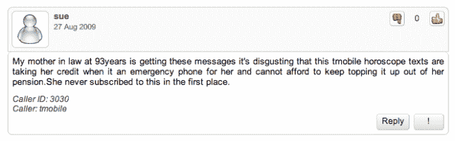
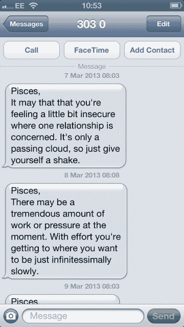
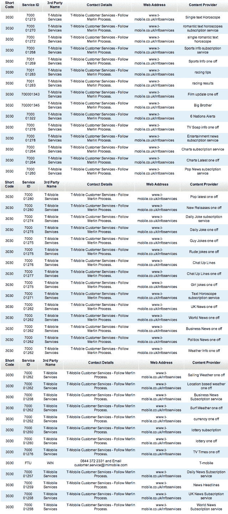

# 为什么创业公司打败了运营商(或者是收费短信星座服务的奇怪案例&缺乏客户同意)

> 原文：<https://web.archive.org/web/https://techcrunch.com/2013/03/25/startups-beating-carriers/>

有没有创业公司试图通过过于复杂的定价结构来迷惑尽可能多的用户，同时欺骗那些负担不起全套服务的人注册价格高得离谱的垃圾服务，然后让他们很难选择退出？如果是这样，你会希望从运营商那里获得灵感。

当然，初创公司也不能幸免于可疑和不负责任的行为——例如，在没有事先询问的情况下盗用通讯录数据，或者[玩弄 TOS 并吓走用户](https://web.archive.org/web/20221207213743/https://beta.techcrunch.com/2012/12/18/instagram-speaks-out-on-users-concerns-about-tos-changes-will-have-more-to-share-soon/)——但是那些像骗子一样的人不得不担心他们的欺诈行为会导致他们(正确地)失去用户。运营商的运营方式不同:它们的基础设施创造了垄断市场，使得客户很难转向更好的选择。因此出现了劣质行为。

但运营商寡头垄断正受到高端数据服务的挑战。虽然网络运营商不会完全失去他们的领地，但他们正被推到后脚。从电路交换语音加文本服务到全 IP 移动数据的转变使得互联网公司得以进入并开始破坏他们利润丰厚的围墙花园。无论是 Skype、Viber、Whatsapp 还是 Line，传统的语音和短信运营商收入流正在被更灵活、更便宜的 VoIP 和其他即时通讯工具侵蚀。根据 [Strategy Analytics](https://web.archive.org/web/20221207213743/http://www.strategyanalytics.com/default.aspx?mod=pressreleaseviewer&a0=5336) 最近的一份报告，由于 OTT 服务的兴起，2012 年至 2017 年间，超过 30 亿美元的运营商信息收入将会消失。

运营商成为“哑管道”——或者稍微不那么贬义地说，一种公用事业服务，就像水、电和煤气——似乎几乎是不可避免的(并不是说有人会为他们哭泣)。但这一结果并不仅仅是更快、更具创新性的创业公司的结果。这么说是为了掩盖运营商如何糟糕地适应和发展他们的商业模式——相反，他们更愿意试图阻止新贵竞争对手，以便尽可能多地从生病的摇钱树中榨取利润，而不是接受技术格局正在发生变化——并转向新的领域。

电信公司已经建立了限制和锁定客户的业务——合同、恼人的门户网站、复杂的资费结构，你能想到的都有——很明显，电信公司很难跳出他们的锁定模式。虽然公平地说，许多老牌公司很难重新点燃企业家精神——让我们面对现实吧，电信公司的 DNA 中有网络基础设施，而不是软件——运营商仍然可以做更多的事情来挖掘自己的创新漏洞。最终，他们还是要责怪自己。

一些运营商正试图单独或通过像 Joyn 这样的集体行动联合起来，参与到这一超越服务的行动中。但是，抛开他们保守、反动的心态和对新想法的怀疑——这已经使他们与初创公司和应用程序制造商相比处于劣势——他们在选择加入和退出数据服务的混合世界中面临的一个巨大问题是长期缺乏客户信任。为什么有人会选择一家多年来一直竭尽全力欺骗用户的公司的新服务呢？

电信公司对待客户就像把牛关起来挤奶一样，玷污了自己的名声。运营商不是服务企业或娱乐企业，他们是收税的——在你使用他们的道路时，尽可能多地设置收费站和处罚警察限速。难怪用户几乎普遍鄙视它们。当你的城堡受到前所未有的攻击时，这是一个非常可怕的处境。(Joyn us？不用了，谢谢！)

这是当前运营商撞车行为的一个例子，涉及英国的 T-Mobile——在我看来，这是运营商更广泛失败的症状，并说明了如果他们想要在应用和服务的受欢迎程度竞赛中成功竞争，他们必须在改革运营方面走多远。

在我继续说下去之前，值得注意的是，这绝不是一个孤立的例子——例如，参见下面的[论坛](https://web.archive.org/web/20221207213743/http://whocallsme.com/Phone-Number.aspx/3030) [帖子](https://web.archive.org/web/20221207213743/http://whocallsme.com/Phone-Number.aspx/3030/2)(比如下面的截图)抱怨 T-Mobile 存在几乎相同的问题，可以追溯到几年前。

**2013 年—一位新的 PAYG 客户加入了 T-Mobile 英国分公司……**

我家一位 70 岁的老人从英国 T-Mobile 公司订购了一款预装 10 张的预付费 SIM 卡。这种资费意味着你不用为使用网络支付月费，你只需为你的实际使用(电话、短信和移动数据)付费

在智能手机(一部 iPhone)送给她之前，SIM 卡被放在包里整整三天。在激活 SIM 卡时，我们注意到一条来自短代码“3030”的不请自来的星座短信。没有一条消息表明接收短信需要付费 

把 SIM 卡放入手机后的第二天早上，在检查 PAYG 的余额时，发现 10 英镑已经降到了 8.22 英镑——尽管没有打电话或发收费短信。(因为它是一部 iPhone，所以也没有运营商门户网站可以错误地注册星座服务)

一名 T-Mobile 的客服代表告诉我们，星座服务是一项高级短信服务(每条短信收费 40 便士)。它说它是由第三方公司运营的。我们被告知，我们已经选择在 3 月 6 日接收短信——这是 SIM 卡从包装中取出并放入手机的两天前。在指出这一点后，该代表说 T-Mobile 将调查这个问题，并在第二天早上回电。他还说，他将阻止第三方短信

T-Mobile 没有回电话。另一条占星短信来了。在再次打电话给 T-Mobile 时，另一位发言人说，我们应该给这个号码发短信停止发送短信。这位发言人声称，这些短信是由一家名为 MX Telecom 的公司发送的，我们需要联系该公司才能获得退款

在我看来，很明显有些可疑的事情正在发生——所以在我们试图通过 T-Mobile 的客户服务电话解决问题的同时，我联系了 T-Mobile 新闻办公室，询问他们如何解释客户在未经他们同意或不知情的情况下注册了一项高级服务？是否存在数据泄露，或者事实上他们在未经 PAYG 客户同意的情况下选择了付费服务？

经过几天对这个问题的调查，T-Mobile 的新闻办公室告诉我，3030 服务实际上是 T-Mobile 的服务，根本不是第三方服务。(值得重申的是，T-Mobile 的客服从来没有给过我们这个信息，尽管有多次关于 3030 的电话。我们多次被错误地告知这是第三方。)

该公司随后声称，PAYG SIM 卡被自动注册以 40 便士一个的价格接收星座短信的原因是因为相关的电话号码是一个旧号码，它的前主人已经注册了这项服务。该公司表示，未能删除旧订阅是“人为错误”。

以下是该公司提供的声明全文:

> 作为 Ofcom 指令的一部分，以确保英国不会用完号码，PAYG 号码被回收。在这种情况下，当号码被转移到[客户]时，号码附带的高级文本服务似乎仍然存在。当 PAYG 号码被回收时，它们会被附加到新的 sim 卡上，因此不会传输任何个人数据。
> 
> 我们已经冻结了[客户的]账户，以阻止任何进一步的短信，并且我们已经将产生的费用记入她的账户。
> 
> 这是一个孤立的人为错误，没有个人数据共享。我们对造成的任何不便表示歉意。

现在，这个问题可能是由人为错误造成的。但这不是一个孤立的错误——从其他人在各种论坛上抱怨 T-Mobile 的相同问题来看(不要假装，T-Mobile 是这里唯一的违规者——我在与其他英国运营商相关的[论坛](https://web.archive.org/web/20221207213743/http://community.o2.co.uk/t5/Discussions-Feedback/Blocking-premium-rate-text-message/td-p/158764/page/2)上发现了[类似的投诉](https://web.archive.org/web/20221207213743/http://forum.vodafone.co.uk/t5/Pay-as-you-go-services/New-Sim-Already-Subscribed-To-Premium-Sms-Service/td-p/195059))。从一些帖子来看，这个问题显然已经重复了好几年。

此外，我们应该说，我的家庭成员从未注册的星座服务(事实上，不可能注册，因为当服务被激活时，SIM 卡仍然在它的包中)似乎相当可疑。黄道十二宫有 12 个星座。其中 11 个是不正确的。但 T-Mobile 的星座服务为与我家庭成员出生日期相关的星座发送了优质短信。

巧合吗？这是 T-Mobile 在我问及此事(以及为什么从未有人告诉我们 T-Mobile 运营 3030 服务)时声称的:

> 我们对您收到的错误信息表示歉意。
> 
> 我们为所有客户服务人员制定了培训流程，以确保他们了解与我们提供的产品和服务相关的所有细节。我们会不断审查这一流程以做出改进，并在收到通知时解决任何具体问题。
> 
> 星座相同是一个巧合，对于论坛上的帖子，我们不能在没有进一步调查每个案例的情况下评论细节。如果客户认为他们错误地注册了这项服务，我们很乐意根据具体情况与他们沟通。

很有可能这个电话号码的前主人也是双鱼座，所以这可能是一个巧合。但是当你考虑到订购 SIM 卡的过程中包括我的家庭成员向 T-Mobile 提供她的出生日期时，这看起来就不那么令人信服了。T-Mobile 拥有计算她的星座的数据，以及她的电话号码和可扣除的 PAYG 余额——换句话说，所有需要的数据都可以让她注册一项高级服务并扣款。唯一缺少的是她的同意。

但让我们宽容一点，假设这只是巧合，在所有各种论坛投诉中的人为错误(一些是运营商主导的，一些是客户造成的)，运营商高级短信服务如此明显草率的部分问题是缺乏监管来控制这些“错误”。

在英国，一个名为 Phonepayplus 的组织监管高级短信服务，但仅限于第三方高级短信服务。当我问它是否收到了对 T-Mobile 3030 服务的投诉时，它让我去找电信监管机构 Ofcom。但是 Ofcom 也没有对这项服务进行监管——在 2012 年 7 月，Ofcom 决定将“自有门户”服务(一位女发言人告诉我，优质短信服务将属于此类)从其监管范围中移除。这意味着运营商高级短信服务目前不受监管(至少在英国)。

去年，Ofcom 给出的将自有门户服务从其监管范围中移除的原因之一(参见:第 21 和 22 页[此处](https://web.archive.org/web/20221207213743/http://stakeholders.ofcom.org.uk/binaries/consultations/review-prs/statement/statement.pdf))是:

> 消费者非常清楚谁提供服务，如果有任何问题，他们应该向谁投诉

—这是一个极大的讽刺，因为 T-Mobile 的高级短信没有包含任何识别 T-Mobile 为发送者的信息；不包含 SMS 要花钱接收的信息；T-Mobile 自己的客户服务人员多次将发件人误认为是第三方，而不是 T-Mobile。

尽管我多次询问，T-Mobile 并未向我提供其运营的优质短信服务的信息。然而，讽刺的是，通过使用网站上托管的[第三方文本服务检查器](https://web.archive.org/web/20221207213743/https://www.t-mobile.co.uk/pricing-data/sms-code-check/result/)(隐藏在多个子菜单下)，可以从网站中挖掘出这些信息。T-Mobile 的 3030 服务列表长达三页，我已将它们合成到下图中。

也许运营商认为他们可以逃脱高级短信部门的一些“人为错误”,因为这些服务不受监管。也许这也是这些寡头的命令和控制心态的症状。可以肯定的是，如果运营商将他们投入的一点精力用于维护这些不合时宜、毫无价值(对他们的客户而言)的优质短信“服务”，以创造客户想要使用的真正有用的服务，那么他们将有更好的机会与跳过他们大门的初创公司竞争。

或者他们会，如果他们没有花费数年时间把用户当成电子表格上的数字来破坏他们的信任。这里有一个教训，适用于任何企业——无论规模大小。

[ [图片](https://web.archive.org/web/20221207213743/http://www.flickr.com/photos/dwabyick/2342437096/sizes/m/in/photostream/)由[迪兹南](https://web.archive.org/web/20221207213743/http://www.flickr.com/photos/dwabyick/)通过 [Flickr](https://web.archive.org/web/20221207213743/http://www.flickr.com/photos/dwabyick/2342437096/sizes/m/in/photostream/) ]