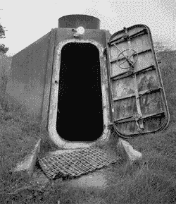

# 初创公司最有能力度过低迷期

> 原文：<https://web.archive.org/web/https://techcrunch.com/2008/09/30/startups-best-positioned-to-weather-a-downturn/>

# 初创公司最有能力度过低迷时期

既然国会未能拯救 T2，这个国家(和世界，在较小程度上)已经开始为核冬天做准备。科技行业也不例外，即使硅谷倾向于认为自己不会受到更广泛的经济动荡的影响。

正如弗雷德·威尔逊[所指出的](https://web.archive.org/web/20230404195423/http://www.avc.com/a_vc/2008/09/my-thoughts-on.html)，那些有幸获得风险投资的初创公司将在这段艰难时期表现最佳。因此，根据 CrunchBase 的数据，我们编制了一份清单，列出了所有在过去两年中至少融资 2500 万美元的科技初创公司。下面列出了最近储备了这么多资金的大约 160 家初创公司。

脸书在过去两年中筹集了 4.55 亿美元(占其 4.96 亿美元总额的大部分)，位居榜首。清洁技术也很受欢迎，Nanosolar 筹集了 3 亿美元，ESO lar 1.4 亿美元，sulfur cell 1.34 亿美元。

当然，要真正了解这些初创公司为未来几年做了多少准备，我们还必须看到其他数据，如烧钱率、收入和人数，这些数据并非都是众所周知的。然而，他们最近的融资提供了一个很好的指南。

我们是否错过了任何相关公司或融资轮次？将它们提交给 CrunchBase，我们将更新该列表。

1.  脸书——4.55 亿美元
2.  ZeniMax3.1 亿美元
3.  [纳米太阳能](https://web.archive.org/web/20230404195423/http://www.crunchbase.com/company/nanosolar)-3 亿美元
4.  监督-2.1 亿美元
5.  OANDA-2 亿美元
6.  Kayak-1.96 亿美元
7.  [grid point](https://web.archive.org/web/20230404195423/http://www.crunchbase.com/company/gridpoint)——1.67 亿美元
8.  [塑料逻辑](https://web.archive.org/web/20230404195423/http://www.crunchbase.com/company/plastic-logic)——1.5 亿美元
9.  欧洲太阳能公司 1.4 亿美元
10.  [需求媒体](https://web.archive.org/web/20230404195423/http://www.crunchbase.com/company/demandmedia)——1.35 亿美元
11.  [硫磺电池](https://web.archive.org/web/20230404195423/http://www.crunchbase.com/company/sulfurcell)——1.34 亿美元
12.  移动式海上钻井平台-1.2 亿美元
13.  [联合移动](https://web.archive.org/web/20230404195423/http://www.crunchbase.com/company/unitedmobile)-1.15 亿美元
14.  智联招聘-1.1 亿美元
15.  宁 1.04 亿美元
16.  魅力媒体-1.04 亿美元
17.  Hulu-1 亿美元
18.  9 你——1 亿美元
19.  特定媒体——1 亿美元
20.  1 亿美元
21.  里尔登商业公司:1 亿美元
22.  澳大利亚——9780 万美元
23.  CDNetworks-9650 万美元
24.  [移动网络](https://web.archive.org/web/20230404195423/http://www.crunchbase.com/company/movenetworks)-9130 万美元
25.  定点竞标者——9100 万美元
26.  特斯拉汽车公司——8500 万美元
27.  大鱼游戏——8330 万美元
28.  实时世界 8100 万美元
29.  广告媒体集团-8000 万美元
30.  [活跃的网络](https://web.archive.org/web/20230404195423/http://www.crunchbase.com/company/theactivenetwork)——8000 万美元
31.  HelioVolt7700 万美元
32.  优酷网 7700 万美元
33.  数据管道——7500 万美元
34.  Trion World Network-7000 万美元
35.  [阿卡迪亚网络公司](https://web.archive.org/web/20230404195423/http://www.crunchbase.com/company/arcadian-networks)——7000 万美元
36.  [华帝传媒](https://web.archive.org/web/20230404195423/http://www.crunchbase.com/company/vantage-media)——7000 万美元
37.  a123 系统-7000 万美元
38.  波士顿电力公司——6860 万美元
39.  Infinia6650 万美元
40.  LinkedIn——6580 万美元
41.  菲斯克——6500 万美元
42.  布莱特科夫:6440 万美元
43.  丝路科技-6400 万美元
44.  Coremetrics——6000 万美元
45.  到达当地——5520 万美元
46.  5500 万美元
47.  [联合媒体](https://web.archive.org/web/20230404195423/http://www.crunchbase.com/company/federatedmedia)-5450 万美元
48.  懒鬼——5350 万美元
49.  摇滚你——5250 万美元
50.  51.com:5100 万美元
51.  健康中心:5000 万美元
52.  频道顾问:5000 万美元
53.  喷灯-5000 万美元
54.  GarageGames——5000 万美元
55.  [革命资金](https://web.archive.org/web/20230404195423/http://www.crunchbase.com/company/revolutionmoney)——5000 万美元
56.  [幻灯片](https://web.archive.org/web/20230404195423/http://www.crunchbase.com/company/slide)——5000 万美元
57.  股票:4900 万美元
58.  支付 4900 万美元
59.  [jump tap](https://web.archive.org/web/20230404195423/http://www.crunchbase.com/company/jumptap)——4800 万美元
60.  [ice](https://web.archive.org/web/20230404195423/http://www.crunchbase.com/company/ice)——4700 万美元
61.  Greenplum-4600 万美元
62.  互联网商城——4500 万美元
63.  [清算](https://web.archive.org/web/20230404195423/http://www.crunchbase.com/company/clear)4440 万美元
64.  叮当网络公司——4300 万美元
65.  [广告媒体](https://web.archive.org/web/20230404195423/http://www.crunchbase.com/company/availmedia)——4200 万美元
66.  Metaweb 技术公司——4200 万美元
67.  BitTorrent4200 万美元
68.  阿莫比——4200 万美元
69.  恩福塔 4000 万美元
70.  地下网络:4000 万美元
71.  涡轮机:4000 万美元
72.  纯数字技术-4000 万美元
73.  万亿美元
74.  si beam——4000 万美元
75.  特内罗斯 4000 万美元
76.  3960 万美元
77.  法布里克——3920 万美元
78.  Zynga 公司 3900 万美元
79.  [转](https://web.archive.org/web/20230404195423/http://www.crunchbase.com/company/turn)——3850 万美元
80.  生命锁——3790 万美元
81.  Digg 公司:3720 万美元
82.  伟大的召唤——3660 万美元
83.  [Segway](https://web.archive.org/web/20230404195423/http://www.crunchbase.com/company/segway) $35M
84.  [hi5](https://web.archive.org/web/20230404195423/http://www.crunchbase.com/company/hi5) – $35M
85.  [Bestofmedia Group](https://web.archive.org/web/20230404195423/http://www.crunchbase.com/company/bestofmedia-group)3500 万美元
86.  [Yodlee](https://web.archive.org/web/20230404195423/http://www.crunchbase.com/company/yodlee) $35M
87.  《Angie's List》T9 - $35M
88.  第 10 名:Lehigh Technologies(34.5 亿美元)
89.  [Sermo](https://web.archive.org/web/20230404195423/http://www.crunchbase.com/company/sermo) $34.5M
90.  [ooma](https://web.archive.org/web/20230404195423/http://www.crunchbase.com/company/ooma) – $34M
91.  [meebo](https://web.archive.org/web/20230404195423/http://www.crunchbase.com/company/meebo) – $34M
92.  [Dailymotion(T19) – $34M](https://web.archive.org/web/20230404195423/http://www.crunchbase.com/company/dailymotion)
93.  [Clearspring](https://web.archive.org/web/20230404195423/http://www.crunchbase.com/company/clearspring) $33.5M
94.  [迅光](https://web.archive.org/web/20230404195423/http://www.crunchbase.com/company/xunlight) – $33M
95.  [Cuil](https://web.archive.org/web/20230404195423/http://www.crunchbase.com/company/cuil) - $33M
96.  [Seatwave (T27) – $33M](https://web.archive.org/web/20230404195423/http://www.crunchbase.com/company/seatwave)
97.  第 28 名:Dilithium Networks(T29) $33M
98.  《T30》Waterfront Media(T31) $33M
99.  [Mzinga](https://web.archive.org/web/20230404195423/http://www.crunchbase.com/company/mzinga) – $32.5M
100.  [瓦努](https://web.archive.org/web/20230404195423/http://www.crunchbase.com/company/vanu) – $32M
101.  [Vuze](https://web.archive.org/web/20230404195423/http://www.crunchbase.com/company/vuze) $32M
102.  [PicScout](https://web.archive.org/web/20230404195423/http://www.crunchbase.com/company/picscout) $32M
103.  [Pando(T41) – $31.9M](https://web.archive.org/web/20230404195423/http://www.crunchbase.com/company/pando)
104.  [Etsy(T43) – $31.3M](https://web.archive.org/web/20230404195423/http://www.crunchbase.com/company/etsy)
105.  [BuzzNet](https://web.archive.org/web/20230404195423/http://www.crunchbase.com/company/buzznet) $31M
106.  [全球漫游(T47) – $30.5M](https://web.archive.org/web/20230404195423/http://www.crunchbase.com/company/global-roaming)
107.  [NebuAd](https://web.archive.org/web/20230404195423/http://www.crunchbase.com/company/nebuad) $30.2M
108.  [制造](https://web.archive.org/web/20230404195423/http://www.crunchbase.com/company/mfg)——3000 万美元
109.  Zillow——3000 万美元
110.  [电子管](https://web.archive.org/web/20230404195423/http://www.crunchbase.com/company/godtube)——3000 万美元
111.  56.com——3000 万美元
112.  Zazzle——3000 万美元
113.  meta cafe-3000 万美元
114.  巴丹加-3000 万美元
115.  3000 万美元
116.  眼部整形手术:3000 万美元
117.  3000 万美元
118.  维亚戈戈——3000 万美元
119.  [IGA 全球](https://web.archive.org/web/20230404195423/http://www.crunchbase.com/company/igaworldwide)-3000 万美元
120.  [蛙跳在线](https://web.archive.org/web/20230404195423/http://www.crunchbase.com/company/leapfrog-on-line)——3000 万美元
121.  3000 万美元
122.  莫利 2960 万美元
123.  自动化公司——2950 万美元
124.  进口额为 2900 万美元
125.  天才 2900 万美元
126.  科斯米克斯——2800 万美元
127.  直播运营:2800 万美元
128.  收音机框架——2800 万美元
129.  [PGP 公司](https://web.archive.org/web/20230404195423/http://www.crunchbase.com/company/pgp-corporation)——2730 万美元
130.  里程碑系统-2700 万美元
131.  帕洛阿尔托网络公司 2700 万美元
132.  潮汐通道 2700 万美元
133.  黑色箭头 2680 万美元
134.  [精选团队](https://web.archive.org/web/20230404195423/http://www.crunchbase.com/company/choicestream)——2650 万美元
135.  [骚动](https://web.archive.org/web/20230404195423/http://www.crunchbase.com/company/ruckus)——2600 万美元
136.  2600 万美元
137.  太阳能照明——2600 万美元
138.  Quantcast2570 万美元
139.  [变成](https://web.archive.org/web/20230404195423/http://www.crunchbase.com/company/become)——2550 万美元
140.  油印本 2500 万美元
141.  重组——2500 万美元
142.  双子座:2500 万美元
143.  制药——2500 万美元
144.  图像系统公司——2500 万美元
145.  极光生物燃料-2500 万美元
146.  宁布兹 2500 万美元
147.  萤火虫能源公司:2500 万美元
148.  Yelp2500 万美元
149.  梅拉奇——2500 万美元
150.  破折号 2500 万美元
151.  零售融合——2500 万美元
152.  Trulia——2500 万美元
153.  SpringSource2500 万美元
154.  泽科——2500 万美元
155.  Koolanoo 集团 2500 万美元
156.  veri matrix2500 万美元
157.  Optaros2500 万美元
158.  [可视世界](https://web.archive.org/web/20230404195423/http://www.crunchbase.com/company/visible-world)2500 万美元
159.  [Splunk](https://web.archive.org/web/20230404195423/http://www.crunchbase.com/company/splunk)——2500 万美元
160.  设备虚拟机-2500 万美元