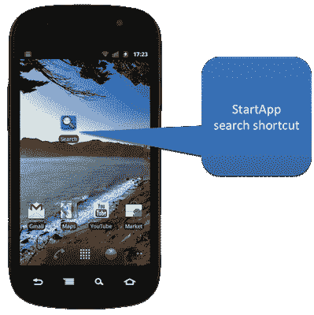
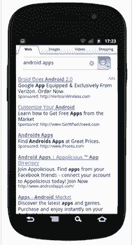

# StartApp 面向 Android 的新盈利平台将搜索与应用捆绑在一起 

> 原文：<https://web.archive.org/web/http://techcrunch.com/2011/09/23/startups-new-monetization-platform-for-android-bundles-search-with-apps/>

StartApp 是一个新的 Android 应用货币化和分发平台，旨在解决该平台在为开发者创收方面带来的挑战。该公司声称，使用新的 StartApp SDK(软件开发工具包)，开发者可以从每 1000 次下载中获得 10-50 美元。StartApp 表示，这高于开发者在其他地方看到的每 1000 次下载 4 美元的平均水平。

听起来很棒，对吧？有什么条件？

当 Android 用户下载[StartApp](https://web.archive.org/web/20230203084536/http://www.startapp.com/)-货币化应用到他们的手机时，一个新的搜索图标和书签链接会自动出现在设备上。没错——捆绑软件！这与过去几年广告软件支持的桌面应用程序没有什么不同。每当用户通过 StartApp 的门户网站搜索网页时，StartApp 就会产生收入，然后可以与开发者分享。

开发者有两种支付方式:预先按下载量付费，或者从新的搜索选项中获得持续的收入分成。预付模式在美国每 1000 次下载收费 50 美元，在国际上每 1000 次下载收费 10 美元。

需要澄清的是，StartApp 要求开发者向用户解释，新的搜索选项是下载的一部分，它不会取代他们的任何默认选项，如果用户不想使用它，可以简单地从他们的主屏幕上删除图标。

在该公司正式发布(计划于周二发布)之前，StartApp 已经集成到 50 个应用程序中，下载量接近 100 万次。

鉴于开发者未能有效利用 Android 上的应用赚钱，新的收入模式被创造出来也就不足为奇了。例如，本月早些时候，第三方移动应用商店 [GetJar 推出了免费 Android 应用的高级目录](https://web.archive.org/web/20230203084536/https://techcrunch.com/2011/09/08/watch-out-amazon-getjar-launches-a-full-catalog-of-premium-android-apps-for-free/)，由 GetJar 网站上的特色搜索列表赞助。

然而，GetJar 模型和 StartApp 之间的区别不仅在于它们如何利用搜索作为一种盈利机制，还在于它们是否愿意激怒最终用户。在 GetJar 的例子中，几乎没有问题——搜索结果中的一些应用列表被标记为“特色”。然而，在 StartApp 的情况下，用户必须在他们的设备上执行清理，以删除额外的图标和书签。

不幸的是，许多用户没有足够的智慧这样做。无伤大雅的“搜索”图标会被反复点击。

这可能像 StartApp 声称的那样是一种有效的收入模式，但这对整个 Android 生态系统来说是什么代价呢？这是开发人员，尤其是纯 Android 开发人员应该仔细考虑的问题。

【T2