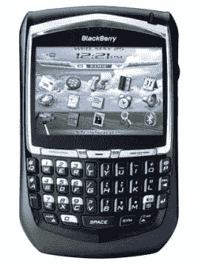
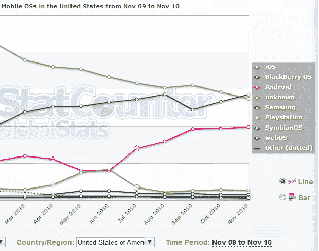

# StatCounter:黑莓首次在美国移动网络大战中击败 iOS 

> 原文：<https://web.archive.org/web/http://techcrunch.com/2010/12/01/statcounter-blackberry-trumps-ios-in-mobile-web-wars-for-the-first-time/>

# StatCounter:黑莓首次在美国移动网络战争中击败 iOS

网络分析公司 [StatCounter](https://web.archive.org/web/20230202232729/http://www.crunchbase.com/company/statcounter) 擅长根据其研究部门 [StatCounter Global Stats](https://web.archive.org/web/20230202232729/http://gs.statcounter.com/#mobile_os-US-monthly-200911-201011) 收集的数据发布[引人注目的新闻稿](https://web.archive.org/web/20230202232729/http://www.businesswire.com/news/home/20101201005766/en/BlackBerry-Overtakes-Apple-Mobile-Wars---StatCounter)。这一次，该公司声称黑莓 11 月在美国的移动互联网使用量首次超过了苹果的 iOS(见下图)。

该公司表示，根据每月超过 150 亿次页面浏览量的样本收集的汇总数据，StatCounter 声称，黑莓 OS 上个月的份额为 34.3%，实际上超过了苹果 iOS，后者在 11 月份的份额为 33%。

根据同一份 StatCounter 数据，就全球份额而言，黑莓在美国的领先地位无法复制。在全球范围内，Symbian 操作系统以 31.9%的份额领先，其次是 iOS(21.9%)、黑莓操作系统(19.3%)和 Android(11.6%)。

除了一个明显的结论，即开发者应该关注其他平台，而不是只专注于为 iOS 设备开发应用程序，StatCounter 补充说，根据其研究，苹果的 iOS 从 2009 年 11 月到 2010 年 11 月已经从 51.9%下降到 33%。

根据其数据，Android 正在快速增长，在同一时期，其互联网使用市场份额几乎增加了两倍，从 8.2%增至 23.8%。

StatCounter 创始人兼首席执行官 Aodhan Cullen 表示，如果目前的趋势继续下去，黑莓和 Android 在移动互联网使用方面的规模将在明年达到 iOS 的两倍。

与此同时，微软的新 Windows Phone 7 还没有出现在雷达上，但 StatCounter 表示，它热衷于观察它在 2011 年及以后的表现。

从另一个分析提供商的角度来看，看看这篇基于 Quantcast 数据的文章: [Android 在美国的移动网络消费份额正在飙升，iOS 份额正在下降](https://web.archive.org/web/20230202232729/https://techcrunch.com/2010/09/03/quantcast-mobile-web-browsing/)

点击图片查看更完整的视图:

