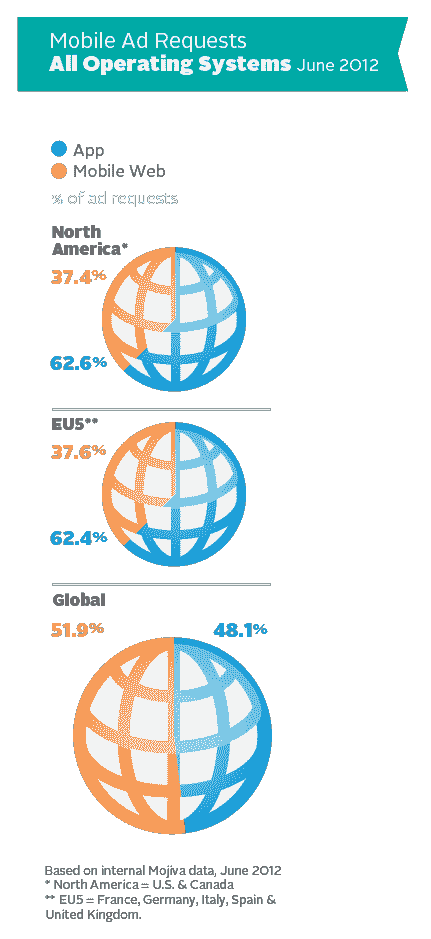
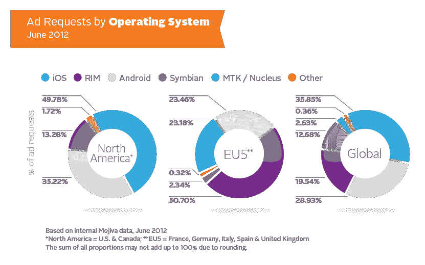
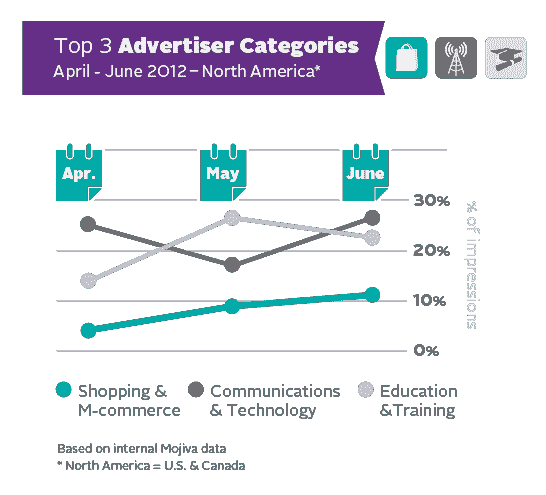

# 移动广告的现状:富媒体规则，移动网络仍在运行&甚至 RIM 也在展示技术

> 原文：<https://web.archive.org/web/https://techcrunch.com/2012/10/01/state-of-mobile-ads-rich-media-rules-mobile-web-still-in-play-even-rim-makes-a-showing/>

移动广告网络 Mojiva 今天早上发布的新数据描绘了移动广告的现状，强调了今年 2 月至 6 月整个网络的趋势。一些高层次的结论:富媒体广告占主导地位，移动网络不应被忽视，大多数移动广告请求来自 Wi-Fi 连接，RIM 仍然是主要参与者。(嗯，在欧洲，就是这样)。

Mojiva 广告网络覆盖全球超过 11 亿台设备，代表 8，000 家移动和平板电脑出版商和应用程序，让您了解其覆盖范围。

根据该报告，富媒体广告将在未来几年继续大幅增长，该网络预测从 2012 年到 2016 年将增长 365%。在报告引用的时间段内，富媒体广告增长了 30%。

 随着移动应用生态系统的增长，一些人可能会认为移动网络广告会受到影响，或者至少不值得了。但是莫吉瓦却发现了另一种情况。在其网络上，移动网络广告稳步增长，从 2012 年 2 月的 27%增长到 6 月的 37%。在北美，62.6%的移动广告请求来自应用内，37.4%来自移动网络。在法国、德国、意大利、西班牙和英国，62%的移动广告请求来自应用程序内，38%来自移动网络。换句话说，这两个市场的百分比非常接近。但在全球范围内，分布更加均匀——48.1%的广告在应用程序内，而在移动网络上为 51.9%。

至于 iOS 与 Android 和黑莓的大战:在全球范围内，iOS 占广告请求的 36%，其次是 Android (29%)，然后是 RIM (20%)。RIM 在欧盟五国(上面列出的五个欧洲国家)的广告请求中占了大部分，份额达到惊人的 51%，而 Android 和 iOS 各占 23%。

此外，大多数广告请求(80%)是通过 Wi-Fi 连接提供的，近 90%的 iOS 设备在浏览网页或使用应用程序时使用 Wi-Fi。

至于哪些类别的应用越来越受欢迎，Mojiva 发现，移动游戏、娱乐和社交网络在美国最受欢迎，分别占广告总浏览量的 23%、20%和 11%。移动购物和移动商务也在增长——在所有类别中增长最快——从 4 月份的 4%上升到 6 月份的 11%。

更多细节将在今天发布的完整报道中[。](https://web.archive.org/web/20221005215156/http://www.mojiva.com/news/mobile_research?utm_source=Download&utm_medium=MAP&utm_campaign=Mojiva+MAP+1.2)