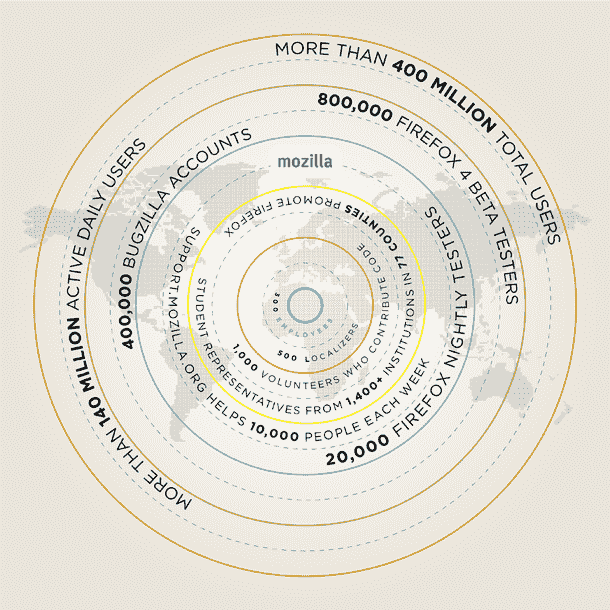

# Mozilla:1.04 亿美元收入，4 亿用户，谷歌交易持续到 2011 年 TechCrunch

> 原文：<https://web.archive.org/web/http://techcrunch.com/2010/11/18/state-of-mozilla/>

# Mozilla:收入 1.04 亿美元，用户 4 亿，谷歌交易将持续到 2011 年

Mozilla 刚刚发布了他们的年度“[Mozilla](https://web.archive.org/web/20230202213730/http://www.mozilla.org/foundation/annualreport/2009/index.html)状态”报告。一旦他们提交了上一年的审计财务报表，他们就会这么做，所以这些数字是 2009 年的。尽管如此，考虑到市场上的激烈竞争，尤其是来自他们最大的赞助者:谷歌的竞争，这些数字还是令人印象深刻。

2009 年，Mozilla 公布的收入为 1.04 亿美元。这比 2008 年的收入 7800 万美元增长了 34%。值得注意的是，这一收入数字包括长期投资损失 10.4 万美元，但这比 2008 年的 780 万美元有了很大改善。那么 Mozilla 的大部分收入来自哪里呢？当然，火狐很大程度上要感谢他们与谷歌的搜索协议。在报告的 [FAQ](https://web.archive.org/web/20230202213730/http://www.mozilla.org/foundation/annualreport/2009/faq.html) 部分，Mozilla 解决了这个问题:

> Mozilla 的大部分收入来自于我们 Firefox 产品中包含的搜索功能，这些搜索功能来自于所有主要的搜索合作伙伴，包括谷歌、雅虎、Yandex、亚马逊、Ebay 等。Mozilla 报告的收入还包括非常重要的个人和企业捐赠和赠款，以及来自我们可投资资产的其他形式的收入。

虽然他们列出了一些公司，但谷歌显然是这里的关键，因为再往下，他们特别提到了他们与搜索巨头的关系和合同:

> 自 2004 年以来，我们一直与谷歌保持着富有成效的关系，而且这种关系一直保持健康。迄今为止，我们已经在 2005 年、2006 年和 2008 年三次续约。目前的版本延续到 2011 年。我们相信，在可预见的未来，搜索服务提供商仍将是 Mozilla 稳定的收入来源。

谷歌和 Mozilla 之间的关系很有趣，因为谷歌有自己的浏览器 Chrome，与 Firefox 竞争。从各方面来看，Chrome 继续快速获得市场份额。虽然看起来他们的大部分份额仍然来自行业领导者 Internet Explorer，但自从 Chrome 开始起飞以来，Firefox 的增长已经明显放缓。

在他们报告的“[竞争世界](https://web.archive.org/web/20230202213730/http://www.mozilla.org/foundation/annualreport/2009/a-competitive-world.html)”部分，Mozilla 深入探讨了为什么他们认为 Firefox 4 将把浏览器带到一个新的水平。最新版本正在测试的后期阶段，应该很快就会出来。在这里，他们还列举了 Firefox 的一些大数据，例如超过 4 亿的总用户，超过 1.4 亿的每日活跃用户，以及 80 万 Firefox 4 beta 测试人员。

展望未来，Mozilla 概述了他们如何将重点放在移动、应用、共享和同步上，这是他们的鼓点项目(促进开放网络)。