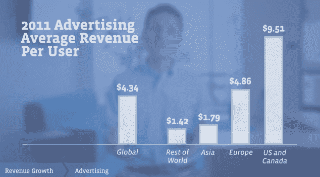
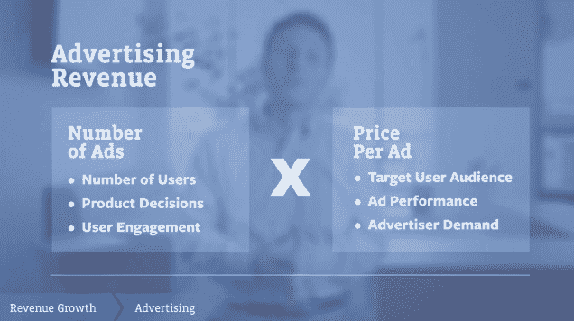
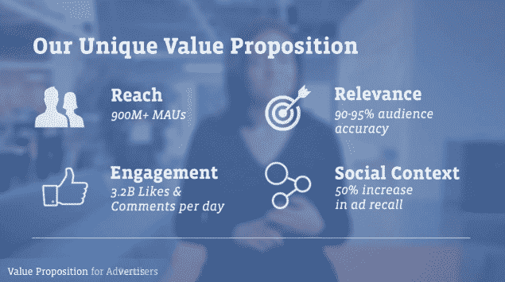
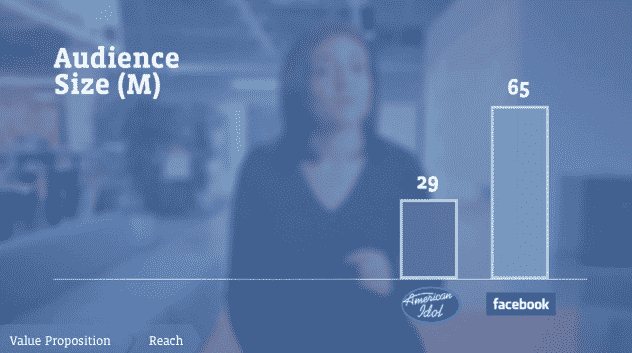
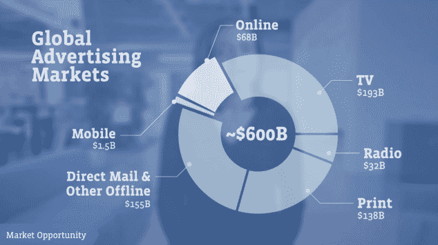
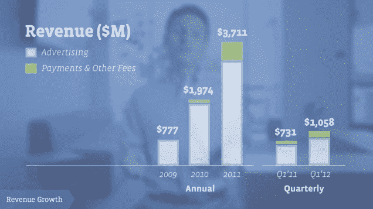
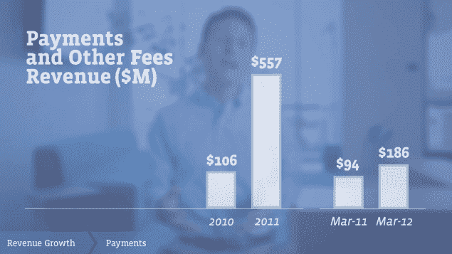
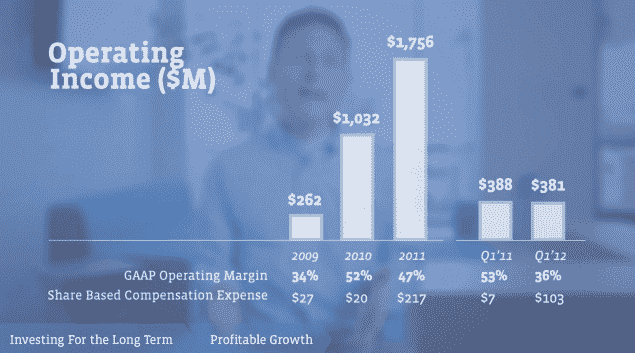

# 统计数据:脸书去年在美国和加拿大的每用户广告收入为 9.51 美元

> 原文：<https://web.archive.org/web/https://techcrunch.com/2012/05/03/stats-facebook-made-9-51-in-ad-revenue-per-user-last-year-in-the-u-s-and-canada/>

尽管脸书的 IPO 路演视频是一个非常煽情的事情，有朋友喝咖啡和婴儿吹灭蜡烛的视频，但其中也隐藏了一些新的数据。

该公司第一次展示了它如何在全球不同地区以每用户为基础实现盈利。有一张图表最有意思。

数据显示，脸书在美国和加拿大的每名用户广告收入约为 9.51 美元。欧洲大约是这个数字的一半，每用户广告收入为 4.86 美元。亚洲和世界其他地区紧随其后，分别为每用户 1.79 美元和 1.42 美元。这表明，如果脸书在西欧和日本成功发展，或者说服更多的区域品牌广告客户加入，西欧和日本等其他经济更发达的市场也可以实现收入轨迹。

但是这些收入也受到季节性和宏观经济趋势的影响。根据脸书最近的 IPO 申报文件，由于欧洲经济疲软，欧洲第一季度的广告平均价格实际上比假期有所下降。

此外，在一段时间内，亚洲和世界其他地区将是一个挑战。这些经济体无法像美国或欧洲那样支持人均消费。还要记住，脸书仍然被中国拒之门外，而新浪、腾讯和人人网等竞争对手正在中国蓬勃发展。

有六个主要因素会影响未来几年脸书广告收入的增长。下面列出了它们，它们与原始增长(或脸书有多少用户)、参与度(或产品的粘性和上瘾程度)以及目标定位(脸书如何将正确的广告发送给正确的用户)有关。

脸书每月有 9.01 亿活跃用户，因此考虑到全球互联网使用的绝对限制，它已经没有增长空间了。更重要的是，它得到了很多唾手可得的果实，即发达国家的用户。它还不断改变产品，这可能会影响短期收入。在过去的一年里，脸书将每页的广告数量从 4 个增加到了 7 个。

就脸书的整体广告定位而言，该公司首席运营官雪莉·桑德伯格表示，公司的长期目标是成为全球 7000 万企业提供个性化相关广告的地方。

她说，“在脸书的每一天都像是《美国偶像》第二季的大结局，”指的是主页。

她还补充说，广告预算在网上的移动速度不够快，无法与用户行为相匹配。在每年大约 6000 亿美元的广告支出中，只有 11%用于在线广告。另外 15 亿美元的广告花费在移动设备上。

总的来说，正如我们之前报道的。脸书的收入有两部分:广告和支付。两者都比去年同期有所上升，但广告收入实际上在第一季度有所下降，脸书称这是季节性消费习惯造成的。从第四季度到第一季度，支付收入几乎持平。

如果我们更仔细地观察支付收入，就会发现它比去年同期增长了不少。脸书从其平台上的应用和游戏中获得 30%的收入份额。但这不是一个公平的比较，因为脸书只是在 7 月份才强制规定收入分成。支付收入与上季度相比基本持平，从第四季度的 1.88 亿美元降至 1.86 亿美元。

令人担忧的是，如果你看看平台上的游戏，Zynga 在脸书画布上的季度环比预订量真的不再增长了。他们大部分的预订增长来自手机。因此，除非脸书很快开启其他种类的支付收入，否则这个数字将会停滞不前。

脸书首席财务官大卫·埃博斯曼强调，如果将支付扩展到游戏之外，该公司可能会削减 30%的收入份额，我们几周前就报道过这一点。

  

他还指出，脸书的营业利润率正在下降。衡量公司运营盈利能力的指标，营业利润率从去年同期的 53%下降到第一季度的 36%。埃博斯曼表示，这与基于股份的薪酬支出有很大关系。

他还补充说，该公司仍处于增长模式，并将不时做出损害其短期盈利能力的决定。例如，尽管脸书才刚刚开始从其移动应用中获得收入，但它仍将继续大举投资。

“我们相信脸书的移动使用对我们的未来至关重要，”他说。“即使移动货币化不确定，也要期待我们对它进行投资。”

