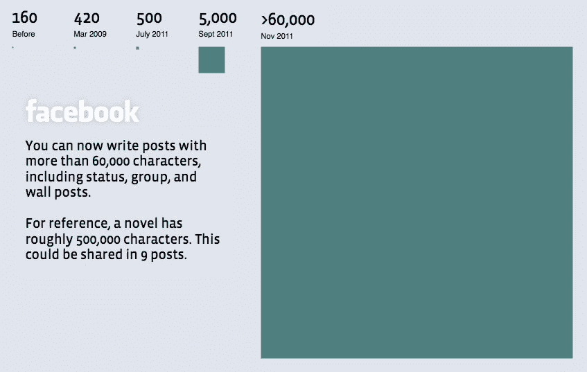

# 脸书 Ups 的字符限制达到 60，000，Google+的更大

> 原文：<https://web.archive.org/web/https://techcrunch.com/2011/11/30/status-update-character-limit/>

# 脸书将字符限制提高到 60，000，Google+的字符限制更大

一场斗尿比赛正在进行。Google+发布时声称没有字符限制，但我的测试显示它在 10 万个字符时停止发布。毫无疑问，与此无关的是，脸书在 9 月份将其限制从 500 人提高到了 5000 人，今天[宣布其限制现在超过了 60000 人](https://web.archive.org/web/20230404054300/http://www.facebook.com/schrep/posts/203969696349811)。那是一本小说长度的九分之一。这让用户可以灵活地撰写成熟的博客文章，甚至更长的内容。然而，我怀疑脸书也在试图抵消其竞争对手的另一个卖点。

我今天测试了脸书和 Google+的字符限制。如果你试图在脸书上发布超过 63，206 个字符的内容，它会告诉你“状态更新太长”,并询问你是否要将该文本作为便笺发布。实际上，这是一个非常优雅的举动。想猜猜它是怎么选择 63206 的吗？脸书工程师[鲍勃·鲍德温](https://web.archive.org/web/20230404054300/http://www.facebook.com/bobbaldwin)写道:“我给一些无聊的东西设定了精确的界限。脸书…Face Boo K…hex(Face)–K…64206–1000 = 63206:-)”，作为对工程副总裁迈克·斯科洛普夫发布公告的回应。

Google+不那么透明。它不会发表任何超过 100，000 字符的内容，给了我一个借口“保存你的帖子时出现了问题。请再试一次。”无限的极限到此为止。

脸书庞大的用户群意味着人们正在以各种方式使用它。也许有人想分期发表冗长的博客文章或整本书的章节。谢天谢地，Google+和脸书分别通过“扩展这篇文章”和“继续阅读”链接减少了史诗般的状态更新。尽管如此，一份 6 万字的《脸书邮报》可能永远也不会在狭小的新闻版面上被阅读，笔记对他们来说是更好的地方。

这就是为什么我认为这是脸书削弱 Google+数量优势的又一举措。自从竞争对手推出 Google+以来，脸书一直在积极推出 Google+中的功能。在线隐私控制、不对称订阅、更好的公开发布功能、改进的好友列表和视频聊天只是几个例子。脸书希望人们比较这两种服务的用户数量、在线时间和社交图密度——在这些方面，它显然处于领先地位。它不希望人们引用脸书没有的东西，即使它们是不必要的。比如 6 万条人物状态更新。

